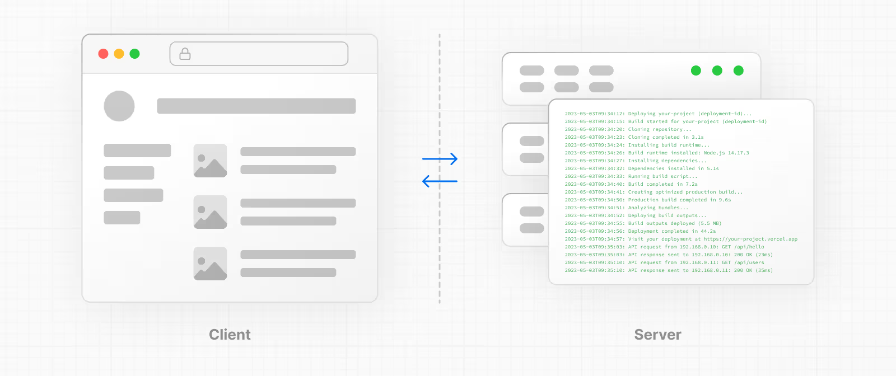
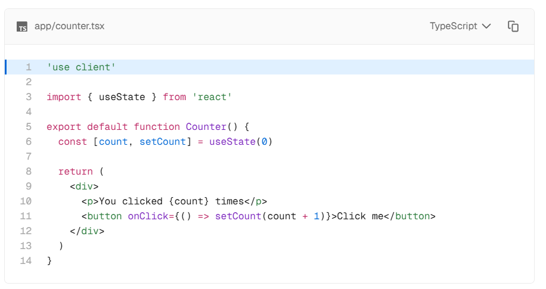

<h1> 📚 Next.js 2주차 학습정리

### 💡 렌더링 (Rendering)

렌더링 : 작성한 코드를 사용자 인터페이스로 바꾸는 과정. React 와 Next.js 를 사용하면 서버 혹은 클라이언트에서 렌더링 할 수 있는 하이브리드 웹 어플리케이션을 만들 수 있다.

## 📍 세 가지 기본 웹 컨셉

#### 1. 렌더링 환경 (Environments)

- 애플리케이션 코드가 실행될 수 있는 환경(Environments) - 서버와 클라이언트



⚡ 과거에는 서버와 클라이언트가 서로 다른 언어와 프레임워크로 개발되어야 했으나, **React와 Next.js의 사용 이후** 에는 하나의 프레임워크 (React기반)으로 서버와 클라이언트 모두에서 코드 작성이 가능해졌다.

⚡특히 Next.js는 서버와 클라이언트의 역할을 하나의 프로젝트 안에서 통합해서 다룰 수 있게 해주었다. 하지만, 서버와 클라이언트는 **역할과 환경이 다르기 때문**에 작성하는 코드가 다를 수 있으며, **각각의 환경에 더 적합한 기능(방식)이 있다**는 점을 알아둬야 한다.

#### 2. 요청-응답 라이프사이클 (Request-Response Lifecycle)

- 일반적으로 모든 웹사이트는 동일한 요청-응답 라이프 사이클을 따르며, 사용자가 애플리케이션을 방문하거나 상호 작용할 때 실행된다.

⚡ 사용자 행동 - HTTP 요청 - 서버(요청 처리 및 응답) - HTTP 응답 - 클라이언트(UI 렌더링) - 사용자 행동 (인터페이스는 사용자와 상호작용 가능해짐)

⚡ **하이브리드 웹 애플리케이션** 을 구축할 때는 라이프사이클에서 작업을 어떻게 분할할 것인지, 네트워크 경계를 어디에 둘 것인지 결정하는 것이 중요하다.

#### 3.네트워크 경계(Network Boundary)

- 다른 환경을 구분하는 개념적인 선 (ex.클라이언트와 서버, 서버와 DB 간의 경계)

- React의 "use client" 규칙
  - 바운더리 정의 가능
  - 서버에서 일부 계산 작업 하도록 React에 지시 가능

### 🔎 하이브리드 애플리케이션 구축

- 애플리케이션의 코드 흐름이 **단방향** 임을 생각하는 것은 도움이 된다. 응답하는 동안, 애플리케이션 코드는 서버에서 클라이언트로 단방향으로 흐느다.

  - **클라이언트에서 서버에 접근**해야 한다면, 같은 요청을 재사용하는 대신 서버에서 새 요청을 보낸다.
  - 이를 통해 컴포넌트를 어디에 렌더링할지, 네트워크 경계를 어디에 둘지 이해하기 쉬워진다.

## 📍 Server Components

- React에서 서버 컴포넌트를 사용하면 서버에서 렌더링하고 선택적으로 캐시할 수 있는 UI 를 작성할 수 있다.
- Next.js에서는 route segments (경로 세그먼트)별로 렌더링 작업을 추가로 분할해서 스트리밍과 부분 렌더링이 가능하게 한다.

#### 🔎 서버 렌더링의 3가지 전략

1. Static Rendering
2. Dynamic Rendering
3. Streaming

### 📌 서버 렌더링의 이점

- **Data Fetching (데이터 가져오기)**
  - 데이터 소스에 더 가까운 서버로 데이터를 가져올 수 있다.
  - 그 결과, 렌더링에 필요한 데이터를 가져오는 시간을 줄이고, 클라이언트의 요청 수를 줄일 수 있다.
- **Security**
  - 토큰, API 키 등 민감한 데이터를 클라이언트에 노출시키지 않을 수 있다.
- **Caching**
  - 서버에서 렌더링하면 결과를 캐시하고 이후 요청과 다른 사용자 간에 재사용할 수 있다.
- **Performance**
  - 서버 컴포넌트는 기본 성능을 최적화하는 도구들을 추가적으로 제공한다.
- **Initial Page Load and First Contentful Paint (FCP)**
  - 초기 페이지 로드와 첫 번째 콘텐츠 도달 시간을 줄일 수 있다.
  - 서버는 클라이언트에서 JS를 다운로드, 파싱, 실행하는 시간을 기다리지 않고 페이지를 즉시 볼 수 있도록 HTML을 생성할 수 있다.
- **Search Engine Optimization and Social Network Shareability**
- **Streaming**
  - 서버 컴포넌트는 렌더링 작업을 여러 조각으로 분할하고 준비되는 대로 클라이언트에 스트리밍할 수 있다.

### 📌 Next.js에서 서버 컴포넌트 사용하기

- 기본적으로 Next.js는 서버 컴포넌트를 사용한다. (추가 구성 없이 서버 렌더링 구현 가능 & 클라이언트 컴포넌트는 필요시 사용)

### 📌 서버 컴포넌트가 렌더링 되는 방법

서버에서 Next.js 는 React API 를 활용해서 렌더링한다

렌더링 작업은 **Route Segment**와 **Suspense Boundary**를 기준으로 Chunk로 스플릿되는데, 각각의 청크는 두가지 단계를 거쳐서 렌더링된다.

1. React: 서버 컴포넌트를 **RSC Payload (React Server Component Payload)** 라는 특수 데이터 형식으로 렌더링
2. Next.js : RSC Payload와 클라이언트 컴포넌트 JS instruction을 사용해 HTML 파일을 렌더링

3. 이후 클라이언트에서 ..
4. HTML : 아무도 상호작용할 수 없지만 빠르게 보여줄 수 있는 초기 화면을 만드는데 사용한다. (처음 페이지 로딩시에만)
5. RSC Payload : 클라이언트 컴포넌트, 서버 컴포넌트를 조정하고, DOM을 업데이트
6. JS instruction : 컴포넌트 hydrate

#### 🔎 RSC Payload?

- 렌더링된 React 서버 컴포넌트 트리를 컴팩트한 이진트리로 표현한 것으로, React가 클라이언트에서 브라우저 DOM을 업데이트하는데 사용됨.
  - 서버 컴포넌트의 렌더링 결과
  - 클라이언트 컴포넌트가 렌더링될 위치의 placehoders & 그 JS 파일에 대한 참조
  - 서버 컴포넌트에서 클라이언트 컴포넌트로 전달한 모든 props

### 📌 서버 렌더링 전략

#### 1. Static Rendering (기본 설정)

⚡ 방법

- 빌드 타임에 해당 경로 렌더링 or 데이터를 검증한 후 백그라운드에서 렌더링
- 결과는 캐시되어 CDN으로 전송 가능

⚡ 특징

1. 사용자마다 달라지는 데이터 X
2. 빌드 타임에 명확히 알 수 있는 데이터를 활용하는 경로에서 유용하게 사용
   ex. 블로그 포스트의 상품 페이지
3. 사용자들과 서버 요청 간에 렌더링 요청 가능

#### 2. Dynamic Rendering

⚡ 방법

- 각 사용자의 요청에 경로를 렌더링함.

⚡ 특징

1. 사용자별로 달라지는 데이터가 있는 경로 요청에 유용하게 사용
2. 쿠키, URL의 params 등 **요청한 시점에만** 알 수 있는 정보가 포함된 경로에서 유용하게 사용

#### 3. Streaming

⚡ 방법

- Streaming을 활용해 서버에서 UI를 점진적으로 렌더링할 수 있다.
  1. 작업이 여러 청크로 분할됨
  2. 준비되는 대로 클라이언트에 streaming 됨.
  3. 사용자: 전체 컨텐츠가 렌더링을 완료하기 전, 페이지의 일부를 즉시 볼 수 있음

⚡ Streaming

- Next.js의 **App Router**에 기본적으로 내장되어 있음. - 초기 페이지 로딩 성능과 로딩 속도가 느린 데이터를 가져오는 UI 성능 개선하는데 도움을 줌.
- loading.js와 같이 React Suspense를 활용해 경로 segment 스트리밍 시작도 가능

## 📍 Client Components

클라이언트 컴포넌트는 서버에서 사전에 렌더링된 UI를 상호작용 가능하게 만들어주며, 브라우저에서 클라이언트 JS를 실행시킬 수 있도록 해준다.

### ⚡ 클라이언트 렌더링의 장점

#### 1. 상호작용

- 상태, 효과, 이벤트 리스너 등을 사용하여 사용자에게 즉각적인 피드백을 제공하고, UI 업데이트를 할 수 있다.

#### 2. 브라우저 API

- 브라우저 API에 접근할 수 있다.
  - geolocation (위치 정보 API) - 사용자의 현재 위치 가져오는 기능
  - localStorage (로컬 저장소) - 브라우저에 데이터 저장해두는 기능 (로그인 정보, 테마 설정, 장바구나 저장 등)

```js
localStorage.setItem("username", "seojin");
const name = localStorage.getItem("username");
console.log(name); // 'seojin'
```

### ⚡ 클라이언트 컴포넌트 사용하기



⚡use Client

- 서버 컴포넌트, 클라이언트 컴포넌트 모듈 간의 경계 선언하는 역할
- 클라이언트 컴포넌트를 사용하기 위해서는 React 의 **use client** 디렉티브를 import 문보다 더 위인 파일 최상단에 사용해야 함.
- use Client를 파일에 정의하면 그 파일로 가져온 모든 다른 모듈들과, 포함된 자식 컴포넌트들까지 클라이언트 번들의 일부로 간주할 수 있다.

- React 컴포넌트 트리에서 여러 use client의 엔트리 포인트를 설정할 수 있다.
  - 애플리케이션을 여러 클라이언트 번들로 분할할 수 있게 해줌
  - 하지만, 경계를 한 번 정의하면, 그 안으로 가져온 모든 자식 컴포넌트와 모듈이 클라이언트 번들의 일부로 간주되기 때문에, 클라이언트에서 렌더링 해야하는 모든 컴포넌트에 use client를 정의할 필요는 없다!

### ⚡ 클라이언트 컴포넌트의 렌더링 방식

#### 📌 #1 Full Page Load (전체 페이지 로드)

- Next.js는 React API를 활용하여 클라이언트 컴포넌트와 서버 컴포넌트 모두에 대해 정적 HTML 미리보기를 서버에서 렌더링한다. (초기 페이지 로드)

  => 사용자가 애플리케이션 방문하면 **클라이언트 컴포넌트**에서 사용될 JS 번들을 다운로드, 파싱, 실행할 필요 없이 페이지의 내용 즉시 확인 가능

⚡ 서버에서 진행되는 과정

1. React : 클라이언트 컴포넌트에 대한 참조 데이터가 있는 특별 데이터 형식인 RSC Payload 로 서버 컴포넌트들을 렌더링함.
2. Next.js : RSC Payload 와 클라이언트 JS instructions 을 사용해 서버에서 해당 경로에 대한 HTML 을 렌더링함.

#### 3. 이후에 클라이언트에서는 ..

1. HTML 파일 : 상호작용 X, 가장 빠르게 보여지는 화면 제공
2. RSC Payload : 클라이언트 및 서버 컴포넌트 트리 조정 & DOM 업데이트
3. JS instructions : 클라이언트 컴포넌트 hydrate

- hydrate : 정적 HTML을 상호작용하게 만들기 위해 DOM에 eventlistener 연결하는 과정. (내부적으로는 hydrateRoot라는 React API 활용)

#### 📌 #2 후속 탐색

- 클라이언트 컴포넌트는 **서버에서 렌더링된 HTML 없이** 전적으로 **클라이언트**에서 렌더링.

## 📍 Composition Patterns

React 애플리케이션을 빌드할 때, 이 애플리케이션이 **서버에서** 렌더링되어야 할지, **클라이언트**에서 렌더링해야할지에 대한 고민을 해야 한다.

#### ⚡서버 컴포넌트 vs 클라이언트 컴포넌트 사용 시기


#### 🔎 서버 컴포넌트 패턴

- Client Side Rendering 을 선택하기 전, 서버에서 데이터를 fetching 하거나, db나 백엔드 서비스에 접근할 수 있다.

#### ⚡ 서버 컴포넌트로 작업할 때 흔히 사용되는 패턴

##### 1. 컴포넌트 간 데이터 공유

- 같은 데이터에 의존하는 레이아웃과 페이지 등, 서버에서 데이터를 가져올 때, 다른 컴포넌트 간에 가져온 데이터를 공유해야 할 경우가 있다.

❌ 잘못된 접근

- React Context (서버 컴포넌트에서는 사용 불가)
- props로 계속 전달하는 것

🔎 권장하는 방법

- fetch() 또는 React의 cache() 함수 활용
  - 필요한 컴포넌트 각각에서 같은 데이터를 다시 fetch해도 **중복 요청이 발생하지 않음** (React가 자동으로 중복 요청 막아줌줌)
  - React는 fetch 요청을 자동으로 memoize 하기 때문에, 같은 요청이면 **한 번만 네트워크 호출**하고, 결과를 **재사용**함.
    - fetch를 사용할 수 없는 상황이면 cache() 함수로 같은 기능 구현 가능.

##### 2. 클라이언트 환경에서 서버 코드 유지 (서버 전용 코드가 실행되지 않게)

⚡문제점 및 위험험

- JS 모듈은 서버 및 클라이언트 컴포넌트 모듈 간에 공유될 수 있다. 따라서, 오직 서버에서만 실행될 의도로 작성된 코드가 클라이언트로 유입될 수 있다.
  - **서버에서만 실행**되어야 하는 코드 예: API 키를 사용하는 코드
- process.env.API_KEY처럼 NEXT_PUBLIC이 없는 환경 변수는 서버에서만 접근 가능함
  - 클라이언트에서는 빈 문자열로 대체됨.
- getData() 같은 서버 전용 함수를 클라이언트에서 가져오면 코드가 동작하지 않거나 보안에 문제가 생길 수 있음.
- 민감한 정보를 클라이언트에 노출하는 실수 가능성.

⚡ 서버 코드의 의도치 않은 클라이언트 사용 방지를 위한 방법

- server-only 패키지 사용

  - 서버 전용 모듈 상단에 import 'server-only' 추가
  - 클라이언트 컴포넌트에서 해당 모듈을 가져오면 빌드 타임 에러 발생

- 반대로, 클라이언트 전용 모듈은 `client-only`로 관리 가능

##### 3. 서드파티 패키지 및 Provider 사용

📌 1. 클라이언트 전용 기능과 use client

- useState, useEffect, createContext와 같은 **클라이언트 전용 기능**은 서버 컴포넌트에서 사용 불가.
  - 서드파티 컴포넌트들이 이런 기능을 사용하면서 `use Client` 지시어를 안 붙인 경우가 많은데, 이 경우 서버 컴포넌트에서 바로 사용하면 에러가 발생.

💡해결 방법 : 클라이언트 컴포넌트로 감싸기

📌 2. Context Provider는 클라이언트 컴포넌트 안에 위치해야 함

- React.createContext()는 서버 컴포넌트에서는 지원되지 않음

💡해결 방법 : Client Component로 따로 분리해서 Provider 작성

📚 정리
| 상황 | 해결 방법 |
|-----------------------------------|--------------------------------------------------|
| 클라이언트 전용 기능 쓰는 서드파티 컴포넌트 | `'use client'`로 감싸서 별도 컴포넌트로 만듦 |
| Context 사용 | Provider를 클라이언트 컴포넌트에서 분리 작성 |
| 루트 컴포넌트 최적화 | Provider는 `children`만 감싸도록 함 |

#### 🔎 클라이언트 컴포넌트 패턴 (관리 전략)

1. Client Component는 트리 아래로 옮긴다

- 클라이언트로 보내는 JS 번들 크기 줄이기
- ex. Layout 전체를 Client Component로 만들지 말고, 인터랙티브한 부분만 분리

2. Server -> Client로 props 전달 시 주의

- Server Component에서 가져온 데이터를 Client Component로 props로 전달할 수 있음
- 단, props는 반드시 serializable 해야함.
  - 직렬화 가능한 데이터 (ex. 객체, 문자열, 배열 등) : 그대로 props 전달
  - 불가능한 데이터 (ex. 함수, 클래스 인스턴스 등) : 클라이언트에서 직접 fetch하거나 Route Handler 이용

#### 🔎 서버 컴포넌트, 클라이언트 컴포넌트 교차 사용 (Interleaving)

⚡ 컴포넌트 트리에서 Server ↔ Client를 섞어 사용하는 방법

- 기본 구조 : layout.tsx 같은 루트는 Server Component
- Client Component로 분기하려면 `use client` 지시어로 명시
- 클라이언트 하위에서도 Server Component를 중첩할 수 있음
  - 주의할점 1. 클라이언트 → 서버로 되돌아가는 건 아님
    - 클라이언트에서 서버 자원이 필요하면 → 새 요청(request) 발생 (Server Component는 처음 요청에서 전부 먼저 렌더링됨)
    - Client Component는 Server Component를 직접 import 불가 (클라이언트에서 서버 코드를 불러오면 또다시 서버 요청을 만들어야 하기 때문)

| 개념                      | 설명                                                                         |
| ------------------------- | ---------------------------------------------------------------------------- |
| Server → Client 혼합 구성 | 트리 형태로 중첩 사용 가능 (`use client` 하위에도 Server 컴포넌트 사용 가능) |
| 직접 import 불가          | Client Component에서 Server Component 직접 import 불가                       |
| props로 전달은 가능       | Server Component를 children 또는 props로 Client Component에 전달 가능        |

## 📍 Runtimes

Next.js에는 애플리케이션에서 사용할 수 있는 두 가지 서버 런타임이 있다.

1. Node.js 런타임 (기본)

- 모든 Node.js API와 에코시스템에서 제공되는 호환 가능한 패키지들을 사용 가능

⚡ 사용

- 애플리케이션 렌더링 할 때

2. Edge 런타임

- Middleware의 기본 런타임.
- 제한된 API 세트를 가지고 있음.

⚡사용

- Middleware을 위해 사용 (setting routing rules - redirection, rewrite, setting headers)

📚 참고 자료 및 느낀점
https://nextjs.org/docs/app/building-your-application/rendering/composition-patterns

양이 너무 많다. 🫠
