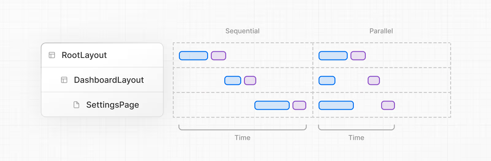

<h1> 📚 Next.js 3주차 학습정리

### 💡 Server Function and Data Fetching

- 리액트 서버 함수와 Next.js에서의 데이터 패칭에 대해 이해한다.

# 📍 Server Function

https://ko.react.dev/reference/rsc/server-functions

| 궁금증                                 | 내용                                                              |
| -------------------------------------- | ----------------------------------------------------------------- |
| **리액트 공식문서에 있는 "서버 함수"** | RSC(Server Components) 안에서 서버에서만 실행되는 함수 개념       |
| **`use server` 문법**                  | React 공식 문법 아님. Next.js 등 프레임워크에서 도입한 구현 방식  |
| **단독 리액트(CRA 등)에서 사용 가능?** | 안 됨. Next.js 같은 프레임워크 필요                               |
| **왜 리액트 공식 문서에 있음?**        | 리액트 자체가 제공하는 "개념"이기 때문 (프레임워크가 이걸 구현함) |

## 💡 서버 함수란?

- 서버 함수를 사용하면 클라이언트 컴포넌트가 서버에서 실행되는 비동기 함수를 호출할 수 있음.

1. 서버 함수를 `use server` 지시어로 정의
2. 프레임워크는 자동으로 서버 함수에 대한 **참조**를 생성, 해당 참조를 **클라이언트 컴포넌트**에 전달.
3. **[클라이언트]** 에서 해당 함수 호출되면,
4. React는 서버에 함수를 실행하라는 요청을 보내고 결과를 반환

(아래 내용 1번)

## 💡 서버 함수 사용법

### 1. 서버 컴포넌트에서 직접 서버 함수 정의하기

```
import Button from './Button';

function EmptyNote () {
  async function createNote() {
    // 서버 함수
    'use server';

    await db.notes.create();
  }

  return <Button onClick={createNote}/>;
}
```

⚡ 사용 방법

1. React가 EmptyNote 서버 컴포넌트를 렌더링
2. createNote 함수에 대한 참조를 생성
3. 그 참조를 Button **클라이언트 컴포넌트**에 전달
4. **버튼을 클릭**하면, React는 제공된 참조를 통해 createNote 함수를 실행하도록 **서버에 요청을 보냄.**

### 1-1. 클라이언트 컴포넌트에서 서버 함수 가져오기

- 클라이언트 컴포넌트는 "use server" 지시어를 사용하는 파일에서 서버 함수를 가져올 수 있음.

```
"use server";

export async function createNote() {
  await db.notes.create();
}
```

🔎 버튼 클릭으로 서버 함수 실행하고 싶다면 1번 혹은 1-1번 사용하면 됨.

### 1-2. 액션으로 서버 함수 구성하기

- 서버 함수는 클라이언트의 액션과 함께 구성할 수 있음
- 클라이언트의 액션으로 래핑하여 서버 함수의 isPending 상태에 접근

### 2. 서버 함수를 사용한 폼 액션

```
"use client";

import {updateName} from './actions';

function UpdateName() {
  return (
    <form action={updateName}>
      <input type="text" name="name" />
    </form>
  )
}
```

- 서버 함수를 폼에 전달하여 폼을 서버에 자동으로 제출할 수 있다.
- **폼 제출 성공**시, React는 자동으로 폼을 재설정.
- useActionState를 추가하여 대기(Pending) 상태 혹은 마지막 응답에 접근하거나, 점진적 향상을 지원가능

🔎 `<form>`으로 제출하고 싶은 경우 사용 - (폼 중심!)

### 3. useActionState를 사용한 서버 함수

- 액션 대기 상태 / 마지막으로 반환된 Response에 접근하는 경우에 `useActionState`를 사용하여 서버 함수를 호출 가능

```"use client";

import {updateName} from './actions';

function UpdateName() {
  const [state, submitAction, isPending] = useActionState(updateName, {error: null});

  return (
    <form action={submitAction}>
      <input type="text" name="name" disabled={isPending}/>
      {state.error && <span>Failed: {state.error}</span>}
    </form>
  );
}
```

- 서버함수와 함께 `useActionState` 사용하는 경우, React는 Hydration이 완료되기 전에 입력된 폼 제출을 자동으로 다시 실행함.

🔎 2번의 응용 버전 - 폼 제출 뿐 아니라 **상태까지** 관리하고 싶을 때

### 3-1. useActionState를 통한 점진적 향상

```
"use client";

import {updateName} from './actions';

function UpdateName() {
  const [, submitAction] = useActionState(updateName, null, `/name/update`);

  return (
    <form action={submitAction}>
      ...
    </form>
  );
}
```

- permalink가 useActionState에 제공될 때, 자바스크립트 번들이 로드되기 전에 폼이 제출되면 React는 제공된 URL로 리디렉션함.

🔎 3번과 3-1번을 함께 사용하면 폼 제출 시 상태 추적 + 사용자 경험 개선까지 할 수 있음.

# 📍 Data Fetching

https://nextjs.org/docs/app/building-your-application/data-fetching

- Next.js에서 데이터를 가져오고 (fetch), 효율적으로 캐싱하는 방법에 대해 알아본다.

## 1. Data Fetching and Caching

### 💡 Data Fetching Examples

### 1. 서버에서 `fetch API`로 데이터 가져오기

```
export default async function Page() {
  const data = await fetch('https://api.vercel.app/blog')
  const posts = await data.json()
  return (
    <ul>
      {posts.map((post) => (
        <li key={post.id}>{post.title}</li>
      ))}
    </ul>
  )
}
```

- 기본 서버 컴포넌트 방식
- fetch 함수의 응답은 디폴트로 캐시되지 X

- 경로 내에서 다른 동적 API를 사용하지 않는 경우, 페이지는 다음 빌드 시 정적 페이지로 사전 렌더링되고, 이후 데이터는 ISR을 통해 갱신 가능.

```
export const dynamic = 'force-dynamic'
```

위 코드를 사용하면, 페이지가 사전 렌더링되는 것을 막을 수 있음.

- 하지만, 실제로 cookies, headers, 또는 searchParams 같은 값을 읽는 경우가 많은데, 이러한 요소들을 사용하면 React가 자동으로 해당 페이지를 동적으로 렌더링하기 때문에 이런 경우에는 사용하지 않아도 된다.

> ❓ 사전 렌더링 왜막지?

### 2. ORM이나 Database로 서버에서 데이터 가져오기

- DB에서의 응답은 기본적으로 캐시되지 않지만, 추가 설정을 통해 캐시할 수 있음.
- 이하 내용은 "1. 서버에서 `fetch API`로 데이터 가져오기"랑 동일함

- ⚡ Next.js에서 데이터 패칭할 때는 fetch로 가져오든, ORM으로 DB에서 가져오든 렌더링 방식은 동일한 규칙을 따라간다

### 3. 클라이언트에서 데이터 가져오기

> 공식문서 왈 : 먼저 **server-side**에서 데이터를 가져오는 방식을 시도해보는 것을 권장한다.

하지만, 클라이언트 측에서 데이터를 가져와야 하는 불가피한 상황에는

- useEffect 안에서 fetch를 직접 호출 (권장X)
- SWR이나 React Query같은 라이브러리 사용

### 4. ORM이나 DB 쿼리 결과 캐싱하기

- `unstable_cache API`를 사용하면 Next.js 빌드 시점에 데이터베이스 응답을 캐싱할 수 있음.

```
import { unstable_cache } from 'next/cache'
import { db, posts } from '@/lib/db'

const getPosts = unstable_cache(
  async () => {
    return await db.select().from(posts)
  },
  ['posts'],
  { revalidate: 3600, tags: ['posts'] }
)

export default async function Page() {
  const allPosts = await getPosts()

  return (
    <ul>
      {allPosts.map((post) => (
        <li key={post.id}>{post.title}</li>
      ))}
    </ul>
  )
}
```

- DB 쿼리 결과를 3600초 (1h) 동안 캐싱
- post 라는 캐시 태그를 통해 `ISR`을 통해 이 캐시를 선택적으로 무효화 가능

### 5. 동일한 데이터를 여러 함수에서 재사용하기

- 페이지에서 가져온 동일한 데이터를 여러 함수에서 재사용해야 할 때, `generateMetadata`와 `generateStaticParams` 같은 API를 사용함.

#### ⚡ fetch를 사용하는 경우

- `cache: 'force-cache'` 옵션을 추가하여 요청을 캐싱할 수 있음.
  - 동일한 URL에 동일한 옵션으로 요청을 보낼 경우, 단 한 번의 요청만 이루어지도록 보장한다는 의미

> Next.js 15 버전부터는 기본값이 cache: 'no-store'로 바뀜.

- 예전에는 fetch 요청 결과가 캐시에 저장돼서, 같은 요청을 여러 번 해도 서버에 다시 요청하지 않고 캐시된 데이터를 가져옴.
- 이제는 기본적으로 캐시를 사용하지 않고 매번 서버에 새로 요청해서 데이터를 가져오게 됨.

#### ⚡fetch 사용하지 않고 ORM이나 DB를 직접 사용하는 경우

- React의 cache 함수로 데이터 요청을 감싸면 된다.
  > 동일한 데이터 요청이 여러 번 있어도 cache()로 감싸면 내부적으로 React가 결과를 캐시에 저장하고 재사용해줘서 성능도 좋아지고 불필요한 쿼리도 방지할 수 있음.

## 💡 Patterns



- 컴포넌트 안에서 데이터를 가져올 때에는 **두 가지 데이터 패칭 방식**을 알아야 함.

🔎 Parallel (병렬) & Sequential (순차적)

### 📍 Sequential Data Patching

- 컴포넌트 트리에서 요청들이 서로 의존적일 때 발생.
- 요청을 하나씩 순서대로 보내기 때문에 **전체 로딩 시간**이 길어질 수 있음.

- **중첩된 컴포넌트(nested components) 구조**에서 1) 각 컴포넌트가 자신의 데이터를 따로 요청, 2) 그 요청들이 메모이즈되지 않은 경우, 데이터 패칭은 순차적으로 이루어짐.

- 사용되는 경우 예시 : Playlists 컴포넌트가 **artistID**에 의존해서 데이터를 불러와야 한다면, Artist 컴포넌트의 데이터가 먼저 로드되어야 Playlists가 패칭을 시작할 수 있음.

  - 하나의 fetch가 다른 fetch의 결과에 의존하는 경우

- 📌 이런 상황에서도 전체 페이지가 멈춘 것처럼 보이지 않게 하기 위한 방법
  - loading.js (route segment 별 로딩 상태)
  - <Suspense> (중첩된 컴포넌트에서 로딩 분리)
  - 위의 방법을 활용하면 React가 데이터를 스트리밍으로 불러오면서 준비된 부분부터 먼저 화면에 보여줄 수 있음.

### 📍 Parallel Data Patching

- 서로 의존하지 않는 요청들이 동시에 수행됨.
- 전체 데이터 로딩 시간이 짧아짐

> 기본적으로 Next.js에서는 layout과 page 세그먼트가 병렬로 렌더링됨. 즉, 해당 세그먼트에서 발생하는 데이터 요청도 병렬로 시작된다는 것을 의미.

#### ⚡문제점

- Next.js에서 async/await를 사용할 때 동일한 컴포넌트 내에서 순차적으로 데이터를 요청하면 블로킹이 발생해 병렬이 아닌 순차적 요청처럼 처리될 수 있음.
  - 이유 :await가 호출 스택을 일시 중단시켜 아래쪽 요청들이 실행되지 못하기 때문

#### ⚡해결 전략

1. Promise.all을 활용해 독립적인 요청들을 동시에 시작함으로써 총 로딩 시간을 단축하기

```
const artistData = getArtist(username)
const albumsData = getAlbums(username)
const [artist, albums] = await Promise.all([artistData, albumsData])
```

- 두 요청을 동시에 시작하지만, 모든 결과가 준비될 때까지 렌더링이 지연된다는 한계가 존재

2. Suspense 경계 활용

```
<Suspense fallback={<ArtistSkeleton />}>
  <ArtistProfile />
</Suspense>
<Suspense fallback={<AlbumSkeleton />}>
  <AlbumList />
</Suspense>
```

- 데이터 도착 순서에 따라 UI를 점진적으로 표시 가능
  - 아티스트 정보와 앨범 목록을 각각 다른 Suspense 블록으로 감싸 독립적인 로딩 상태를 관리

### 📍 Preloading Data

> waterfall (데이터 요청이 순차적으로 발생해서 로딩이 느려지는 문제)를 피하는 방법 : preload

⚡ preload() : 데이터를 미리 요청해서 후속 렌더링이 더 빠르게 이루어지도록 도와주는 패턴. 순차적 요청을 피해서 성능을 개선함

🔎 `<Item />` 컴포넌트가 렌더링되려면 `checkIsAvailable()` 같은 함수가 먼저 실행되어야 한다고 가정

#### 해결

```
preload(); // 먼저 요청 시작

const isAvailable = await checkIsAvailable(); // 이후에 블로킹 요청
```

- preload() 같은 유틸리티 함수를 먼저 실행해서 `<Item />`이 렌더링되기도 전에 데이터 요청을 미리 시작
- 이 경우, `<Item />`이 렌더링될 땐 이미 데이터가 도착했을 가능성이 높음

📍 preload()

- preload()는 비동기적으로 요청만 시작
- 따라서, checkIsAvailable()을 막거나 지연 X
- 병렬적으로 돌아가기 때문에 전체 속도가 빨라짐

#### 💡 React에서 cahce + preload() + Server-only 세개를 같이 사용하면?!

- cache() → 데이터를 한 번만 요청해서 결과를 재사용 (memoize)

- Preload 패턴 → 컴포넌트가 렌더링되기 전에 데이터를 미리 요청해서 로딩 속도 향상

- server-only → 이 함수는 서버에서만 실행되게 보장
  (클라이언트로 노출되지 않도록 보호)

### 📍 민감한 데이터가 클라이언트로 노출되는 것 방지하기

- React의 taint API 사용하는 것을 추천

#### ⚡ taint API란?

- taintObjectReference
  → 객체 전체를 taint(오염)시켜서 클라이언트로 전달되지 않도록 막음

- taintUniqueValue
  → 특정 값 하나만 taint해서 클라이언트로 유출되지 않게 함

## 2. Server Actions and Mutations

### 💡 Server Action

- 서버에서 실행되는 비동기 함수로, Next.js 애플리케이션에서 폼 제출이나 데이터 변경 작업(mutations)을 처리하는 데 사용됨.
- 서버 액션은 서버 컴포넌트와 클라이언트 컴포넌트 모두에서 호출 가능.

- 폼 제출 시 데이터를 처리하거나 데이터베이스를 업데이트하는 등의 작업을 위해 **서버 액션을 활용**하면, API 엔드포인트를 별도로 생성하지 않아도 됨.
- 이를 통해 클라이언트와 서버 간의 상호작용이 간소화되고, 데이터 처리를 더욱 직관적으로 할 수 있음.

### 💡 사용 규칙

- Server Action은 React의 `"use Server"`를 이용해서 정의.
  - Next.js에서 특정 함수가 서버에서만 실행되어야 함을 명시

1. 함수 안에 use Server 쓰기 (인라인 방식)

```export default function Page() {
  // Server Action
  async function create() {
    'use server'
    // 예: DB에 저장, 외부 API 호출 등 서버에서만 해야 할 일
  }

  return '...'
}
```

- create()는 서버에서만 실행되는 함수가 되고, Server Component 안에서 정의된 Server Action이 됨.
- DB에 저장, 외부 API 호출 등 서버에서만 해야 할 일 등..

2. 파일 최상단에 `"use server"` 쓰기

```
// app/actions.ts
'use server';

export async function createUser() {
  // 서버 전용 로직
}

export async function deleteUser() {
  // 이것도 서버 전용
}

```

- 이 파일 안의 모든 export 함수가 Server Action이 된다.

#### 🖥️ Server Components 에서의 사용

- 위처럼 2가지 경우로 Server Action 정의 가능

#### 🖥️ Client Components 에서 Server Action 호출하기

- 다른 파일에 정의된 Server Action을 import해서 호출해야 함. (직접 정의 불가)
- 별도 파일 만들고 -> Client Component에서 불러와서 사용

#### 🖥️ Server Action을 클라이언트 컴포넌트에 props로 넘기기

### 💡 Behavior (서버 액션의 동작 방식)

- Server Action은 <form> 요소의 action 속성을 사용해 호출할 수 있다:

  - Server Component는 기본적으로 점진적 향상(progressive enhancement)을 지원하며, JavaScript가 아직 로드되지 않았거나 비활성화되어 있어도 폼이 제출된다.
  - Client Component에서는, Server Action을 호출하는 폼이 JavaScript가 아직 로드되지 않은 경우 제출을 대기열에 넣고, 클라이언트 하이드레이션(client hydration)을 우선한다.
  - 하이드레이션 이후에는, 브라우저가 폼 제출 시 새로고침하지 않는다.

- Server Action은 <form>에만 제한되지 않으며, 이벤트 핸들러, useEffect, 서드파티 라이브러리, <button>과 같은 다른 폼 요소 등에서도 호출할 수 있다.

- Server Action은 Next.js의 캐싱 및 재검증(caching and revalidation) 아키텍처와 통합된다. 액션이 호출되면, Next.js는 업데이트된 UI와 새로운 데이터를 단 하나의 서버 라운드트립으로 반환할 수 있다.

- 내부적으로, 액션은 POST 메서드를 사용하며, 이 HTTP 메서드만이 Server Action을 호출할 수 있다.

- Server Action의 인자와 반환값은 React가 직렬화할 수 있어야 한다. (직렬화 가능한 인자 및 값 목록은 React 문서를 참조하라.)

- Server Action은 함수이다. 따라서 애플리케이션 어디에서나 재사용할 수 있다.

- Server Action은 사용된 페이지나 레이아웃의 runtime 설정을 상속받는다.

- Server Action은 사용된 페이지나 레이아웃의 Route Segment Config도 상속받으며, maxDuration과 같은 필드도 포함된다.

## 💡 Examples

### 📍 1. Forms

- React는 HTML의 <form> 요소를 확장하여, action 속성을 통해 Server Action을 호출할 수 있게 함.
- 폼에서 Server Action이 호출되면, 해당 액션은 자동으로 FormData 객체를 받음.
- 입력값들을 관리하기 위해 굳이 React의 useState를 사용할 필요가 없으며,
  대신 브라우저의 기본 FormData 메서드들을 이용해 데이터를 추출할 수 있다.

### 📍 2. Passing additional arguments

- JavaScript의 bind 메서드를 사용하여, 추가 인자들을 Server Action에 전달할 수 있다.

```
'use server'

export async function updateUser(userId: string, formData: FormData) {}
```

- form Data 외에더 userID인자도 함꼐 받게 됨.

### 📍 3. Nested form elements

- `<form>` 안에 중첩된 `<button>, <input type="submit">, <input type="image">` 같은 요소에서도 Server Action을 호출 가능
- 이런 요소들은 formAction prop이나 이벤트 핸들러를 통해 Server Action을 실행

> 하나의 폼에서 여러 개의 Server Action을 호출하고 싶을 때 유용

- ex) 게시글을 게시하는 것 외에 임시저장(draft 저장) 용도의 <button> 요소를 따로 만들 수 있다.

### 📍 4. Programmatic form submission

- `requestSubmit()` 메서드 - form 코드 없이 프로그래밍적으로 폼 제출을 할 수 있음.
- ex) 사용자가 Windows + Enter 키보드 단축키로 폼을 제출할 때, `onKeyDown` 이벤트를 통해 감지 가능
  > 가장 가까운 <form> 조상 요소가 제출되고, 해당 폼에 연결된 Server Action이 호출됨.

```
'use client'

import React from 'react'

export default function KeyboardSubmitForm() {
  const formRef = React.useRef<HTMLFormElement>(null)

  const handleKeyDown = (e: React.KeyboardEvent) => {
    // ⌘(Mac) 또는 Ctrl + Enter 감지
    if ((e.metaKey || e.ctrlKey) && e.key === 'Enter') {
      e.preventDefault()
      formRef.current?.requestSubmit()
    }
  }

  return (
    <form ref={formRef} action={submitAction}>
      <textarea
        name="content"
        onKeyDown={handleKeyDown}
        placeholder="⌘ + Enter 또는 Ctrl + Enter로 제출"
      />
      <button type="submit">제출</button>
    </form>
  )
}

// 서버 액션 예시
async function submitAction(formData: FormData) {
  'use server'
  const content = formData.get('content')
  console.log('제출된 내용:', content)
}
```

### 📍 5. Server-side form validation

⚡기본적인 클라이언트 측 폼 검증을 위해서

- required나 type="email" 같은 HTML 속성들을 사용 가능

⚡서버 측 검증을 위해서

- zod 같은 라이브러리를 사용하여 데이터를 변경(mutate)하기 전에 폼 필드를 검증 가능

- 폼 필드가 서버에서 검증된 후에는, Server Action 안에서 직렬화 가능한(serializable) 객체를 반환할 수 있으며, React의 useActionState 훅을 사용해서 사용자에게 메시지를 보여줄 수 있다.

  - `useActionState`에 Server Action을 전달
  - 해당 액션 함수의 시그니처는 첫 번째 인자로 prevState 또는 initialState를 받도록 변경됨.
  - `useActionState`는 React 훅이기 때문에 반드시 클라이언트 컴포넌트(Client Component) 안에서 사용해야 함.
  - 이후, 액션을 `useActionState`에 전달하고, 반환된 state를 이용해 에러 메시지를 사용자에게 표시

### 📍 6. Pending states

- `useActionState` 훅은 pending이라는 불리언 값을 제공

  - 액션이 실행되는 동안 로딩 표시기를 보여주는 데 사용.

- 대안: `useFormStatus` 훅을 사용하여 액션이 실행되는 동안 로딩 표시기를 보여줄 수 있음.
  - 이 훅을 사용하기 위해서는 로딩 표시기를 렌더링하기 위한 별도의 컴포넌트를 만들어야 합니다.
  - ex) 액션이 대기 상태일 때 버튼을 비활성화하려면 다음과 같이 구현할 수 있다:

```
function SubmitButton() {
  const { pending } = useFormStatus();

  return (
    <button type="submit" disabled={pending}>
      {pending ? 'Loading...' : 'Submit'}
    </button>
  );
}
```

- 이후, `<SubmitButton>` 컴포넌트를 폼 내부에 중첩하여 사용할 수 있습니다:

```
<form action={action}>
  <SubmitButton />
</form>
```

### 📍 7. Optimistic Updates

- React의 `useOptimistic` 훅을 사용하여 Server Action의 실행이 완료되기를 기다리지 않고, 먼저 UI를 업데이트 할 수 있음.

### 📍 8. Event Handlers

- `<form>` 요소 안에서 Server Action을 사용하는 것이 일반적
- 하지만, 이벤트 핸들러를 통해서도 Server Action을 호출 가능
  - onClick : **좋아요 수** 증가시키기
  - onChange

> 짧은 시간 안에 여러 이벤트가 빠르게 발생할 수 있는 상황 - 불필요한 Server Action 호출을 방지하기 위해 디바운싱(debouncing)을 사용하는 것을 추천!

#### ⚡ useEffect

- React의 `useEffect` 훅을 사용하여 컴포넌트가 마운트될 때나 특정 의존성이 변경될 때 Server Action을 호출할 수 있음.

- 글로벌 이벤트에 의존하거나 자동으로 실행되어야 하는 mutation 작업에 유용
  - 앱 단축키를 위한 onKeyDown
  - 무한 스크롤을 위한 인터섹션 옵저버 훅
  - 컴포넌트가 마운트될 때 조회수(view count)를 업데이트할 때 등

### 📍 9. Error Handling

- 에러 발생시, 해당 에러는 가장 가까운 error.js 파일이나 클라이언트의 `<Suspense> boundary`에서 잡히게 됨.

### 📍 10. Revalidating Data

1. Server Action 내부에서 `revalidatePath` API를 사용시. Next.js의 캐시를 **재검증**할 수 있음.

2. `revalidateTag`를 사용해서 특정 캐시 태그를 가진 데이터 요청만 **무효화**할 수도 있음.

### 📍 11. Redirecting

- Server Action이 완료된 후, 사용자를 다른 경로로 리디렉션(redirect)하고 싶다면, `redirect API`를 사용할 수 있음.
  > redirect는 try/catch 블록 바깥에서 호출되어야 한다.

### 📍 12. Cookies

- Server Action 내부에서 `cookies API`를 사용하여, 쿠키를 가져오고(get), 설정하고(set), 삭제(delete)할 수 있음.

## 💡 Security

- 기본적으로 Server Action이 생성되고 export되면, 공개 HTTP 엔드포인트(public HTTP endpoint)가 만들어지며, 이에 따라 일반적인 보안 가정 및 권한 검사를 적용해야 한다.
- 서버 액션이나 유틸리티 함수가 코드가 코드 어디에도 import되지 않았더라도, 외부에서 공개적으로 접근 가능하다는 의미. (맞나?)

⚡ 보안을 개선하기 위한 Next.js의 내장 기능

1. Secure action IDs

- Next.js는 암호화되고 비결정적인(non-deterministic) ID를 생성하여 클라이언트가 서버 액션을 참조하고 호출할 수 있도록 함.
- 이러한 ID는 빌드 간에 주기적으로 재계산되어 보안을 강화

2. Dead code elimination

- 사용되지 않는 서버 액션(클라이언트 번들에서 ID로 참조되지 않는 액션)은 클라이언트 번들에서 제거되어 서드파티에 의한 공개 접근을 방지.

### 📍Authentication and authorization

- 서버 액션을 사용할 때, 사용자가 해당 액션을 수행할 권한이 있는지 확인해야 함.

### 📍 Closures and encryption

- 컴포넌트 내부에 서버 액션(Server Action)을 정의하면 클로저(closure)가 생성됨.
- 이 액션은 상위 함수의 스코프에 접근 가능.

  - ex) publish 액션: `publishVersion` 변수에 접근할 수 있다

- 클로저 : 렌더링 시점의 데이터 스냅샷(예: publishVersion)을 캡처해두고,
  나중에 Server Action이 호출될 때 사용할 수 있도록 할 때 유용.

🔐 클로저와 Server Action의 동작 과정

1. 렌더링 시점에 변수 캡처

- ex) 클로저를 통해 `publishVersion` 같은 값을 렌더링 시점에 저장.

2. 캡처된 변수는 클라이언트로 전송됨

- 나중에 Server Action이 호출될 수 있도록, 클로저 안의 값은 클라이언트로 함께 전달됨.

3. 클라이언트에서 Server Action 호출 시 변수와 함께 서버로 다시 전송됨

- 사용자가 액션을 실행하면, 클라이언트에서 캡처된 변수들과 함께 서버로 요청이 다시 보내짐짐.

4. Next.js는 클로저 변수들을 자동으로 암호화함

- 민감한 값이 클라이언트에 노출되지 않도록, Next.js는 이 클로저 변수들을 자동으로 암호화.

5. 빌드 시 Server Action마다 고유한 개인 키가 생성됨

- 이 암호화를 위해, 앱을 빌드할 때마다 각 Server Action에 대한 새로운 개인 키가 생성됨 .

6. 이 Server Action은 해당 빌드에서만 실행 가능

- 암호화된 값은 해당 빌드에서만 복호화할 수 있기 때문에 **Server Action은 특정 빌드에서만 호출할 수 있음!**

### 📍 Overwriting encryption keys (advanced)

> 여러 서버 인스턴스 간 암호화 키를 일관되게 유지해야 할 때 사용

- 여러 서버에서 동일한 암호화 키를 사용하려면 NEXT_SERVER_ACTIONS_ENCRYPTION_KEY 환경변수를 설정해야 함.

- 이 키는 AES-GCM 방식으로 암호화되어야 하며, Vercel은 자동으로 처리함.

### 📍 Allowed origins (advanced)

> 서버 도메인과 프론트 도메인이 다르거나 프록시를 사용할 때 사용용

- Server Action은 POST 메서드만 허용되고, Origin과 Host 헤더가 다르면 요청이 차단됨.

- 리버스 프록시나 복잡한 백엔드 구조에서는 allowedOrigins 옵션으로 안전한 origin을 명시해야 함.

## 3. Incremental Static Regeneration (ISR)

### 🔍 ISR 설명이 해당 부분에 포함된 이유

- Next.js의 Server Actions 및 데이터 처리 흐름 전반에서 성능과 확장성을 고려할 때, 정적 콘텐츠 업데이트를 어떻게 효율적으로 다루는지도 함께 설명하기 위해서

- 데이터를 어떻게 불러오고, 갱신하고, 안전하게 처리할 것인가에 대해 공부했음 (Server Actions, 캐싱 등..)

📌 실제 실무에서는:
"데이터를 서버에서 처리한 후, 그 결과가 반영된 정적 페이지를 어떻게 갱신할까?" 라는 문제가 존재

💡 ISR이 등장하는 이유

- Server Action으로 데이터가 변경되었을 때 변경된 내용을 사용자에게 보여주기 위해선 페이지도 새로 고쳐져야 함.

- 이때 페이지를 완전히 리빌드하지 않고, 부분적으로 정적 페이지를 갱신할 수 있는 방법이 ISR

- ex) 게시글을 수정하거나 댓글을 달았을 때, 해당 글의 정적 페이지가 자동으로 최신 상태로 재생성되어야 할 수도 있는데, 이 때 **revalidatePath()로 트리거하고, ISR로 뒷단이 처리**

⚡ ISR은 "정적 페이지"와 "동적 데이터 변경(Server Actions)"을 연결해주는 핵심 메커니즘임. 그래서 Server Actions나 revalidate 관련 설명이 나올 때,
정적 페이지를 자동으로 최신 상태로 유지하는 방법으로 ISR이 함께 소개한다다

### 📍 ISR은 다음을 가능하게 해준다:

- 사이트 전체를 다시 빌드하지 않고도 정적 콘텐츠를 업데이트할 수 있음
- 대부분의 요청에 대해 사전 렌더된 정적 페이지를 제공하여 서버 부하를 줄일 수 있음
- 페이지에 적절한 cache-control 헤더가 자동으로 추가되도록 보장함
- 수많은 콘텐츠 페이지를 긴 빌드 시간 없이 처리할 수 있음

## 📍 Examples

### ⚡ Time-based revalidation (시간 기반 재검증)

```
interface Post {
  id: string
  title: string
  content: string
}

export const revalidate = 3600 // invalidate every hour

export default async function Page() {
  const data = await fetch('https://api.vercel.app/blog')
  const posts: Post[] = await data.json()
  return (
    <main>
      <h1>Blog Posts</h1>
      <ul>
        {posts.map((post) => (
          <li key={post.id}>{post.title}</li>
        ))}
      </ul>
    </main>
  )
}
```

#### <코드 설명>

- `/blog` 경로에서 블로그 글 목록을 가져와서 보여줌
- 1시간이 지나면, 다음 방문 시 페이지의 캐시가 무효화됨
- 이후 백그라운드에서 최신 블로그 글을 반영한 새로운 페이지 버전이 생성됨

📌 Next.js에서는 재검증 시간을 **길게 설정**하는 것을 권장한다.

- 1초보다 1시간이 더 적절

- 더 **정밀한 제어**가 필요하다면 → on-demand revalidation
- **실시간 데이터**가 필요하다면 → 동적 렌더링(dynamic rendering)

### ⚡ On-demand revalidation with revalidatePath

### 🔍 On-demand 캐시가 뭔디

- 원할 때 직접 캐시를 무효화(갱신)하는 방식

- 보통 정적 페이지나 fetch 요청 결과는 자동으로 일정 시간 동안 캐시됨. 하지만 어떤 상황에서는, "지금 당장 캐시를 새로고침하고 싶다!"는 경우가 있음.
  - 새로운 블로그 글을 작성했을 때
  - 댓글을 달았을 때
  - 관리자 페이지에서 데이터를 수정했을 때 등

> 이럴 때는 자동 갱신을 기다리지 않고,개발자가 명령을 내려서 직접 캐시를 무효화할 수 있는 기능이 필요

📌 그래서 On-demand 캐시가 등장 (Next.js에서는 다음과 같은 API를 제공)

- `revalidatePath()` → 특정 경로의 페이지 캐시 무효화
- `revalidateTag()` → 특정 데이터에 부여한 태그 캐시만 정밀하게 무효화

---

#### 💡 `revalidatePath 함수`를 사용하여 더 정밀하게 재검증할 수 있음.

```
'use server'

import { revalidatePath } from 'next/cache'

export async function createPost() {
  // Invalidate the /posts route in the cache
  revalidatePath('/posts')
}
```

- 위의 Server Action은 새 게시글을 추가한 후 호출됨.
- 데이터를 fetch로 가져오든 데이터베이스에서 직접 조회하든 상관없이, 이 함수는 해당 경로의 **캐시를 제거**하고, Server Component가 **최신 데이터**를 가져올 수 있도록 해줌줌

### ⚡ On-demand revalidation with revalidateTag

1. 기본 권장 방식 : 대부분의 경우 \*\*전체 경로를 revalidate하는 것을 권장

2. 세분화된 제어 : 더 세밀한 제어가 필요한 경우 revalidateTag 함수를 사용 가능

3. ORM/데이터베이스 연동 시 : ORM을 사용하거나 데이터베이스에 직접 연결하는 경우 unstable_cache를 활용할 수 있음

### ⚡Handling uncaught exceptions

- 데이터를 재검증하는 과정에서 에러가 발생하면, 마지막으로 성공적으로 생성된 데이터가 캐시에서 계속 제공됨.
- 그 후 다음 요청이 들어오면, Next.js는 데이터 재검증을 다시 시도.

### ⚡ Customizing the cache location

- ISR을 사용할 때, 페이지를 캐싱하고 재검증하는 데 동일한 공유 캐시(shared cache)가 사용됨

- Vercel 에 배포하는 경우나 셀프 호스팅 하는 경우, 캐시가 각각 durable storage 나 Next.js 서버의 파일 시스템(디스크)에 저장되는데,

- Next.js의 캐시 저장 위치를 직접 설정할 수 있음
  - 캐시된 페이지와 데이터를 내구성 있게 저장
  - 여러 컨테이너 또는 Next.js 인스턴스 간에 캐시를 공유하고 싶을 때

## 💡Troubleshooting

### ⚡Debugging cached data in local development

- 로컬 개발 환경에서 캐시된 데이터를 디버깅하려면 fetch API를 사용할 때 추가 로그를 설정해서 어떤 요청이 캐시되었는지, 캐시되지 않았는지를 파악할 수 있다

### ⚡ Verifying correct production behavior

`next build ` 혹은 `next start` 명령어를 통해 운영 환경과 동일한 조건에서 ISR 동작을 테스트할 수 있따.

- 페이지가 실제 운영 환경에서 제대로 캐시되고 재검증되는지 확인하기 위해서

추가적으로 아래 설정을 통해 더 자세한 디버깅도 할 수 있다

```
NEXT_PRIVATE_DEBUG_CACHE=1
```

Next.js 서버 콘솔에 아래 내용이 뜸

- 어떤 페이지가 next build 중에 미리 생성되었는지
- 어떤 페이지가 요청 시(on-demand) 생성되었는지
- 페이지가 어떻게 갱신(revalidate)되는지

## 💡 주의

1. ISR is only supported when using the **Node.js runtime (default)**.
2. ISR is not supported when creating a **Static Export**.
3. If you have multiple fetch requests in a statically rendered route, and each has a different revalidate frequency, the **lowest time will be used for ISR**. However, those revalidate frequencies will still be respected by the Data Cache.
4. If any of the fetch requests used on a route have a revalidate time of 0, or an explicit no-store, the route will be dynamically rendered.
5. Middleware won't be executed for on-demand ISR requests, meaning any path rewrites or logic in Middleware will not be applied. Ensure you are revalidating the exact path. For example, `/post/1` instead of a rewritten `/post-1`.

끝...
