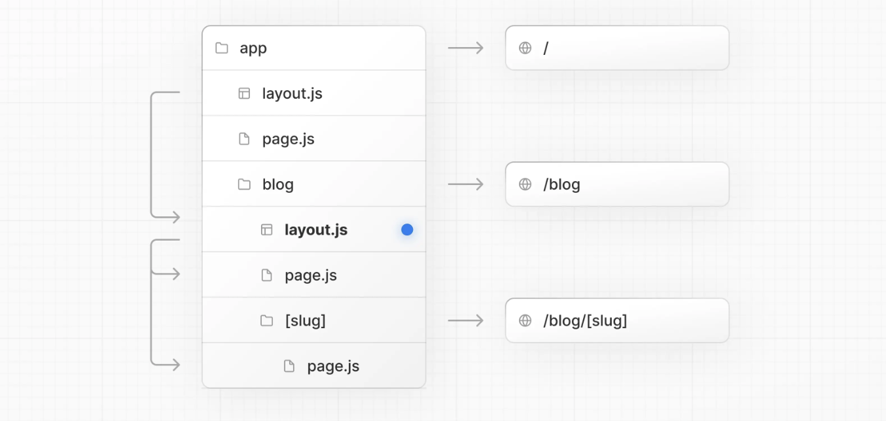
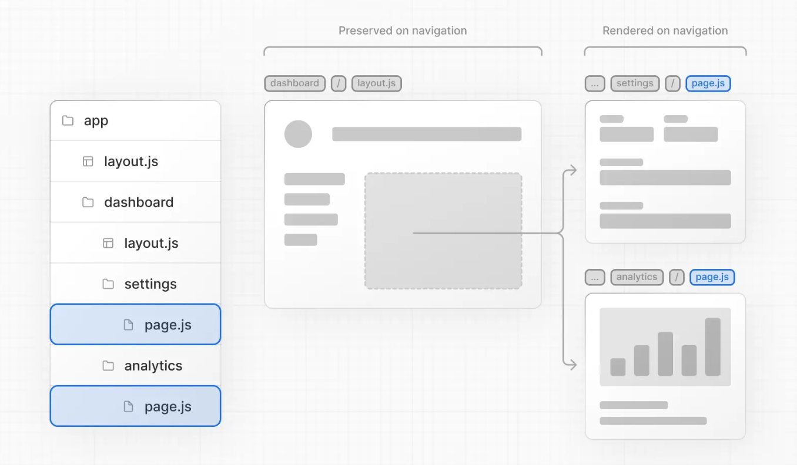
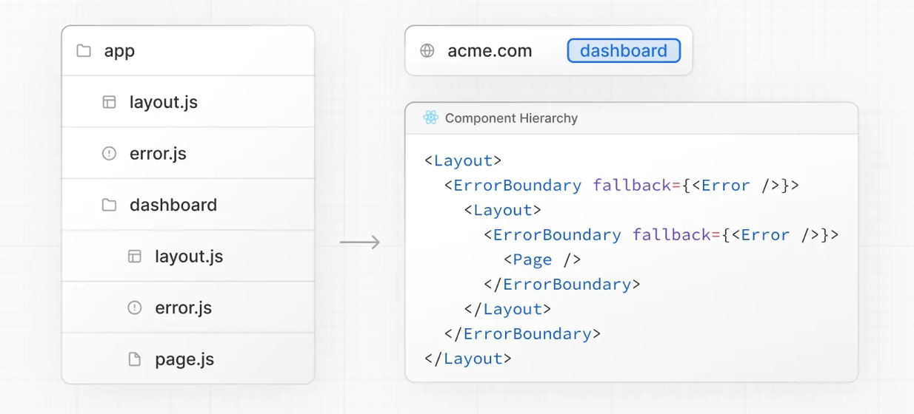
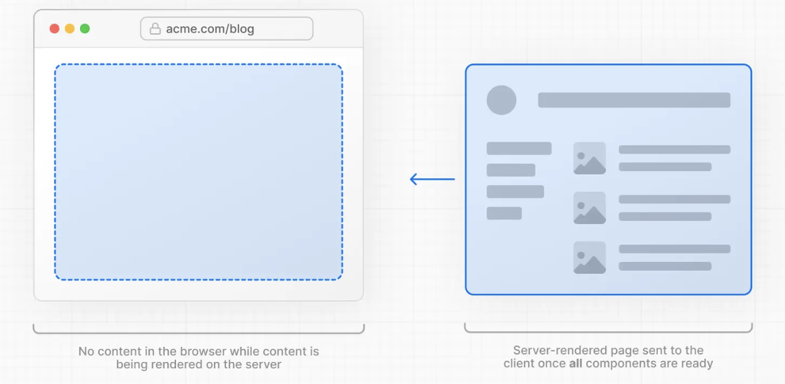
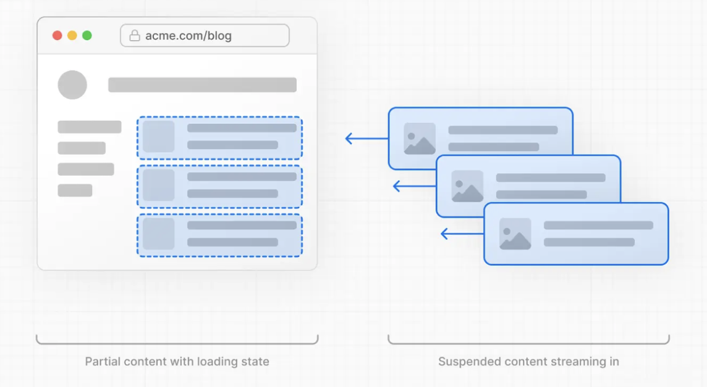
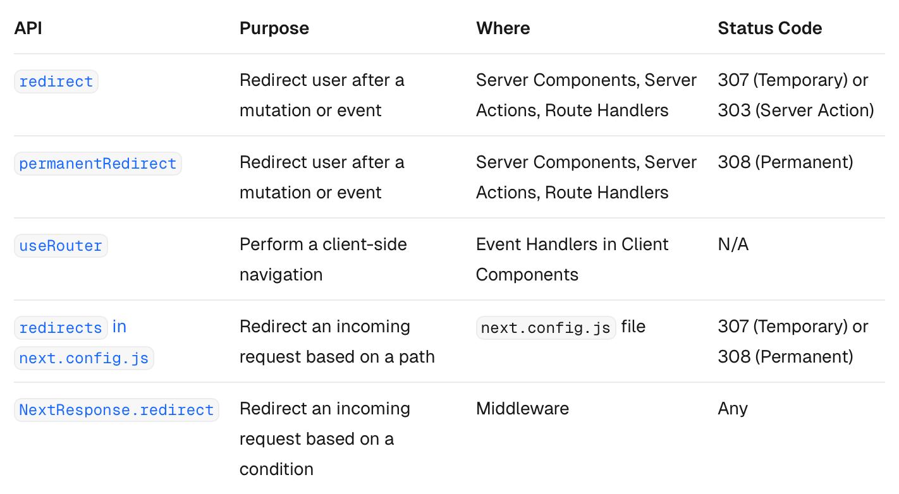

<h1> 📚 Next.js 4주차 학습정리

## 💡 How to create layouts and pages
- Next.js는 **파일 시스템 기반** 라우팅을 이용함. (폴더와 파일을 이용해서 라우트를 정의할 수 있다는 뜻)
    - Next.js에선 파일 이름과 위치만 잘 정하면 자동으로 URL 경로(route)를 만들어줌.

### 📍  Creating a page 
- **page** : 특정 경로(route)에 렌더링되는 UI. 
- Next.js에서는 app 폴더 안에 page.tsx 또는 page.js 파일을 만들고, 거기에 React 컴포넌트를 기본 export 하면 그게 곧 해당 경로의 페이지가 됨.

```
export default function Page() {
  return <h1>Hello Next.js!</h1>
}
```
- app 디렉토리 안에 page 파일을 만들고, 그 안에서 React 컴포넌트를 기본(default)으로 export


### 📍  Creating a layout
- **layout** : 여러 페이지에서 공유되는 UI (ex. 공통으로 사용되는 헤더, 네비게이션 바 등)
- 페이지를 이동해도 레이아웃은 상태를 유지하고, 인터랙티브한 상태도 그대로이며, 다시 렌더링되지 않음.

```
// app/layout.tsx
export default function RootLayout({ children }: { children: React.ReactNode }) {
  return (
    <html>
      <body>
        <header>공통 헤더</header>
        <main>{children}</main>   // <-- 여기에 인덱스 페이지가 들어감!
        <footer>공통 푸터</footer>
      </body>
    </html>
  );
}
```

```
// app/page.tsx (인덱스 페이지)
export default function HomePage() {
  return <div>여기가 인덱스 페이지야!</div>;
}
```

이렇게 해두면 브라우저에서 /에 접속했을 때 Next.js가 알아서

```
<RootLayout>
  <HomePage />
</RootLayout>
```

이런 구조로 자동으로 감싸서 보여준다. 

- layout.tsx는 외부 틀 (공통 구조)
- page.tsx는 내부 내용 (화면마다 달라지는 부분)

### 정리 
- app/layout.tsx는 모든 페이지의 기본 틀이 되는 루트 레이아웃
- 루트 레이아웃은 무조건 있어야 하고, 그 안에는 <html>과 <body> 태그를 직접 작성해야 함. -> Next.js가 이걸 바탕으로 전체 페이지 구조를 만들어줌.

### 📍 Creating a nested root

- **nested route(중첩 라우트)** : 여러개의 URL segment로 구성된 라우트 
  - ```/blog/[slug]```는 세개의 조각으로 나뉨. 
    - ```/``` : 루트 세그먼트
    - ```blog``` : 중간 세그먼트
    - ```[slug]``` : 마지막 세그먼트 <- 보통 동적 라우팅에 사용 

- Next.js에서는 
  - folders : URL 경로를 정의하는데 사용 (폴더 이름이 URL 경로의 한 부분이 된다)
  - files : 그 경로에서 보여질 UI를 만드는데 사용 

- 중첩 라우트를 이용하고 싶다면 폴더를 서로 중첩해서 사용하면 됨. 
  -  /blog 경로를 만들고 싶다면, app 디렉토리 안에 blog라는 폴더를 만들면 됨
  - /blog 경로를 실제로 열 수 있게 하려면, 그 blog 폴더 안에 page.tsx 파일을 추가!

```
/app
 └── blog
      └── page.tsx   ← 여기 파일이 실제로 /blog 페이지로 보이게 됨!
```

- 폴더 이름을 대괄호([ ])로 감싸면 **동적 라우트 세그먼트(dynamic route segment)** 가 만들어짐. 
  - 데이터를 기반으로 여러 개의 페이지를 만들 때 사용. (블로그 글, 제품 상세 페이지 등)

### 📍  Nesting Layouts
- 기본적으로 폴더 구조에 따라 layout도 중첩됨
- 중첩 레이아웃 구성 
  - 특정 경로(폴더)에 layout.tsx 파일을 추가하면, 그 경로에만 적용되는 레이아웃을 만들 수 있움.


-  두 개의 레이아웃(루트 레이아웃과 블로그 레이아웃)을 같이 사용한다면, ```app/layout.js```에 있는 루트 레이아웃이 ```app/blog/layout.js``` 에 있는 블로그 전용 레이아웃을 감싼다.
- 블로그 레이아웃은 ```/blog``` 페이지와 ```/blog/[slug]``` 페이지를 감싼다.

```
export default function BlogLayout({
  children,
}: {
  children: React.ReactNode
}) {
  return <section>{children}</section>
}
```
1. ```BlogLayout``` 이라는 레이아웃 컴포넌트 만든다 
  → 블로그 관련 페이지들에만 적용되는 틀이 되는 레이아웃

2. ```children``` : 이 레이아웃 안에 들어갈 실제 페이지 내용
  - ```/blog/page.tsx``` 나 ```/blog/[slug]/page.tsx``` 등

3. 브라우저에는 이렇게 렌더링됨
```
<section>
  <!-- blog/page.tsx 내용 -->
</section>
```


### 📍 Linking between Pages 
- Next.js에서는 <Link> 컴포넌트를 사용해서 페이지 간 이동을 할 수 있다.
  -  ```<Link> ``` : 기본 HTML ```<a>``` 태그를 확장한 Next.js 전용 컴포넌트
  - prefetching (미리 로딩하는 것)과 클라이언트 사이드 navigation 제공 

```
import Link from 'next/link';

<Link href="/blog">블로그로 이동</Link>

```
- next/link에서 <Link>를 불러오고, href 속성을 넣어줌.

- ```<Link>```는 Next.js 앱에서 경로 간 이동을 할 때 가장 기본적이고 권장되는 방법이지만, 좀 더 복잡한/동적인 이동이 필요할 때는  ```useRouter``` 훅을 사용할 수 있음. 


## 💡 Linking and Navigating
- 링크 연결과 페이지 이동 

#### Next.js 에서 페이지간 이동하는 방법 
1. ```<Link>``` 컴포넌트 사용 (→ 가장 기본적이고 추천)
2. ```useRouter``` 훅 사용 (클라이언트 컴포넌트에서만 사용 가능)
3. ```redirect()``` 함수 사용 (서버 컴포넌트에서 사용됨)
4. 브라우저의 기본 ```History API```를 직접 사용

---
### 📍 1. ```<Link>``` 컴포넌트 사용하기
- 위에서 설명함

### 📍 2. ```useRouter``` 훅 사용하기
-  useRouter 훅을 사용하면, 클라이언트 컴포넌트에서 프로그래밍적으로 경로를 변경할 수 있다.
  - ```<Link>``` : 클릭하면 자동으로 이동하는 (정적인) 방법
  - ```useRouter``` : 코드로 직접 이동시키는 (동적인) 방법

👀 경로를 이동할 때는 ```<Link>``` 컴포넌트를 사용하는 것을 적극 권장. (useRouter은 정말 필요할때만 써라!) -  *```<Link>```  가 Next.js가 최적화해서 처리해주는 기본 방식이라 가장 안정적이고 성능도 좋음* 

### 📍 3. ```redirect()``` 함수 사용하기
- ```redirect()``` 는 서버 컴포넌트 또는 서버 액션에서만 쓸 수 있는 함수로, 특정 경로로 강제 이동(리디렉션) 시킬 수 있음. 

- 브라우저에서 리다이렉트 되는 게 아니라, 서버에서 아예 다른 페이지로 응답을 돌려주기 때문에 사용자가 ```"/profile"``` 에 들어오더라도 자동으로 ```"/login"``` 이나 ```"/join"``` 으로 이동하게 만든다

#### import 하는 방법 
```
import { redirect } from 'next/navigation'
```

```
export default async function Profile({
  params,
}: {
  params: Promise<{ id: string }>
}) {
```
- params: URL에서 받은 값
  -  ```/profile/123``` 이라면 ```params.id === '123'```

```
  const { id } = await params
  if (!id) {
    redirect('/login')
  }
```
- id가 없다면 (즉, URL이 이상하거나 유저 정보가 없으면), **즉시 ```/login``` 페이지로 강제 이동시킴**

```
  const team = await fetchTeam(id)
  if (!team) {
    redirect('/join')
  }
```
- ```fetchTeam()``` 함수가 실패하거나 결과가 없다면, ```/join``` 으로 즉시 이동!

👀 ```redirect('/경로')``` 는 서버에서 조건 맞으면 (렌더링 없이) 즉시 이동시기 때문에 서버 컴포넌트에서 로그인 체크, 권한 검사, 데이터 존재 여부 등 처리할 때 사용하면 좋음. 

👍🏻  Good to Know
1. redirect는 기본적으로 307 (임시 리디렉션) 상태 코드를 반환한다. 서버 액션에서 사용될 경우에는 303 (다른 위치 보기) 상태 코드를 반환하며, 이는 주로 POST 요청 후 성공 페이지로 리디렉션할 때 사용된다.
2. redirect는 내부적으로 에러를 발생시키므로, try/catch 블록 밖에서 호출해야 한다.
3. redirect는 렌더링 중인 클라이언트 컴포넌트에서는 호출할 수 있지만, 이벤트 핸들러 안에서는 사용할 수 없다. 이런 경우에는 useRouter 훅을 대신 사용할 수 있다.
4. redirect는 **절대 경로(URL)**도 받을 수 있으며, 이를 통해 외부 링크로도 리디렉션이 가능하다.
5. 렌더링 전에 리디렉션을 하고 싶다면, next.config.js 또는 Middleware를 사용해야 한다.


### 📍 4. 브라우저의 기본 ```History API```를 직접 사용하기
- Next.js는 기본 브라우저 API인 ```window.history.pushState``` 와 ```window.history.replaceState``` 메서드를 사용할 수 있게 해주며, 이 메서드들을 통해 페이지를 새로 고침하지 않고도 브라우저의 히스토리 스택을 업데이트할 수 있음.

- 이 ```pushState```와 ```replaceState``` 호출은 Next.js의 라우터 시스템과도 통합되어 있어서 ```usePathname```이나 ```useSearchParams``` 같은 훅과 함께 연동해서 사용할 수도 있음. 

### ```window.history.pushState ```
- 브라우저의 히스토리 스택에 새로운 항목을 추가할 때 사용
- 사용자는 뒤로 가기 버튼을 눌러 이전 상태로 돌아감.


### ```window.history.replaceState```
- 브라우저의 히스토리 스택에서 현재 항목을 교체할 때 사용
- 사용자는 이전 상태로 되돌아갈 수 없음


## 📍 How Routing and Navigation Works
- App Router는 라우팅과 내비게이션을 처리할 때 **하이브리드 방식(서버 + 클라이언트 혼합)** 을 사용함. 

- **서버** 에서는 애플리케이션 코드가 라우트 세그먼트 단위로 자동으로 코드 분할됨.
  - 경로별로 필요한 코드만 나눠서 로딩한다는 의미 
- **클라이언트** 에서는  Next.js가 라우트 세그먼트를 미리 불러오고(prefetch) 캐싱까지 해둠. 
  - 바뀐 라우트 세그먼트만 다시 렌더링되기 때문에, 내비게이션 경험과 성능이 향상

⚡️ Next.js 의 App Router는 1. 서버에서 코드 분할, 2. 클라이언트에서 미리 로드와 캐싱, 3. 그리고 필요한 부분만 렌더링하는 구조로 빠르고 부드럽게 페이지 전환 가능하게 해줌.

- **Route Segment** : URL 경로의 각 부분을 의미하는 단위

---
### 1. 코드 분할 
- 애플리케이션 코드를 작은 번들로 나눠서 브라우저가 필요한 것만 다운로드하고 실행할 수 있게 해주는 기술. 
- 각 요청마다 전송되는 데이터량이 줄고 실행 시간도 줄어들어서 성능을 향상시킬 수 있음.

📌  Next.js의 **서버 컴포넌트(Server Components)** 는 이걸 자동으로 처리해줌.
 - 라우트 세그먼트 단위로 코드를 자동 분할해주기 때문에, 사용자가 어떤 페이지로 이동할 때 그 경로에 필요한 코드만 로딩됨.

### 2. Prefetching (사전에 불러오기)
- 사용자가 아직 방문하지 않았더라도, 백그라운드에서 해당 경로에 대한 데이터를 미리 불러오는 기능

#### Next.js에서 prefetching이 일어나는 방식 
- ```<Link>``` 컴포넌트 사용 시: Link가 뷰포트(화면)에 보이면 자동으로 해당 경로를 미리 로드해줌.
  - 페이지 처음 로딩 시, 또는 스크롤해서 화면에 들어올 때 prefetch가 발생!
- ```router.prefetch()``` 사용 시: useRouter 훅을 이용하면, 프로그래밍적으로 prefetch를 제어 가능 (ex. 버튼 클릭 시 특정 경로를 미리 로드)


- ```Link``` 의 prefetch 동작은 상황에 따라 조금 달라진다. 
  - prefetch 속성을 명시하지 않거나 null로 둔 경우 : 
    - loading.js가 처음 나오는 시점까지의 layout만 prefetch되고, 나머지는 안 함.
    - 즉, 공통 레이아웃까지만 미리 캐싱되고, 전체 동적 페이지 전체를 미리 다 가져오는 것은 아님. 
    - 비용이 줄어들고, 대신 사용자에겐 로딩 상태를 보여줄 수 있다는 장점이 있음

- ```prefetch``` 옵션 제어
  - ```prefetch={false}``` → 미리 불러오지 않음
  - ```prefetch={true}``` → 로딩 경계를 넘어 전체 페이지 데이터까지 prefetch함

👀 Prefetching은 개발 환경에서는 X. 배포 환경에서만 O

### 3. Caching
- Next.js에는 **Router Cache(라우터 캐시)** 라고 불리는 클라이언트 메모리 기반의 캐시가 있음.
- 사용자가 앱 내에서 페이지를 이동할 때, 미리 불러온(route prefetch된) 라우트 세그먼트나 이미 방문한 페이지의 React Server Component Payload가 이 캐시에 저장됨. 

- 사용자가 다른 페이지로 이동할 때 서버에 새로 요청을 보내는 대신 **이미 캐시에 있는 데이터를 최대한 재사용** 한다는 뜻
  - 불필요한 요청과 데이터 전송이 줄어들기 때문에 성능이 향상됨. 

### 4. Partial Rendering
- 페이지를 이동할 때 **변경된 라우트 세그먼트만** 클라이언트에서 다시 렌더링되고, 공유된 세그먼트는 그대로 유지되는 것을 의미. (= 변하는 세그먼트만 새로 렌더링되고, 공통된 부모 레이아웃은 그대로 유지!)

- ```/dashboard/settings``` → ```/dashboard/analytics``` 로 이동할 경우:
  - settings 페이지 : unmount(제거)됨
  - analytics 페이지 : 새 상태로 mount(생성)됨
  - 둘이 공유하고 있는 dashboard 레이아웃 : 유지됨.

- 동적 세그먼트 내의 페이지 전환에서도 동일하게 작동한다. ```/blog/[slug]/page ``` 구조에서 ```/blog/first``` → ```/blog/second```로 이동할 때: 
  - 공통된 ```/blog``` 레이아웃은 유지됨
  - ```[slug]```에 해당하는 콘텐츠만 바뀜! 



- partial rendering이 없으면 페이지를 이동할 때마다 클라이언트에서 전체 페이지가 다시 렌더링 되어야 함..

### 5. Soft Navigation
- Hard Navigation : 브라우저는 일반적으로 hard navigation을 수행. 
  - 전체 페이지를 새로 불러오고 렌더링.

#### 📌 Next.js의 App Router
 - Soft Navigation을 가능하게 함.
 - 바뀐 라우트 세그먼트만 다시 렌더링하는 부분 렌더링(partial rendering)을 지원. 

 - 페이지 간 이동을 하더라도 클라이언트 측의 React 상태가 유지될 수 있음. (ex. 입력한 폼 내용, 탭 선택 상태 등)


### 6. Back and Forward Navigation
Next.js에서 backwards and forwards navigation 할 때 
 -  스크롤 위치를 그대로 유지
 - 라우터 캐시에 저장된 라우트 세그먼트도 재사용

### 7. Routing between ```pages/``` and ```app/```
- ```pages/```에서 ```app/```으로 점진적으로 마이그레이션할 때, 라우터는 두 디렉토리 간의 hard navigation을 자동으로 처리해줌. 

- Next.js : ```pages/``` → ```app/``` 으로 전환되는 시점을 감지하기 위해 클라이언트 라우터 필터를 사용함. 이는 확률적(probabilistic) 방식으로 ```app/``` 라우트를 체크함.
  - ( Next.js가 ```pages/``` → ```app/``` 으로 이동하는 라우팅 상황에서 "이 경로가 app/ 라우트인지 아닌지" 이걸 매번 100% 정확히 서버에 요청하거나, 전체 라우트 정보를 다 들고 있지 않고도 거의 정확하게 예측할 수 있는 알고리즘을 사용한다고 합니다 )
  - 가끔 잘못 감지할 수 있는데 그 확률은 매우 희박 

- 확률은 ```next.config.js``` 의 ```experimental.clientRouterFilterAllowedRate``` 옵션을 통해 조절할 수 있는데, false positive 확률을 낮추면 필터 자체가 커져서 클라이언트 번들의 크기가 증가하게 된다는 점도 고려해야 함. 

- 자동 처리를 완전히 비활성화하고, ```pages/``` ↔ ```app/``` 사이의 라우팅을 직접 수동으로 관리하고 싶다면, ```next.config.js```에서 ```experimental.clientRouterFilter```를 ```false```로 설정하면 된다. 하지만, 이 기능을 끄면 ```pages/```에서 정의된 동적 라우트가 ```app/```의 라우트와 겹친다면 기본적으로는 그 경로로 제대로 이동되지 않을 수 있으니 주의해야 함. 


# 💡 Error Handling
- 에러는 크게 두 가지로 나눌 수 있다
  1. 예상 가능한 에러 (expected errors)
    - 예상 가능한 에러는 **"값으로 처리"** 하는 게 좋다.
    - Server Action 안에서 예상 가능한 에러를 ```try/catch``` 로 잡지 말고, 에러(실패했을 때의 결과)를 반환값으로 모델링하는 것이 좋음.
    - 클라이언트에서는 ```useActionState``` 훅으로 그 에러 값을 받아서 처리
    - 사용자 입력 오류, 유효성 검사 실패 등

  2. 예상하지 못한 예외 (uncaught exceptions)
    - 예상치 못한 에러는 **"에러 바운더리"** 로 처리 (```error.tsx```, ```global-error.tsx``` 같은 파일을 이용)
    - 렌더링 중 발생하는 치명적인 에러들 : **fallback UI(대체 화면)** 로 처리
    - ```error.tsx``` → 해당 라우트에서 에러 나면 보여줄 컴포넌트
    - ```global-error.tsx``` → 앱 전체에서 에러 나면 보여줄 컴포넌트
    
    ❗️ 에러 바운더리 : 어떤 컴포넌트 안에서 에러가 발생했을 때앱 전체가 하얗게 뻗지 않도록 "여기까지만 깨지고, 나머지는 멀쩡하게 보여줘!" 라고 해주는 장치

    ❗️ Next.js의 App Router에서는 특정 경로마다 에러 바운더리를 만들 수 있음.


## 📍  Handling Expected Errors

**Expected Errors**  : 애플리케이션이 정상적으로 작동하는 도중에 충분히 발생할 수 있는 에러
- 예시
   - 서버 측 폼 유효성 검사에서 발생하는 오류
   - API 요청 실패처럼 예상 가능한 실패 상황
- 처리 방법
  -  명시적으로 처리하고 클라이언트로 반환해주는 방식으로 다뤄야 함.
  - try/catch로 무작정 잡는 게 아니라, 값처럼 다뤄서 사용자에게 피드백을 줄 수 있도록 하는게 좋다는 의미. 

### 📚 서버 액션(Server Actions)에서 예상 가능한 에러를 처리하는 방법
- ```useActionState``` 훅을 사용하면, 서버 액션의 실행 결과(성공/실패)를 포함한 상태를 관리할 수 있고, 이는 특히 예상 가능한 에러 처리에도 적합하다

- 방식
  - throw new Error('유효하지 않음') ❌
  - return { success: false, message: '유효하지 않음' } 🅾️ 
  - 반환값을 통해 클라이언트에 에러 정보를 전달하고, 클라이언트에서는 useActionState로 그걸 받아서 UI에 반영!


### 📚 예상하지 못한 예외 
- 애플리케이션의 정상적인 흐름에서는 발생하지 말아야 할 버그나 문제를 의미.
- 이런 에러들은 throw로 예외를 발생시키고, **에러 바운더리(Error Boundaries)** 가 그걸 받아서 처리하는게 좋음 

- 처리 방법
  - 일반적인 경우: root layout 바로 아래에서 발생하는 에러는 ```error.js```로 처리 
    - ex. ```/app/error.js```
  - 선택적인 경우 (세분화된 처리): 특정 경로(세그먼트)에서만 에러를 다루고 싶다면 중첩된 ```error.js``` 파일을 사용
    - ex. ```/app/dashboard/error.js```
  - 드물지만 가능한 경우: root layout 자체에서 에러가 발생한 경우에는  ```global-error.js```를 사용해서 처리
    - ```/app/global-error.js```


#### 📌 Using Error Boundaries
 - 에러 바운더리는 자식 컴포넌트에서 발생한 에러를 잡아서 전체 컴포넌트 트리가 깨지는 대신 **대체 UI(fallback UI)** 를 보여줌.
 - ```라우트 세그먼트(route segment)``` 안에 ```error.tsx``` 파일을 만들고 React 컴포넌트를 export

 - 에러가 상위 에러 바운더리로 전파되게 하고 싶다면 에러 컴포넌트를 렌더링할 때 throw를 사용하면 됨. (현재 라우트에서 에러가 발생했을 때 해당 ```error.tsx``` 를 직접 처리하지 않고, 그 에러를 부모 컴포넌트의 에러 바운더리로 넘기고 싶다면, ```error.tsx``` 안에서 다시 에러를 throw해줌)


#### 📌 Handling Errors in Nested Routes
- 에러는 가장 가까운 상위 에러 바운더리로 전파되기 때문에 에러가 발생하면 가장 가까운 ```error.tsx``` 가 있는 곳에서 잡힘.
  - 라우트 계층 구조에서 error.tsx 파일을 다양한 위치에 배치해서 세분화된(granular) 에러 처리를 할 수 있음!



#### 📌 Handling Global Errors
(일반적이진 않음) 
- **루트 레이아웃(root layout)** 에서 발생한 에러는 app 디렉토리 최상단에 위치한 ```app/global-error.js``` 파일로 처리 가능

- Global error UI는 루트 레이아웃 자체를 대체하기 때문에 반드시 자신만의 ```<html>```과 ```<body>``` 태그를 포함해야함. ( = 일반적인 ```error.js```와는 달리 전체 문서 구조를 직접 만들어야 함)

# 💡 Loading UI and Streaming 


- ```loading.js``` : React Suspense 기능과 함께 의미 있는 로딩 UI를 만들어주는 Next.js의 파일 
- ```loading.js``` 파일을 이용하면 특정 라우트 세그먼트의 콘텐츠가 로드되는 동안 서버에서 즉시 로딩 화면을 보여줄 수 있음. 콘텐츠가 모두 렌더링 된 이후에는 로딩 UI는 자동으로 사라지고, 새 컨텐츠로 교체됨. 

⚡️ **React Suspense** 
 : 비동기 작업이 끝날 때까지 기다리는 동안, 대신 보여줄 UI를 설정할 수 있게 해주는 기능

 ```
 import { Suspense } from 'react'

<Suspense fallback={<div>로딩 중...</div>}>
  <SomeComponent />  // 비동기 데이터가 필요한 컴포넌트
</Suspense>
```
- Next.js App Router에서는 기본적으로 Suspense를 기반으로 작동함
- 복잡한 if문 안 써도 되고, 컴포넌트 단위로 기다릴 수 있기 때문에 좋음. 


## 📍 Instant Loading States
- 페이지 이동이 시작되자마자 바로 보여지는 fallback UI를 의미.
- 뭔가 로딩되고 있다는 걸 즉시 시각적으로 보여주는 화면! 
- 미리 렌더링해둘 수 있는 요소들 
  - 스켈레톤 UI / 로딩 스피너
  - 앞으로 보여질 화면의 일부 정보 (ex. 커버 사진, 제목)

- 이를 통해 사용자는 앱이 잘 작동 중이라는 걸 인지할 수 있고, 훨씬 **더 나은 사용자 경험(UX)** 을 제공할 수 있음.

### 사용 방법 
- 해당 폴더 안에 ```loading.js``` 파일을 추가
  - Next.js는 이 파일을 자동으로 인식해서, 해당 페이지가 완전히 준비되기 전까지 이 파일을 먼저 보여줌. 

- ```layout.js```, ```loading.js```, ```page.js```가 같은 폴더에 있을 때, Next.js가 내부적으로 아래처럼 구성해주기 때문에 자동으로 부분 로딩 + 자연스러운 UI 전환 구현 가능 

```
<Layout>
  <Suspense fallback={<Loading />}>
    <Page />
  </Suspense>
</Layout>
```

👍🏻  Good to Know
1. 서버 중심 라우팅을 사용하더라도, 페이지 전환은 즉시 반응한다.
2. 페이지 전환은 중단 가능하다. 즉, 한 경로의 콘텐츠가 완전히 로드되기 전에 다른 경로로 이동할 수 있다.
3. 새로운 라우트 세그먼트가 로드되는 동안에도, 공유된 레이아웃은 계속 인터랙티브하게 동작한다.


## 📍 Streaming with Suspense
- ```loading.js``` 를 사용하는 것 외에도, 직접 ```<Suspense>``` 바운더리를 만들어서 자신만의 UI 컴포넌트에 적용할 수도 있음.
- Next.js의 App Router는 ```<Suspense>``` 를 활용한 스트리밍(render-as-you-fetch)을 지원하기 때문에 비동기 컴포넌트나 느리게 로딩되는 UI를 유연하게 분리해서 렌더링할 수 있음.

### ✨ Streaming이 무엇인가?
- Streaming이 어떻게 작동하는지를 이해하기 전에, 먼저 SSR(서버 사이드 렌더링)의 개념과 그 한계를 아는 것이 좋다. 

### 1. SSR의 작동 방식 
1. 해당 페이지에 필요한 모든 데이터를 서버에서 먼저 불러온다.
2. 서버가 데이터를 바탕으로 HTML을 렌더링한다.
3. 렌더링된 HTML, CSS, JavaScript가 클라이언트(브라우저)로 전송된다.
4. 브라우저는 HTML과 CSS를 이용해 비상호작용 UI를 먼저 보여준다.
5. React가 이 UI를 ```hydrate``` 해서 상호작용 가능하게 만든다.

### 2. SSR의 한계 
- 이 단계들은 순차적이고 서로를 블로킹함. 
  - 서버는 **모든 데이터** 를 먼저 받아야 HTML을 렌더링할 수 있음
  - 클라이언트는 모든 컴포넌트 코드가 로딩되어야 React가 상호작용 가능한 UI로 만들 수 있음
- 데이터가 느리면 전체 페이지 렌더링이 지연될 수 있음

### 3. React & Next.js의 SSR의 효과 
- 사용자에게 빠르게 페이지의 기본 형태(HTML)를 보여줌
- 지각적인 로딩 속도 향상 



#### ❗️ 하지만 SSR은 모든 데이터를 서버에서 다 가져와야만 페이지를 보여줄 수 있어서 대기 시간이 길어질 수 있다!


### ✨ Streaming
- Streaming은 페이지의 HTML을 작은 조각으로 나눠서 서버에서 클라이언트로 점진적으로 전송할 수 있게 해줌. 
- 따라서 모든 데이터가 준비되기 전이라도 일부 UI를 먼저 보여줄 수 있음




#### Streaming은 React의 컴포넌트 모델과 잘 어울린다. 
- React는 UI를 컴포넌트 단위로 나누기 때문에 컴포넌트를 하나의 조각처럼 보고, 우선순위에 따라 먼저 보내거나 나중에 보낼 수 있음
  - 우선순위 높은 컴포넌트 (ex. 제품 정보, 레이아웃) → 먼저 렌더링
  - 우선순위 낮은 컴포넌트 (ex. 리뷰, 추천 상품) → 나중에 데이터 받아서 렌더링

### Streaming의 이점
- 느린 데이터 요청 때문에 전체 페이지가 늦게 뜨는 것을 막아줌.

| 지표 | 의미 | Streaming의 효과 |
|------|------|-------------------|
| **TTFB** | 첫 응답 도착 시간 | 조각으로 먼저 보내서 **더 빠름** |
| **FCP**  | 눈에 보이는 콘텐츠 | 중요한 콘텐츠 먼저 보여줘서 **더 빠름** |
| **TTI**  | 상호작용 가능 시간 | 느린 기기에서도 먼저 뜬 부분부터 **바로 사용 가능** |

- TTFB : Time To First Byte 
  - 아무것도 없는 흰 화면에서 뭔가 나오는 화면까지 기다리는 시간이 짧아짐
- FCP : First Contentful Paint
  - 우선순위 높은 콘텐츠(예: 제목, 썸네일)를 먼저 보내기 때문에 화면에 눈에 보이는 요소가 빨리 그려짐 (사용자는 "페이지가 빨리 떴다"는 착각을 하게 됨)
- TTI : Time to Interactive
  - 느린 네트워크, 느린 휴대폰에서도 사용자가 빨리 "버튼 클릭"이나 "탭 전환" 같은 동작을 할 수 있게 됨. (핵심 인터렉션 요소를 먼저 로드할 수 있기 때문)

### ✨  Example 
- ```<Suspense>``` : 비동기 작업(ex. 데이터 fetch)을 수행하는 컴포넌트를 감싸는 방식으로 동작함.
- 이 작업이 진행되는 동안에는 스켈레톤, 스피너 등 fallback UI를 보여주고, 작업이 완료되면 원래 컴포넌트로 바꿔서 보여줌.

#### Suspense 사용의 이점 
- Streaming Server Rendering : 서버에서 클라이언트로 HTML을 점진적으로 렌더링할 수 있다.
- Selective Hydration : React는 사용자와의 상호작용 우선순위에 따라 컴포넌트를 인터랙티브하게 만드는 순서를 조절한다. (먼저 필요한 컴포넌트를 먼저 하이드레이션함)


###  SEO
- ```Next.js``` 는 ```generateMetadata``` 함수 안에서 데이터 패칭이 완료될 때까지 기다린 후에 UI 스트리밍을 클라이언트로 시작함.
  - 스트리밍 응답의 가장 첫 부분에 <head> 태그가 반드시 포함되도록 보장할 수 있음.

- 스트리밍은 서버 사이드 렌더링(SSR) 기반이기 때문에 SEO에 영향을 주지 않는다.
  - 검색 엔진 최적화에는 문제가 없다는 의미

### Status Code
- 스트리밍을 사용할 때는, 요청이 성공했다는 것을 나타내기 위해 항상 200 상태 코드가 반환됨. 

- 그럼에도 불구하고, 서버는 여전히 스트리밍되는 콘텐츠 안에서 에러나 문제 상황을 클라이언트에 전달할 수 있음. 
  - ```redirect()```나 ```notFound()``` 같은 함수를 사용하는 경우

- 하지만 이미 응답 헤더(즉, 상태 코드 등)가 클라이언트로 전송된 이후에는 응답의 상태 코드를 변경할 수 없다. 즉, HTML 본문에서 에러를 보여줄 순 있지만,
상태 코드는 여전히 200인 상태로 유지된다. 

- 검색 엔진은 HTML 콘텐츠를 기반으로 잘 인식할 수 있기 때문에 SEO에는 영향을 주지 않는다. 


# 💡 Redirecting
- Next.js에는 리디렉션을 처리할 수 있는 방법이 여러 가지 있다. 




## 📍 ```redirect``` function
- ```redirect``` 함수는 사용자를 다른 URL로 리디렉션(이동)시킬 수 있도록 해주며, 다음과 같은 곳에서 사용할 수 있다. 
  - 서버 컴포넌트(Server Components)
  - 라우트 핸들러(Route Handlers)
  - 서버 액션(Server Actions)


#### 👍🏻 Good to Know
1. ```redirect```는 기본적으로 307 (임시 리디렉션) 상태 코드를 반환한다.
서버 액션에서 사용할 경우에는 303 (다른 위치 보기) 상태 코드를 반환하는데 
이는 보통 POST 요청 후 성공 페이지로 리디렉션할 때 사용된다.
2. ```redirect```는 내부적으로 에러를 발생시키는 방식으로 동작하기 때문에,
try/catch 블록 바깥에서 호출해야 한다.
3. ```redirect```는 클라이언트 컴포넌트의 렌더링 과정 중에는 호출할 수 있지만 이벤트 핸들러 내부에서는 사용할 수 없다. 이런 경우에는 대신 useRouter 훅을 사용해야 한다.
4. ```redirect```는 절대 경로(ex. https://example.com)도 허용하며,
외부 링크로 리디렉션하는 데도 사용할 수 있다.
5. 렌더링이 시작되기 전에 리디렉션을 하고 싶다면,
next.config.js나 Middleware를 사용해야 한다.

## 📍 ```permanentRedirect``` function
- ```permanentRedirect``` 함수는 사용자를 다른 URL로 영구적으로 리디렉션(이동)시킬 수 있도록 해준다.
- 서버 컴포넌트(Server Components), 라우트 핸들러(Route Handlers), 서버 액션(Server Actions)에서 사용 가능. 

- 보통 entity(데이터)의 고유 URL이 바뀌는 이벤트 이후에 사용되는데, 사용자가 자기 아이디(또는 닉네임)를 변경한 후 그에 따라 프로필 URL이 바뀌는 경우 예전 URL에서 새 URL로 영구 리디렉션할 때 유용하게 사용됨. 

#### 👍🏻 Good to Know
1. ```permanentRedirect``` 는 기본적으로 308 (영구 리디렉션) 상태 코드를 반환한다.
2. ```permanentRedirect``` 는 절대 URL도 허용되며, 외부 링크로 리디렉션하는 데에도 사용할 수 있다.
3. 렌더링이 시작되기 전에 리디렉션을 하고 싶다면, ```next.config.js```나 Middleware를 사용해야 한다.


## 📍 ```useRouter()``` hook
- 클라이언트 컴포넌트의 이벤트 핸들러 안에서 리디렉션이 필요하다면 ```useRouter``` 훅의 ```push``` 메서드를 사용하면 된다.
  - ex. 버튼 클릭 시 특정 페이지로 이동하는 경우가 이에 해당해.

- ```useRouter``` : 클라이언트 컴포넌트 안에서 라우팅을 프로그래밍적으로 제어할 수 있게 해주는 훅 (버튼을 눌렀을 때 코드로 "이 페이지로 가!" 하고 직접 명령 내리는 방법)

- ```useRouter().push('/경로')``` 을 이용하면 사용자를 원하는 경로로 이동시킬 수 있음. 

#### 👍🏻 Good to Know
사용자를 프로그래밍적으로 이동시킬 필요가 없다면, 그냥 ```<Link>``` 컴포넌트를 사용하는 것이 더 적절하다. (정적인 내비게이션에서는 ```<Link>```가 가장 권장되는 방식임)

## 📍 ```redirects``` in ```next.config.js```
- ```next.config.js``` 파일의 ```redirects``` 옵션은 들어오는 요청 경로를 다른 목적지 경로로 리디렉션할 수 있도록 해줌.

#### 유용하게 사용할 수 있는 경우 
- 페이지의 URL 구조를 변경했을 때
- 미리 정해진 리디렉션 목록이 있을 때 

#### 특징
- ```redirects``` 는 ```경로(path)```, ```헤더(header)```, ```쿠키(cookie)```, ```쿼리 파라미터(query)``` 등의 조건에 따라 리디렉션을 처리할 수 있기 때문에 요청에 따라 유연하게 사용자 리디렉션을 설정할 수 있다. 

```
import type { NextConfig } from 'next'
 
const nextConfig: NextConfig = {
  async redirects() {
    return [
      // Basic redirect
      {
        source: '/about',
        destination: '/',
        permanent: true,
      },
      // Wildcard path matching
      {
        source: '/blog/:slug',
        destination: '/news/:slug',
        permanent: true,
      },
    ]
  },
}
 
export default nextConfig
```

- ```next.config.js``` 파일에 ```redirects``` 옵션을 추가해서 사용 가능. 

#### 👍🏻 Good to Know
1. redirects는 permanent 옵션을 사용하여 307 (임시 리디렉션) 또는 308 (영구 리디렉션) 상태 코드를 반환할 수 있다.
2. redirects는 플랫폼에 따라 제한이 있을 수 있다. 예를 들어, Vercel에서는 리디렉션이 최대 1,024개로 제한된다.
3. 1,000개 이상의 리디렉션을 관리하려면, Middleware를 사용한 맞춤형(custom) 솔루션을 고려해야 한다.
4. redirects는 Middleware보다 먼저 실행된다.

## 📍 ```NextResponse.redirect``` in Middleware
(간단 설명) 
- middleware : 요청(request)이 서버에 도달했을 때, 페이지가 보여지기 전에 실행되는 중간 코드

  - 사용자가 어떤 페이지를 열려고 할 때, 페이지를 보여주기 전에 사용자의 로그인 여부를 먼저 검사하고, 로그인 안 했으면 ```/login```으로 리디렉션(강제 이동) 시킬 수 있는데, 이런 걸 Middleware에서 처리! 

(공식문서)
- Middleware는 요청이 완료되기 전에 코드를 실행할 수 있게 해줌.
- 들어오는 요청을 기반으로 NextResponse.redirect를 사용하여 다른 URL로 리디렉션할 수 있음. 

- 인증, 세션 관리 등의 조건에 따라 사용자를 리디렉션하고 싶을 때나 리디렉션이 많은 경우에 유용하게 사용됨. 

#### ❗ 리디렉션이 많을 때 왜 Middleware가 유용한 이유..?
-  기존 방식: `next.config.js`의 `redirects` 옵션

- Next.js에서는 기본적으로 `next.config.js`에서 리디렉션을 선언적으로 설정한다:

```js
// next.config.js
redirects: [
  { source: '/a', destination: '/b', permanent: true },
  { source: '/old-page', destination: '/new-page', permanent: false },
  ...
]
```

**문제점**
- Vercel 기준 최대 1,024개의 리디렉션 제한
- 조건 기반 리디렉션(쿠키, 쿼리, 헤더 등)이 어려움

**대안 : Middleware**
- Middleware는 자바스크립트 코드로 요청을 처리하므로 리디렉션 갯수에 제한이 없고 조건문을 자유롭게 사용할 수 있어 매우 유연함 

```
// middleware.ts
import { NextResponse } from 'next/server'
import type { NextRequest } from 'next/server'

const redirectionMap = {
  '/old-1': '/new-1',
  '/old-2': '/new-2',
  '/old-3': '/new-3',
  // ... 수천 개 가능
}

export function middleware(request: NextRequest) {
  const url = new URL(request.url)
  const redirectTarget = redirectionMap[url.pathname]

  if (redirectTarget) {
    return NextResponse.redirect(new URL(redirectTarget, request.url))
  }

  return NextResponse.next()
}
```


- ```next.config.js```의 ```redirects``` : 간단하고 선언적이지만 	1024개 제한, 조건 처리 어려움.
- ```Middleware``` : 갯수 제한 없음, 조건 처리 가능 but	직접 코드 
작성 필요


#### 👍🏻 Good to Know
- Middleware는 `next.config.js`의 redirects가 실행된 후, 그리고 페이지가 렌더링되기 전에 실행된다.


## 📍 Managing redirects at scale (advanced)
### ⭐️ Pass (하준오빠가 안해도 된다 했음 - "프로젝트 하면서 middleware를 실제로 사용해보고 거기서 redirect 간단히 구현해보고 다시 공부해봐라~") 

- 1,000개 이상의 리디렉션을 관리하려면 Middleware를 이용해 커스텀 솔루션을 만드는 것을 고려할 수 있는데, 이렇게 하면 애플리케이션을 다시 배포하지 않고도 리디렉션을 유연하게 처리할 수 있다. (리디렉션을 외부에서 불러오거나 업데이트 가능)

**고려해야 할 사항들** :
1. 리디렉션 맵(redirect map)을 생성하고 저장할 방법 
  - Redirect map(리디렉션 맵) : 리디렉션 목록을 담고 있는 자료 구조
 - 보통 데이터베이스 (특히 key-value 저장소, ex. Redis) 또는 JSON 파일로 저장. 

2. 요청이 들어올 때 빠르게 매핑 정보를 조회할 수 있도록 최적화 
 - 키 기반 검색, 캐싱, 효율적인 자료구조 사용 등


## 💡 Route Groups 
- `app` 디렉토리에서는 일반적으로 중첩된 폴더 구조가 URL 경로로 그대로 매핑됨. 

```
/app/blog/page.tsx → /blog
/app/dashboard/settings/page.tsx → /dashboard/settings
```
- 하지만 특정 폴더를 “Route Group”으로 지정하면 그 폴더 이름은 URL 경로에 포함되지 않는다. 

- 이 방식을 사용하면 폴더 구조는 논리적으로 깔끔하게 정리하면서도, URL은 간결하게 유지할 수 있기 때문에 유용하다. 

#### Route Group이 유용한 경우 
- 사이트 섹션, 기능, 팀별로 라우트를 나눠 관리하고 싶을 때
- 같은 라우트 세그먼트 내에서 중첩 레이아웃을 구성하고 싶을 때
- 특정 경로만 layout 적용 대상에 포함시키고 싶을 때
- 특정 경로만 loading skeleton 보여주고 싶을 때

#### 사용 방법 
```
/app
 └── (admin)
       └── dashboard
            └── page.tsx → /dashboard
```
이렇게 하면 구현할 수 있다고 합니다 

### (추가 설명) - Route Group의 의미와 사용 
📌 폴더 구조와 URL 경로를 분리한다는 뜻 ! 
- Route Group은 괄호 ( )로 감싼 폴더이고, 이 폴더는 URL 경로에는 나타나지 않지만 Next.js 내부에서 “구조 구분”에는 확실히 사용된다. 

예제 상황 
- `/products` 라는 페이지에 대해: 어떤 경우엔 로딩 스피너가 필요하고 어떤 경우엔 바로 페이지를 렌더링하고 싶다고 가정

```
/app
 ├── (with-loading)
 │    └── products
 │         ├── loading.tsx     ← ✅ 여긴 스켈레톤 포함
 │         └── page.tsx
 │
 └── (no-loading)
      └── products
           └── page.tsx        ← ✅ 여긴 loading 없음
```

- (with-loading) 이라는 폴더 이름은 URL에 안보이지만, 내부적으로 `loading.tsx`, `layout.tsx` 구분 가능
- products라는 폴더 이름은 URL에 보이고, 실제 URL 경로로 쓰인다~

⚡️ 한줄 요약 : Route Group은 URL에 안 보이지만 그 안의 파일 구조는 분리되기 때문에 같은 경로(products)라도 다르게 렌더링(loading 포함)할 수 있다. (조건부로 렌더링 가능)


#### 👍🏻  Good to Know
1. Route Group의 이름은 구조 정리를 위한 것이며, 특별한 의미는 없다. 즉, URL 경로에는 아무런 영향을 주지 않는다.
2. Route Group을 포함한 라우트는 다른 라우트와 동일한 URL 경로로 겹치면 안 된다. 예를 들어, (marketing)/about/page.js와 (shop)/about/page.js는 둘 다 /about 경로로 해석되기 때문에 충돌이 발생한다.
3. 최상위 layout.js 파일 없이 여러 개의 루트 레이아웃을 사용하는 경우, 홈 페이지(page.js)는 반드시 하나의 Route Group 안에 정의되어야 한다. (예: app/(marketing)/page.js)
4. 여러 개의 루트 레이아웃 간에 페이지를 이동하면, 클라이언트 내비게이션이 아닌 전체 페이지 리로드가 발생한다. `app/(shop)/layout.js`를 사용하는 `/cart`에서
`app/(marketing)/layout.js`를 사용하는 `/blog`로 이동하면 전체 페이지가 다시 로드된다. 이 동작은 루트 레이아웃이 여러 개일 때만 적용된다.


