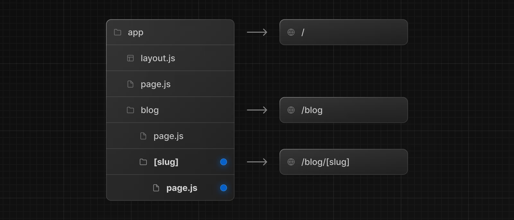
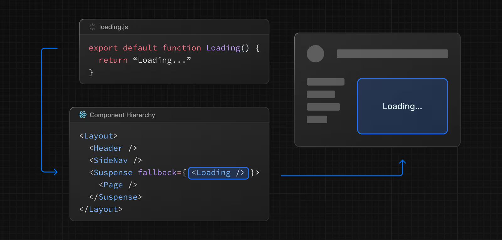
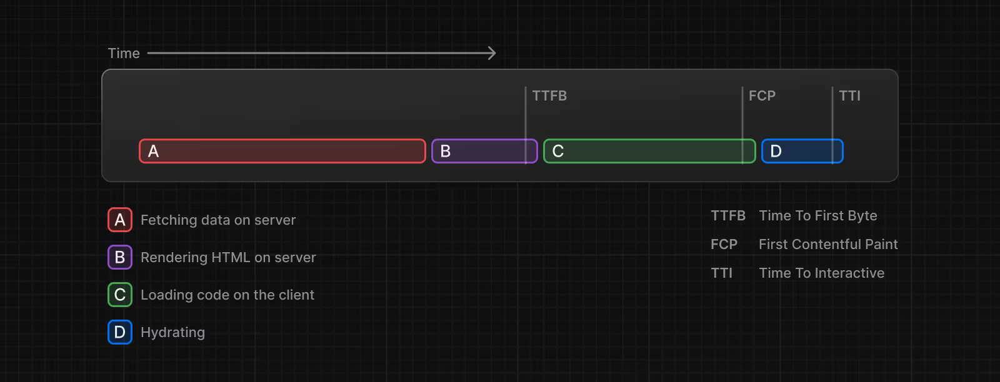
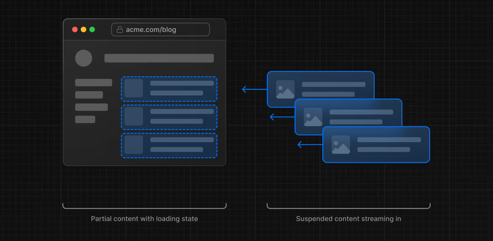
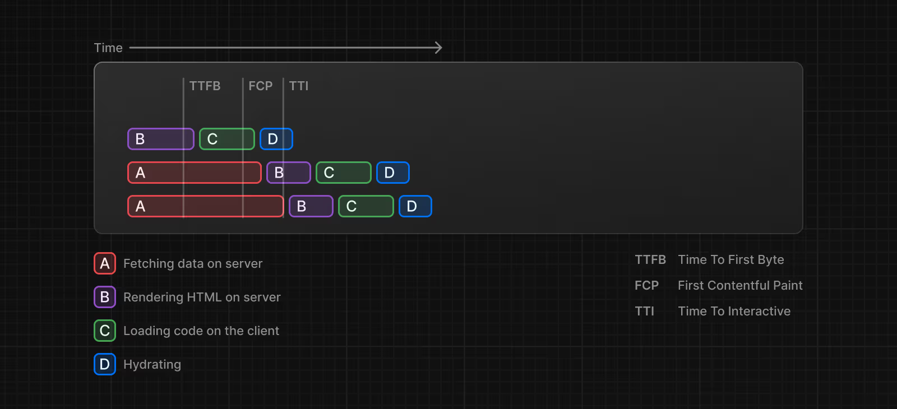
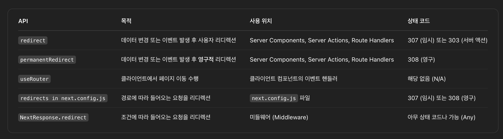

# How to create layouts and pages (레이아웃과 페이지 만들기)

Next.js는 파일 시스템 기반 라우팅을 사용합니다. 즉, 폴더와 파일 구조를 통해 라우트를 정의할 수 있습니다.

## 페이지 만들기

**페이지(page)** 는 특정 경로에서 렌더링되는 UI입니다. 페이지를 만들려면 app 디렉토리 내에 페이지 파일을 추가하고, React 컴포넌트를 default export 하면 됩니다.  
예시: 인덱스 페이지(/)를 만들고 싶다면 아래와 같이 작성합니다.


```tsx
// app/page.tsx
export default function Page() {
  return <h1>Hello Next.js!</h1>;
}
```

## 레이아웃 만들기

**레이아웃(layout)** 은 여러 페이지에서 공유되는 UI입니다. 라우트를 이동해도 레이아웃은 상태를 유지하고, 다시 렌더링되지 않으며, 상호작용이 유지됩니다.

레이아웃을 만들려면 layout 파일에서 React 컴포넌트를 `default export` 하면 됩니다. 이 컴포넌트는 children이라는 prop을 받아야 하며, 이 children은 페이지나 다른 레이아웃이 될 수 있습니다.

예시: 인덱스 페이지를 자식으로 받는 레이아웃 만들기


```tsx
// app/layout.tsx
export default function DashboardLayout({
  children,
}: {
  children: React.ReactNode;
}) {
  return (
    <html lang="en">
      <body>
        {/_ 레이아웃 UI _/}
        <main>{children}</main>
      </body>
    </html>
  );
}
```

이 레이아웃은 루트 레이아웃(root layout)이라고 불리며, 루트 레이아웃은 `html`과 `body` 태그를 반드시 포함해야 합니다.

## 중첩 라우트 만들기

**중첩 라우트(nested route)** 는 여러 URL 세그먼트로 구성된 경로입니다.  
예를 들어, `/blog/[slug]`는 아래 세 부분으로 구성됩니다.

- `/` (루트 세그먼트)

- `blog` (세그먼트)

- `[slug]` (말단 세그먼트)

Next.js에서는:

- **폴더**는 URL 세그먼트에 매핑되는 경로 세그먼트를 정의하는 데 사용됩니다.
- **파일**(예: `page` 및 `layout`)은 세그먼트에 표시되는 UI를 만드는 데 사용됩니다.

중첩 경로를 만들려면 **폴더를 서로 안에 중첩**하면 됩니다. 예를 들어 `/blog`에 대한 경로를 추가하려면 `app` 디렉터리에 `blog` 라는 폴더를 만듭니다. 그런 다음 **`/blog` 에 공개적으로 액세스할 수 있도록 하려면** , `page.tsx` 파일을 추가합니다.


계속 폴더를 중첩함으로써, 중첩 경로도 계속 만들 수 있다. 특정 블로그 글 하나를 보여주는 경로를 생성하기 위해, `blog` 폴더 안에 `[slug]` 폴더를 만들고, `page.tsx` 파일을 추가합니다.



`[slug]` 처럼 대괄호로 감싸면 동적 라우트가 됩니다. 이는 데이터에 따라 여러 페이지를 생성할 때 사용됩니다 (예: 블로그 글, 상품 페이지 등).

## 레이아웃 중첩하기

기본적으로 폴더 구조 내의 레이아웃은 서로 중첩됩니다. 상위 레이아웃이 하위 레이아웃과 페이지를 감쌉니다. **레이아웃을 중첩하고 싶다면, 특정 라우트 세그먼트(폴더)에 `layout`을 추가하면 된다.**

**예시) `/blog` 경로만을 위한 레이아웃 만들기**

```tsx
export default function BlogLayout({
  children,
}: {
  children: React.ReactNode;
}) {
  return <section>{children}</section>;
}
```


루트 레이아웃(`app/layout.tsx`)  
→ 블로그 레이아웃(`app/blog/layout.tsx`)  
→ 블로그 페이지(`app/blog/page.tsx`) 및 블로그 포스트 페이지(`app/blog/[slug]/page.tsx`)  
순서대로 중첩됩니다.

## 페이지 간 링크 연결하기

**라우트 간 네비게이션을 하고 싶다면, `<Link>` 컴포넌트를 사용합니다.**  
이 컴포넌트는 HTML의 `<a>` 태그를 확장한 Next.js 기본 제공 기능으로, **프리패칭(prefetching)** 및 **CSR** 을 지원합니다.

```tsx
import Link from "next/link";

export default async function Post({ post }) {
  const posts = await getPosts();

  return (
    <ul>
      {posts.map((post) => (
        <li key={post.slug}>
          <Link href={`/blog/${post.slug}`}>{post.title}</Link>
        </li>
      ))}
    </ul>
  );
}
```

`<Link>`는 Next.js에서 라우트 간 이동을 위한 가장 추천되는 방법입니다. 더 복잡한 탐색이 필요하면 `useRouter` 훅도 사용할 수 있습니다.

# Linking and Navigating

`Next.js`에서 경로 간 탐색 방법은 총 4가지가 있습니다.

- `<Link>` 컴포넌트 사용
- `useRouter` 훅 사용 (클라이언트 컴포넌트)
- `redirect` 함수 사용 (서버 컴포넌트)
- 네이티브 `History API` 사용

## `<Link>` 컴포넌트

`<Link>`는 HTML `<a>` 태그를 확장하여 경로 간의 **프리패칭** 및 **클라이언트 측 탐색을 제공**하는 **내장 컴포넌트**입니다.

```tsx
import Link from "next/link";

export default function Page() {
  return <Link href="/dashboard">Dashboard</Link>;
}
```

- `Next.js`에서 경로 간 탐색을 위한 **기본 및 권장 방법**
- `next/link`에서 가져와 컴포넌트에 `href` prop을 전달하여 사용

## `useRouter()` hook

`useRouter` hook은 **클라이언트 컴포넌트**에서 **프로그래매틱**하게 경로를 바꿀 수 있도록 한다.

```tsx
"use client";

import { useRouter } from "next/navigation";

export default function Page() {
  const router = useRouter();

  return (
    <button type="button" onClick={() => router.push("/dashboard")}>
      Dashboard
    </button>
  );
}
```

`router.push`로 되어 있는 건 프리패칭되지 않음

> **권장사항** : 특정 요구사항이 없는 한 `<Link>` 컴포넌트를 사용해 경로 탐색

## `redirect` 함수

서버 컴포넌트에서는, `redirect` 함수를 사용한다.

```tsx
import { redirect } from "next/navigation";

async function fetchTeam(id: string) {
  const res = await fetch("https://...");
  if (!res.ok) return undefined;
  return res.json();
}

export default async function Profile({
  params,
}: {
  params: Promise<{ id: string }>;
}) {
  const { id } = await params;
  if (!id) {
    redirect("/login");
  }

  const team = await fetchTeam(id);
  if (!team) {
    redirect("/join");
  }

  // ...
}
```

> ### 알아두면 좋은 점:
>
> - `redirect`는 기본적으로 307 (Temporary Redirect) 상태 코드를 반환합니다.
>
> - `Server Action` 내에서 사용될 경우에는 `303 (See Other)` 상태 코드를 반환하며, 이는 **일반적으로 POST 요청 결과로 성공 페이지로 리디렉션할 때 사용**됩니다.
>
> - `redirect`는 내부적으로 에러를 `throw`하기 때문에, `try/catch` 블록 외부에서 호출해야 합니다.
>
> - `redirect`는 Client Component의 렌더링 과정 중에 호출할 수 있지만, 이벤트 핸들러 내부에서는 사용할 수 없습니다.
>
>   - 이벤트 핸들러에서는 `useRouter` 훅을 대신 사용할 수 있습니다.
>
> - `redirect`는 **절대 URL도 허용**하므로 외부 링크로도 리디렉션할 수 있습니다.
>
> - 렌더링 과정 이전에 리다이렉션하고 싶다면, `next.config.js`나 `Middleware`를 사용하세요.

> **🤔 `redirect` 를 클라이언트 컴포넌트에서 사용할 수 있다?**
> Client Component에서 사용 가능하다는데, 왜 그런지 더 찾아봐야겠다.
>
> 컴포넌트 렌더링 중 redirect는 괜찮지만, 이벤트 핸들러 안에서는 안된다고 한다.  
> **참고 자료 :**
>
> - [Chat GPT 질문 결과](https://chatgpt.com/share/67f77a49-44a8-800d-a702-58742b62543c)
> - [Next.js 공식 문서](https://nextjs.org/docs/app/api-reference/functions/redirect)

## 네이티브 History API 사용하기

Next.js는 브라우저의 기본 API인 `window.history.pushState`와 `window.history.replaceState`를 사용하여 **페이지를 새로 고침하지 않고도 브라우저의 히스토리 스택을 업데이트할 수 있도록 허용**합니다.

`pushState`와 `replaceState`를 호출하면 Next.js 라우터에 통합되어, `usePathname`이나 `useSearchParams`와 같은 훅과도 동기화됩니다.

### `window.history.pushState`

`window.history.pushState`를 사용하여 브라우저의 히스토리 스택에 새로운 항목을 추가합니다. 사용자는 이전 상태로 돌아갈 수 있습니다.

#### 제품 목록 정렬 예시 코드

```tsx
"use client";

import { useSearchParams } from "next/navigation";

export default function SortProducts() {
  const searchParams = useSearchParams();

  function updateSorting(sortOrder: string) {
    const params = new URLSearchParams(searchParams.toString());
    params.set("sort", sortOrder);
    window.history.pushState(null, "", `?${params.toString()}`);
  }

  return (
    <>
      <button onClick={() => updateSorting("asc")}>Sort Ascending</button>
      <button onClick={() => updateSorting("desc")}>Sort Descending</button>
    </>
  );
}
```

### `window.history.replaceState`

**현재 브라우저의 히스토리 스택**에서 **현재 항목을 교체**하는 데 사용됩니다. 사용자는 이전 상태로 돌아갈 수 없습니다.

#### 앱 locale 전환 예시 코드

```tsx
"use client";

import { usePathname } from "next/navigation";

export function LocaleSwitcher() {
  const pathname = usePathname();

  function switchLocale(locale: string) {
    // e.g. '/en/about' or '/fr/contact'
    const newPath = `/${locale}${pathname}`;
    window.history.replaceState(null, "", newPath);
  }

  return (
    <>
      <button onClick={() => switchLocale("en")}>English</button>
      <button onClick={() => switchLocale("fr")}>French</button>
    </>
  );
}
```

## 라우팅 & 네비게이션 동작 원리 (How Routing and Navigation Works)

### 1. 🚀 Code Splitting (코드 분할)

- 각 라우트(segment)별로 코드가 자동 분할되어 필요할 때만 로드됨
- 브라우저는 최소한의 코드만 다운로드 → 초기 로딩 속도 향상
- Server Components 사용 시 자동으로 라우트 기반 코드 분할 적용됨

### 2. 📦 Prefetching (사전 로딩)

- `<Link>` 컴포넌트가 뷰포트에 보이면 해당 라우트가 자동으로 사전 로딩됨
- `useRouter().prefetch()`로 직접 사전 로딩도 가능
- `loading.js` 아래 공통 레이아웃까지만 캐시됨 (기본 30초 유지)
- 개발 모드에서는 비활성화, 프로덕션 모드에서만 작동

### 3. 🧠 Router Cache (라우터 캐시)

- 클라이언트 메모리에 라우트 데이터(React Server Component Payload) 캐싱
- 사전 로딩되거나 방문한 라우트는 캐시에서 재사용
- 서버 요청을 줄이고, 탐색 속도 향상

### 4. 🔄 Partial Rendering (부분 렌더링)

- 경로가 변경될 때, 변경된 세그먼트만 클라이언트에서 다시 렌더링
- 공통 레이아웃은 유지되어 효율적인 렌더링 가능
- 예: `/dashboard/settings` → `/dashboard/analytics` 이동 시 `dashboard` layout 유지

### 5. 💡 Soft Navigation (소프트 네비게이션)

- 브라우저의 하드 리로드 없이 변경된 부분만 렌더링
- 클라이언트 상태(UI, 입력 등) 유지 가능
- 빠른 탐색 및 사용자 경험 향상

### 6. ↩️ Back/Forward Navigation

- 브라우저의 뒤로/앞으로 버튼 사용 시:
  - 스크롤 위치 자동 복원
  - 캐시된 라우트 재사용

### 7. 🔁 pages/ 와 app/ 간 라우팅 전환

- `pages/`에서 `app/`로 점진적으로 마이그레이션 가능
- 내부적으로 확률 기반 필터로 전환 감지 (오탐 확률 기본 0.01%)
- `next.config.js` 설정:
  - 오탐률 조정: `experimental.clientRouterFilterAllowedRate`
  - 완전 비활성화: `experimental.clientRouterFilter: false`

# 에러 처리 (Error Handling)

에러는 두 가지 범주로 나눌 수 있습니다.

- **① 예상 가능한 에러**(expected errors)
- **② 예기치 못한 예외**(uncaught exceptions)

**① 예상 가능한 에러를 반환값 형태로 표현하라 / 구조화하세요**

- `Server Actions`에서 예상 가능한 에러에 대해 `try/catch`를 사용하는 것을 피하세요.
  - 예상 가능한 에러는 `throw` 하지 말고, `return { error: ... }`처럼 데이터 형태로 만들어서 리턴하세요. ( = 예상 에러를 **"값으로 모델링"** 하자)
- `useActionState`를 사용하여 에러를 관리하고 클라이언트에 반환하는 방식으로 처리하세요.

**② 예기치 못한 에러는 에러 바운더리(error boundaries) 를 사용하세요**

- `error.tsx`와 `global-error.tsx `파일을 이용해 에러 바운더리를 구현하세요.
- 이를 통해 예상치 못한 에러가 발생했을 때, **사용자에게 대체 UI(fallback UI)** 를 보여줄 수 있습니다.

## 예상 가능한 에러 처리 (Handling Expected Errors)

예상 가능한 에러란, **서버 측 폼 검증 실패나 요청 실패**처럼 **애플리케이션의 정상 동작 중에 발생할 수 있는 에러**를 의미합니다. 이러한 에러는 **명시적으로 처리하고 클라이언트에 반환**해야 합니다.

### Server Actions에서의 예상 가능한 에러 처리

- `useActionState` 훅을 사용하여 에러 처리 및 Server Action의 상태를 관리하세요.

- 이 방법은 예상 가능한 에러를 예외(exception)를 던지는(throw) 방식으로 처리하지 말고, 반환값(return)으로 모델링해야 합니다.

```tsx
"use server";

import { redirect } from "next/navigation";

export async function createUser(prevState: any, formData: FormData) {
  const res = await fetch("https://...");
  const json = await res.json();

  if (!res.ok) {
    return { message: "Please enter a valid email" }; // 예상 가능한 에러를 반환값으로 처리
  }

  redirect("/dashboard");
}
```

그런 다음 useActionState hook에 action 전달하고, 리턴 받은 state를 가지고 에러 메시지를 화면에 출력합니다.

```tsx
"use client";

import { useActionState } from "react";
import { createUser } from "@/app/actions";

const initialState = {
  message: "",
};

export function Signup() {
  const [state, formAction, pending] = useActionState(createUser, initialState); // useActionState hook에 action 전달

  return (
    <form action={formAction}>
      <label htmlFor="email">Email</label>
      <input type="text" id="email" name="email" required />
      {/* 추가 폼 필드 생략 */}
      <p aria-live="polite">{state?.message}</p> {/* 리턴 받은 state를 가지고 에러 메시지 출력 */}
      <button disabled={pending}>Sign up</button>
    </form>
  );
}
```

반환된 값을 클라이언트 컴포넌트에서 toast message를 띄우는데 사용할 수도 있다.

### 서버 컴포넌트에서 예상 가능한 에러 처리하기

서버 컴포넌트 내부에서 데이터를 가져올 때, 응답을 사용하여 **조건부로 오류 메시지를 렌더링**하거나 **`redirect` 함수를 사용할 수 있습니다.**

```tsx
export default async function Page() {
  const res = await fetch(`https://...`);
  const data = await res.json();

  if (!res.ok) {
    return "There was an error."; // 조건부 오류 메세지 렌더링
  }

  return "...";
}
```

## 예상치 못한 에러 처리 (Uncaught Exceptions)

예기치 못한 에러는, 애플리케이션의 정상적인 흐름에서는 발생하지 않아야 할 버그나 문제를 나타내는 것을 말한다.
이러한 오류는 **`throw`를 통해 에러를 발생**시키고, 이후 **error boundary(오류 경계)에 의해 처리**되어야 합니다.

### 처리 방식

- **일반적인 방법** : 루트 레이아웃 아래에 있는 `error.js`에서 오류를 처리합니다.
- **선택적인 방법** : 더 세분화된 오류 처리를 위해 하위 경로에 `error.js` 파일을 둘 수 있습니다. (예: `app/dashboard/error.js`)
- **드물게 사용하는 방법** : **루트 레이아웃에서 전역 오류를 처리**하기 위해 **`global-error.js`를 사용**할 수 있습니다.

### 에러 바운더리 사용하기 (Using Error Boundaries)

Next.js는 **예외를 처리하기 위해 Error Boundary(에러 바운더리)** 를 사용합니다. Error Boundary(에러 바운더리)는 자식 컴포넌트에서 발생한 오류를 포착하고, **크래시가 발생한 컴포넌트 트리 대신 대체 UI(fallback UI)를 표시**합니다.

라우트(경로) 세그먼트 내부에 error.tsx 파일을 생성하고, React 컴포넌트를 export 하여 에러 바운더리를 생성할 수 있습니다.

#### `app/dashboard/error.tsx`

```tsx
"use client"; // 에러 바운더리는 반드시 클라이언트 컴포넌트여야 함

import { useEffect } from "react";

export default function Error({
  error,
  reset,
}: {
  error: Error & { digest?: string }; // 에러 객체와 요약(digest) 속성
  reset: () => void; // 오류 복구를 시도하는 함수
}) {
  useEffect(() => {
    // 오류를 외부 오류 로깅 서비스에 기록
    console.error(error);
  }, [error]);

  return (
    <div>
      <h2>Something went wrong!</h2> {/* 오류 발생 메시지 */}
      <button
        onClick={
          // 해당 세그먼트를 다시 렌더링하여 복구 시도
          () => reset()
        }
      >
        Try again
      </button>
    </div>
  );
}
```

오류가 상위 에러 바운더리로 전파되게 하려면, 오류 컴포넌트를 렌더링할 때 `throw`를 사용하면 됩니다.

> **❓ 궁금한 점**
>
> 1. 하위 컴포넌트에서 처리하지 않고, 더 상위의 에러 바운더리에게 맡기고 싶을 때 throw를 다시 던져주면 그 상위에서 받아 처리할 수 있다는 의미인가?
>
> 2. 왜 에러 바운더리는 반드시 클라이언트 컴포넌트여야 할까?

### 중첩 라우트에서 에러 처리하기 (Handling Errors in Nested Routes)

오류는 **가장 가까운 상위 에러 바운더리(error boundary)로 전파(bubble)** 됩니다. 덕분에, 라우트 계층 구조의 서로 다른 위치에 **`error.tsx` 파일을 배치하여 세밀한 오류 처리**를 가능하게 합니다.

**컴포넌트 계층 구조**


### 전역 에러 처리하기 (Handling Global Errors)

자주 쓰이진 않지만, 루트 app 디렉터리에 `app/global-error.js` 파일을 만들어, 루트 레이아웃 수준에서 오류를 처리할 수 있습니다. (국제화를 적용한 프로젝트일지라도 사용 가능)
**전역 에러(Global error) UI**는 루트 레이아웃 또는 템플릿을 대체하기 때문에, 자**체적으로 `<html>` 및 `<body>` 태그를 정의**해야 합니다.

```tsx
"use client"; // 에러 바운더리는 클라이언트 컴포넌트여야 함

export default function GlobalError({
  error,
  reset,
}: {
  error: Error & { digest?: string }; // 전달된 에러 객체
  reset: () => void; // 다시 렌더링을 시도하는 함수
}) {
  return (
    // 전역 에러는 레이아웃을 완전히 대체하기 때문에 html, body를 직접 정의해야 함
    <html>
      <body>
        <h2>Something went wrong!</h2> {/* 오류 메시지 */}
        <button onClick={() => reset()}>Try again</button> {/* 복구 버튼 */}
      </body>
    </html>
  );
}
```

> **❓ 국제화랑 전역 에러 처리랑 무슨 연관 관계가 있을까?**
>
> 국제화를 적용하면 URL 구조와 라우트 구조가 달라지기 때문에, 전역 에러 페이지(global-error.js)가 필요할 수 있다.
>
> **[Next.js에서 국제화가 적용된 구조 예시]**
>
> ```vbnet
> app/
> ├── [locale]/             ← 언어 코드 (예: en, ko, ja)
> │   ├── page.tsx
> │   ├── layout.tsx
> │   └── error.tsx
> ├── global-error.tsx      ← 전역 오류 UI (모든 언어에 공통 적용)
> └── layout.tsx            ← 루트 레이아웃
> ```
>
> → 국제화를 사용하는 경우에도, `app/global-error.tsx`를 만들면 언어와 관계없이 전역 에러를 처리할 수 있다는 걸 문서에서 설명하는 것이다.

# Loading UI and Streaming (로딩 UI와 스트리밍)


`loading.js`라는 특수 파일은 **React의 Suspense 기능을 활용하여 의미 있는 로딩 UI를 만들 수 있도록 도와**줍니다.
이 규칙을 사용하면, 특정 라우트 세그먼트의 콘텐츠가 로드되는 동안 **서버에서 즉시 로딩 상태를 보여줄 수 있습니다**. 렌더링이 완료되면 새로운 콘텐츠로 자동 교체됩니다.

## Instant Loading States

Instant Loading States는 **페이지를 이동하자마자 즉시 표시되는 대체 UI(fallback UI)** 입니다.
스켈레톤, 스피너 등의 로딩 indicator를 미리 렌더링하거나, 향후 보여질 화면의 일부(예: 커버 사진, 제목 등)를 의미 있게 먼저 보여줄 수 있습니다.
이런 처리는 사용자에게 앱이 반응하고 있다는 느낌을 주고, 더 나은 사용자 경험을 제공합니다.

폴더 내부에 `loading.js` 파일을 추가하여 로딩 상태를 만들 수 있습니다.


```tsx
export default function Loading() {
  // Loading 컴포넌트 내부에 스켈레톤 등 원하는 UI 요소를 자유롭게 넣을 수 있습니다.
  return <LoadingSkeleton />;
}
```



같은 폴더 안에서는 `loading.js`가 자동으로 `layout.js` 내부에 중첩되어 작동합니다.
`page.js`와 그 하위 요소들을 `<Suspense>`로 자동 감싸게 됩니다.

### Good to know (알아두면 좋은 점):

- 서버 중심 라우팅을 사용하더라도 페이지 이동은 즉시 일어납니다.
- 페이지 이동은 중단 가능하며, 라우트의 콘텐츠가 완전히 로드되기 전이라도 다른 페이지로 이동할 수 있습니다.

- Shared layouts(공유 레이아웃)은 새로운 라우트 세그먼트가 로드되는 동안에도 계속 상호작용 가능합니다.

✅ Next.js는 이 기능을 최적화하고 있으므로, 라우트 세그먼트(레이아웃 및 페이지)에 대해 `loading.js` 규칙을 사용하는 것이 권장됩니다.

## Streaming with Suspense

`loading.js` 외에도, 원하는 UI 컴포넌트를 직접 `<Suspense>`로 감싸서 스트리밍 경계를 만들 수 있습니다. App Router는 Suspense 기반의 스트리밍을 지원합니다.

> **❗️ 추가 정보**  
> 일부 브라우저는 스트리밍 응답을 버퍼링하므로, 응답 크기가 1024바이트를 초과하기 전까지는 화면에 표시되지 않을 수 있습니다. 이 현상은 보통 "hello world" 같은 아주 작은 테스트 앱에서만 발생하며, 실제 애플리케이션에는 영향을 주지 않습니다.

## What is Streaming?

React와 Next.js에서 스트리밍이 어떻게 작동하는지 이해하려면, 서버 사이드 렌더링(SSR)과 그 한계를 이해하는 것이 도움이 됩니다.

SSR에서는 사용자가 페이지를 보고 상호작용할 수 있기 전에 일련의 과정이 완료되어야 합니다.

- 1. 해당 페이지에 필요한 모든 데이터가 서버에서 먼저 가져와져야 합니다.
- 2. 서버가 가져온 데이터를 바탕으로 페이지의 HTML을 렌더링합니다.
- 3. HTML, CSS, JavaScript가 클라이언트로 전송됩니다.
- 4. 클라이언트에서는 서버에서 생성한 HTML과 CSS로 비상호작용(정적) UI를 먼저 보여줍니다.
- 5. 마지막으로, React가 hydration을 통해 UI를 상호작용 가능하게 만듭니다.



이 과정은 **순차적으로 실행되며 블로킹될 수 있기 때문에**, 서버는 모든 데이터를 다 가져온 뒤에야 HTML을 렌더링할 수 있습니다. 또한 클라이언트에서는, 페이지 내 모든 컴포넌트의 코드가 다운로드된 후에야 React가 UI를 하이드레이트할 수 있습니다.

React와 Next.js의 SSR은 비 상호작용 페이지라도 최대한 빨리 화면을 사용자에게 보여줌으로써 지각적 로딩 성능을 개선합니다. 하지만, **서버에서 모든 데이터를 다 받아야만 사용자에게 페이지가 표시**될 수 있으므로 **여전히 느릴 수 있습니다**.

### 🚀 Streaming

스트리밍은 페이지의 HTML을 작은 조각들로 나누고, 서버에서 클라이언트로 점진적으로 전송할 수 있게 해줍니다. **→ 모든 데이터를 다 가져오지 않아도 페이지의 일부를 먼저 렌더링하여 더 빠르게 사용자에게 보여줄 수 있음**



React는 컴포넌트 기반이므로, 스트리밍과 잘 어울립니다. 각각의 컴포넌트를 하나의 '조각(chunk)'으로 볼 수 있기 때문입니다.

- **우선순위가 높은 컴포넌트**(예: 제품 정보)나 **데이터를 필요로 하지 않는 컴포넌트**(예: 레이아웃)는 **먼저 전송하여, React가 빠르게 하이드레이션을 시작** 하도록 한다.
- **우선순위가 낮은 컴포넌트**(예: 리뷰, 관련 제품)는 데이터가 준비된 후, **같은 서버 요청 내에서 나중에 전송**한다.

이렇게 하면, 모든 콘텐츠가 fetch 될 때까지 기다리지 않아도 된다.

### ⏱ 성능 최적화

Streaming(스트리밍)은 **긴 데이터 요청으로 인해 렌더링이 지연되는 것을 방지**하는 데 유용하며, **TTFB**(첫 바이트 도달 시간)와 **FCP**(첫 콘텐츠 렌더링 시간)를 줄이는 데 도움이 됩니다.



### 예시

`<Suspense>`는 비동기 작업(예: 데이터 가져오기)을 수행하는 컴포넌트를 감싸고, 작업이 완료되기 전에는 스켈레톤, 스피너 같은 대체 UI를 보여줍니다. 이후 작업이 완료되면 원래 컴포넌트로 교체됩니다.

```tsx
// app/dashboard/page.tsx
import { Suspense } from "react";
import { PostFeed, Weather } from "./Components";

export default function Posts() {
  return (
    <section>
      <Suspense fallback={<p>Loading feed...</p>}>
        <PostFeed />
      </Suspense>
      <Suspense fallback={<p>Loading weather...</p>}>
        <Weather />
      </Suspense>
    </section>
  );
}
```

#### `<Suspense>` 를 사용하면 장점

1. **Streaming Server Rendering (스트리밍 서버 렌더링)** – 서버에서 클라이언트로 HTML을 점진적으로 렌더링합니다.

2. **Selective Hydration (선택적 하이드레이션)** – React는 사용자 상호작용을 기준으로 어떤 컴포넌트를 먼저 상호작용 가능하게 만들지 우선순위를 설정합니다.

### 🔍 SEO

- Next.js는 클라이언트에 스트리밍을 시작하기 전에 `generateMetadata` 내부의 데이터 패칭이 완료되기를 기다립니다. 이로 인해 **스트리밍 응답의 첫 부분에 `<head>` 태그가 포함되도록 보장**됩니다.

- 스트리밍은 서버에서 렌더링되므로 SEO에 영향을 주지 않습니다. **Google의 Rich Results Test 도구를 통해, 페이지가 크롤러에 어떻게 보이는지 확인하고 HTML 소스를 확인**할 수 있습니다.

### Status Codes

스트리밍 시, 요청이 성공했음을 나타내기 위해 200 상태 코드가 반환됩니다.
서버는 여전히 스트리밍되는 콘텐츠 내부에서 오류나 문제를 클라이언트에게 전달할 수 있습니다. (예: `redirect()`나 `notFound()`를 사용)

**응답 헤더가 이미 클라이언트로 전송된 후에는, 상태 코드를 변경할 수 없습니다.** 이 제한은 SEO에 영향을 주지 않습니다.

# 리디랙션

Next.js에서는 리디렉션을 처리하는 여러 방법이 있다.



## `redirect` 함수

`redirect` 함수는 사용자를 다른 URL로 리디렉션할 수 있게 해줍니다. 이 함수는 **서버 컴포넌트, 라우트 핸들러, 서버 액션**에서 호출할 수 있습니다. `redirect`는 주로 포스트 작성 등 **데이터 변경 이후에 사용**됩니다.

```tsx
// app/actions.ts
"use server";
import { redirect } from "next/navigation";
import { revalidatePath } from "next/cache";

export async function createPost(id: string) {
  try {
    // 데이터베이스 처리
  } catch (error) {
    // 에러 처리
  }

  revalidatePath("/posts"); // 캐시된 게시글 목록 갱신
  redirect(`/post/${id}`); // 새 게시글 페이지로 이동
}
```

**✅ Good to know:**

- `redirect`는 기본적으로 `307 (임시 리디렉션)` 상태 코드를 반환합니다.

- **서버 액션에서 사용되면 `303 (다른 페이지 보기)` 코드로 반환**됩니다 (주로 POST 후 성공 페이지로 이동할 때 사용).

- 내부적으로 에러를 `throw`하기 때문에, **`try/catch` 내부에서 호출하면 안 됩니다.**

- 클라이언트 컴포넌트의 렌더링 중에는 사용할 수 있지만, 이벤트 핸들러에서는 사용할 수 없습니다 (이 경우 useRouter 사용).

- 절대 URL도 허용하며 외부 링크로 리디렉션하는 것도 가능합니다.

- **렌더 전에 리디렉션하려면 `next.config.js`나 `Middleware`를 사용**하세요.

## `permanentRedirect` 함수

`permanentRedirect` 함수는 **사용자를 영구적으로 다른 URL로 리디렉션**할 수 있게 해줍니다.
이 함수는 **서버 컴포넌트, 라우트 핸들러, 서버 액션**에서 사용할 수 있습니다.

### 예시 코드: 사용자가 사용자 이름을 변경했을 때, 새로운 프로필 URL로 이동

```tsx
// app/actions.ts
"use server";
import { permanentRedirect } from "next/navigation";
import { revalidateTag } from "next/cache";

export async function updateUsername(username: string, formData: FormData) {
  try {
    // DB 처리
  } catch (error) {
    // 에러 처리
  }

  revalidateTag("username"); // username 관련 캐시 갱신
  permanentRedirect(`/profile/${username}`); // 새 프로필 페이지로 이동
}
```

**✅ Good to know:**

- 기본적으로 **`308 (영구 리디렉션)` 상태 코드가 반환**됩니다.

- `redirect`와 마찬가지로 절대 URL도 허용, 외부 링크로도 리디렉션할 수 있습니다.

- 렌더 전에 리디렉션하려면 `next.config.js` 또는 `Middleware`를 사용하세요.

> **❓ 영구 리디렉션?**

## useRouter() 훅

**클라이언트 컴포넌트**의 **이벤트 핸들러 내부**에서 리디렉션하려면 `useRouter` 훅의 `push()` 메서드를 사용할 수 있습니다.

```tsx
// app/page.tsx
"use client";
import { useRouter } from "next/navigation";

export default function Page() {
  const router = useRouter();

  return (
    <button type="button" onClick={() => router.push("/dashboard")}>
      Dashboard
    </button>
  );
}
```

**✅ Good to know:**

- 프로그래밍 방식이 아닌 일반적인 이동이라면 `<Link>` 컴포넌트를 사용하는 것이 좋습니다.

## `next.config.js`에서 `redirects` 설정

`next.config.js`파일의 `redirects` 옵션을 사용하면, **들어오는 요청 경로를 다른 경로로 리디렉션**할 수 있습니다.  
**페이지의 URL 구조를 변경했거나, 미리 정의된 리디렉션 목록이 있는 경우 유용합니다.**

`redirects`는 [경로(path), 헤더(header), 쿠키(cookie), 쿼리(query) 조건에 따른 매칭을 지원](https://nextjs.org/docs/app/building-your-application/routing/redirecting#header-cookie-and-query-matching)하여, 들어오는 요청에 따라 유연하게 사용자를 리디렉션할 수 있게 해줍니다.

```tsx
// next.config.ts
import type { NextConfig } from "next";

const nextConfig: NextConfig = {
  async redirects() {
    return [
      {
        source: "/about", // 요청 경로
        destination: "/", // 리디렉션 대상
        permanent: true, // 영구 리디렉션 (308)
      },
      {
        source: "/blog/:slug", // 와일드카드 경로 매칭
        destination: "/news/:slug",
        permanent: true,
      },
    ];
  },
};

export default nextConfig;
```

**✅ Good to know:**

- `permanent: true` → 308, `false` → 307 상태 코드 사용

- Vercel 등 일부 플랫폼에서는 **리디렉션 수에 제한(예: 1,024개)**이 있습니다.

- 1,000개 이상의 리디렉션이 필요한 경우 Middleware를 사용하는 커스텀 방식을 고려하세요.

- **`redirects()`는 `Middleware`보다 먼저 실행됩니다.**

## `NextResponse.redirect` in Middleware (미들 웨어)

Middleware는 요청이 완료되기 전에 코드를 실행할 수 있게 해줍니다. 그 후, 들어오는 요청에 따라 `NextResponse.redirect`를 사용하여 다른 URL로 리디렉션할 수 있습니다.

이는 인증, **세션 관리 등의 조건에 따라 사용자를 리디렉션**해야 하거나, **리디렉션 경로가 매우 많을 때 유용**합니다.

### 예시 코드 : 사용자가 로그인하지 않은 경우 `/login`으로 리디렉션

```tsx
// middleware.ts
import { NextResponse, NextRequest } from "next/server";
import { authenticate } from "auth-provider";

export function middleware(request: NextRequest) {
  const isAuthenticated = authenticate(request);

  if (isAuthenticated) {
    return NextResponse.next(); // 정상적으로 계속 진행
  }

  return NextResponse.redirect(new URL("/login", request.url)); // 로그인 페이지로 이동
}

export const config = {
  matcher: "/dashboard/:path*", // 어떤 경로에 적용할지 지정
};
```

**✅ Good to know:**

- Middleware는 **`next.config.js`의 `redirects()` 이후, 렌더링 전에 실행**됩니다.

- **인증, 세션, A/B 테스트** 등 **조건 기반 리디렉션**에 적합합니다.

## 크기에 따른 리디렉션 관리

1,000개 이상의 많은 리디렉션을 관리하려면, Middleware를 활용한 사용자 정의 솔루션을 고려할 수 있습니다. 이를 통해, **애플리케이션을 재배포하지 않고도 프로그래밍적으로 리디렉션을 처리**할 수 있습니다.

**고려 사항**

- 리디렉션 맵의 생성 및 저장
- 데이터 조회 성능 최적화

### 1. 리디렉션 맵(redirect map)의 생성 및 저장

**리디렉션 맵**은 **리디렉션 정보를 담은 목록**으로, 보통 데이터베이스(특히 key-value 저장소) 또는 JSON 파일에 저장됩니다.

**예시**

```json
{
  "/old": {
    "destination": "/new",
    "permanent": true
  },
  "/blog/post-old": {
    "destination": "/blog/post-new",
    "permanent": true
  }
}
```

Middleware에서는 `Vercel Edge Config`나 `Redis`와 같은 데이터베이스로부터 정보를 읽고, 들어오는 요청에 따라 사용자를 리디렉션할 수 있습니다.

```ts
// middleware.ts
import { NextResponse, NextRequest } from "next/server";
import { get } from "@vercel/edge-config";

type RedirectEntry = {
  destination: string;
  permanent: boolean;
};

export async function middleware(request: NextRequest) {
  const pathname = request.nextUrl.pathname;
  const redirectData = await get(pathname);

  if (redirectData && typeof redirectData === "string") {
    const redirectEntry: RedirectEntry = JSON.parse(redirectData);
    const statusCode = redirectEntry.permanent ? 308 : 307;
    return NextResponse.redirect(redirectEntry.destination, statusCode);
  }

  // 리디렉션 대상이 없다면 그대로 요청 처리
  return NextResponse.next();
}
```

### 2. 데이터 조회 성능 최적화

모든 요청마다 큰 데이터를 조회하면 속도가 느려지고 비용도 증가할 수 있습니다.

**데이터 조회 성능을 최적화하는 방법**

- **빠른 읽기 성능을 제공하는 DB** 사용 (예: Vercel Edge Config, Redis)
- **리디렉션 존재 여부를 먼저 빠르게 검사**하여 효율적인 Bloom 필터 같은 data lookup 전략 사용

앞선 예시처럼, 미리 생성된 Bloom 필터 파일을 미들웨어에서 불러와, 요청 경로(pathname)가 존재하는지를 먼저 확인할 수 있습니다.

Bloom 필터에 존재하면, `Route Handler`로 요청을 넘겨 실제 `JSON` 파일을 확인한 후 적절한 URL로 리디렉션합니다.

이 방식은 미들웨어에서 대용량 리디렉션 파일을 직접 로딩하지 않아도 되므로, 모든 요청을 빠르게 처리할 수 있게 해줍니다.

```ts
// middleware.ts
import { NextResponse, NextRequest } from "next/server";
import { ScalableBloomFilter } from "bloom-filters";
import GeneratedBloomFilter from "./redirects/bloom-filter.json";

type RedirectEntry = {
  destination: string;
  permanent: boolean;
};

// JSON 파일로부터 Bloom 필터 초기화
const bloomFilter = ScalableBloomFilter.fromJSON(GeneratedBloomFilter as any);

export async function middleware(request: NextRequest) {
  const pathname = request.nextUrl.pathname;

  // Bloom 필터로 존재 여부 확인
  if (bloomFilter.has(pathname)) {
    const api = new URL(
      `/api/redirects?pathname=${encodeURIComponent(pathname)}`,
      request.nextUrl.origin
    );

    try {
      const redirectData = await fetch(api);

      if (redirectData.ok) {
        const redirectEntry: RedirectEntry | undefined =
          await redirectData.json();

        if (redirectEntry) {
          const statusCode = redirectEntry.permanent ? 308 : 307;
          return NextResponse.redirect(redirectEntry.destination, statusCode);
        }
      }
    } catch (error) {
      console.error(error);
    }
  }

  // 리디렉션 대상이 없으면 그대로 요청 처리
  return NextResponse.next();
}
```

**Route Handler 구현 (리디렉션 응답 반환)**

```ts
// app/api/redirects/route.ts
import { NextRequest, NextResponse } from "next/server";
import redirects from "@/app/redirects/redirects.json";

type RedirectEntry = {
  destination: string;
  permanent: boolean;
};

export function GET(request: NextRequest) {
  const pathname = request.nextUrl.searchParams.get("pathname");
  if (!pathname) {
    return new Response("Bad Request", { status: 400 });
  }

  const redirect = (redirects as Record<string, RedirectEntry>)[pathname];

  // Bloom 필터의 false positive 방지
  if (!redirect) {
    return new Response("No redirect", { status: 400 });
  }

  // 리디렉션 데이터 반환
  return NextResponse.json(redirect);
}
```

**📌 Good to know**

- Bloom 필터를 생성하려면 bloom-filters 같은 라이브러리를 사용할 수 있습니다.
- Route Handler로 들어오는 요청은 **악의적인 요청을 막기 위해 검증(validation)** 하는 것이 좋습니다.

# Route Groups (라우트 그룹)

**app 디렉토리에서 중첩된 폴더**들은 **일반적으로 URL 경로와 매핑**됩니다.

하지만 폴더를 **라우트 그룹(Route Group)** 으로 표시하면, **해당 폴더는 URL 경로에 포함되지 않도록 설정할 수 있습니다.**

이 기능을 사용하면, URL 경로 구조에 영향을 주지 않으면서, **라우트 세그먼트와 프로젝트 파일을 논리적으로 그룹화**할 수 있습니다.

## 라우트 그룹이 유용한 경우

- 사이트 섹션, 목적(intent), 팀 단위 등으로 라우트를 그룹화할 때

- 같은 라우트 세그먼트 수준(level)에서 중첩된 레이아웃(nested layouts)을 사용 가능하게 할 때

  - 하나의 세그먼트 내에 여러 중첩 레이아웃을 생성하고자 할 때 (여러 개의 루트 레이아웃을 포함해서)
  - 특정 세그먼트를 특정 레이아웃에 포함시키고 싶을 때

- 특정 경로에서 로딩 스켈레톤 UI를 적용하고 싶을 때

## Convention (작성 규칙)

라우트 그룹은 폴더 이름을 괄호로 감싸서 만들 수 있습니다: `(폴더 이름)` 형식

**예시**

`app/(marketing)/about/page.tsx → 실제 경로: /about`

## Good to know (알아두면 좋은 점)

라우트 그룹 이름은 조직적인 분류 외에는 특별한 의미가 없습니다. 이름이 URL 경로에 영향을 주지 않습니다.

#### 라우트 그룹을 포함한 라우트는 다른 라우트와 같은 URL 경로로 겹치면 안 됩니다.

예를 들어, 라우트 그룹은 URL에 영향을 주지 않기 때문에,
`(marketing)/about/page.js`와 `(shop)/about/page.js`는 모두 `/about` 경로로 연결되어 충돌 에러가 발생합니다.

#### 최상단에 `layout.js`가 없고, 여러 개의 루트 레이아웃을 사용하는 경우, 홈 페이지(/)에 해당하는 page.js 파일은 라우트 그룹 중 하나에 정의되어야 합니다.

`app/(marketing)/page.js → / 경로 담당`

Navigating across multiple root layouts will cause a full page load (as opposed to a client-side navigation).

#### 여러 개의 루트 레이아웃 사이를 이동하면, client-side navigation이 아닌 **전체 페이지가 새로 로드(full page load)**됩니다.

예를 들면, `app/(shop)/layout.js`를 사용하는 `/cart` 에서 `app/(marketing)/layout.js`를 사용하는 `/blog`로 이동하면, 전체 페이지가 새로 고침됩니다.

**이 동작은 여러 루트 레이아웃이 있는 경우에만 적용됩니다.**
