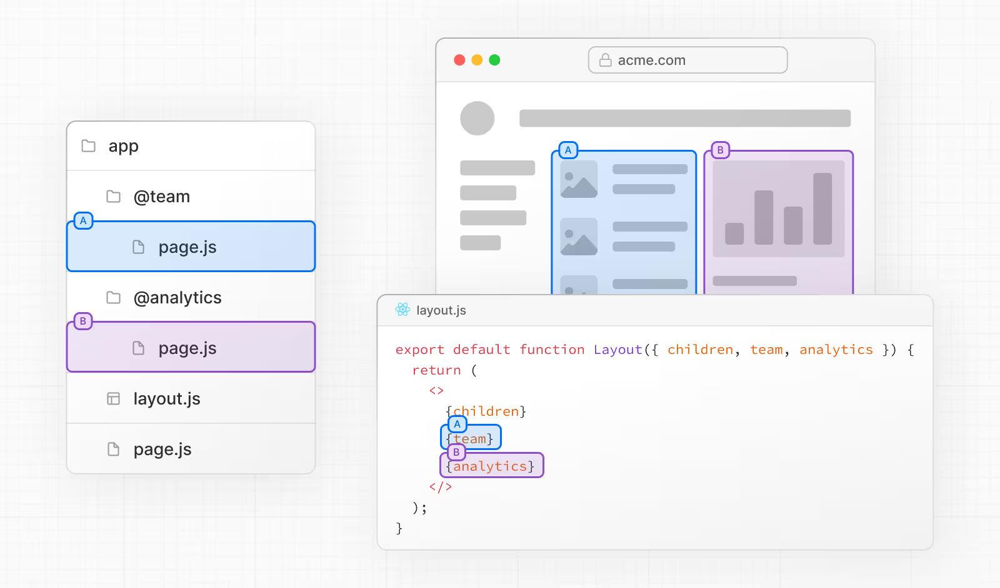
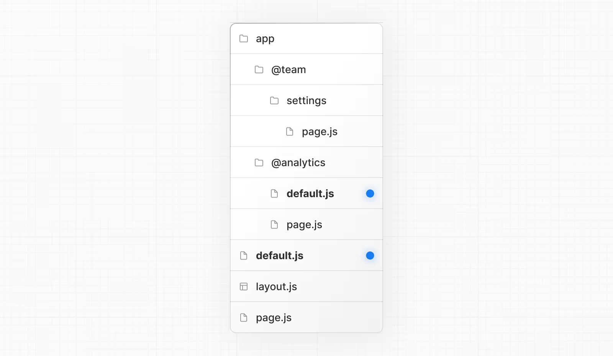
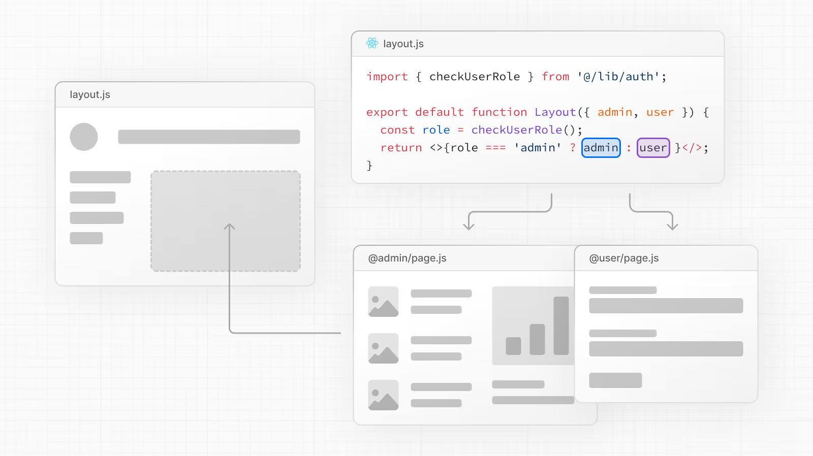
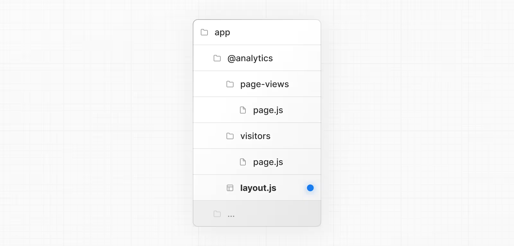
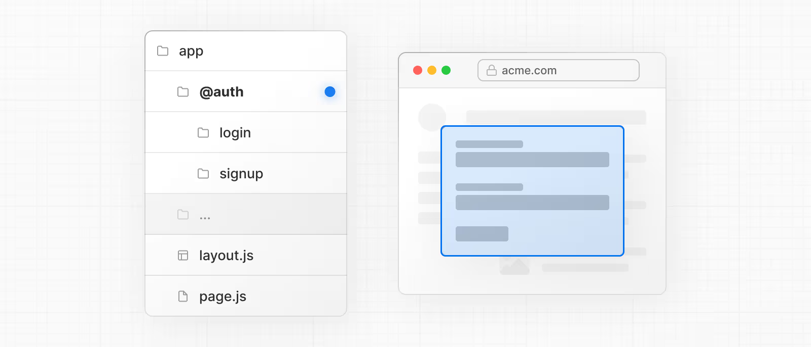
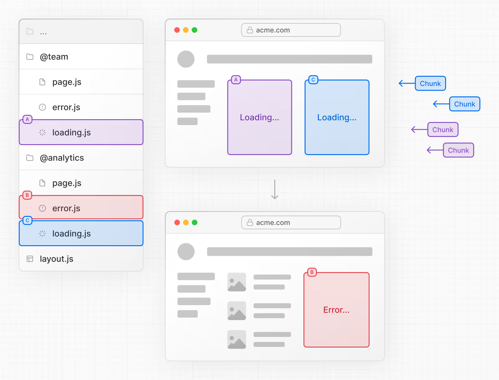
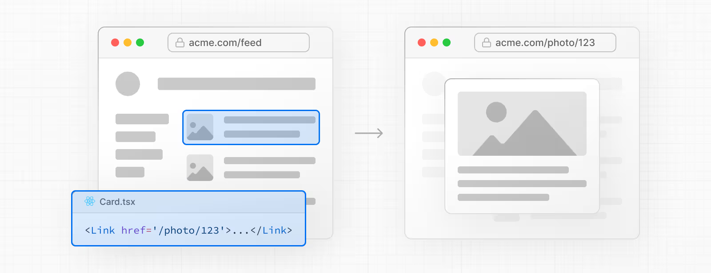
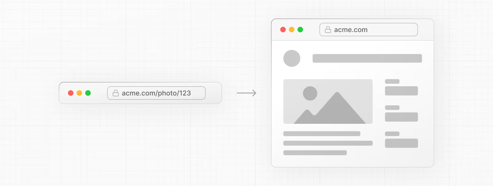
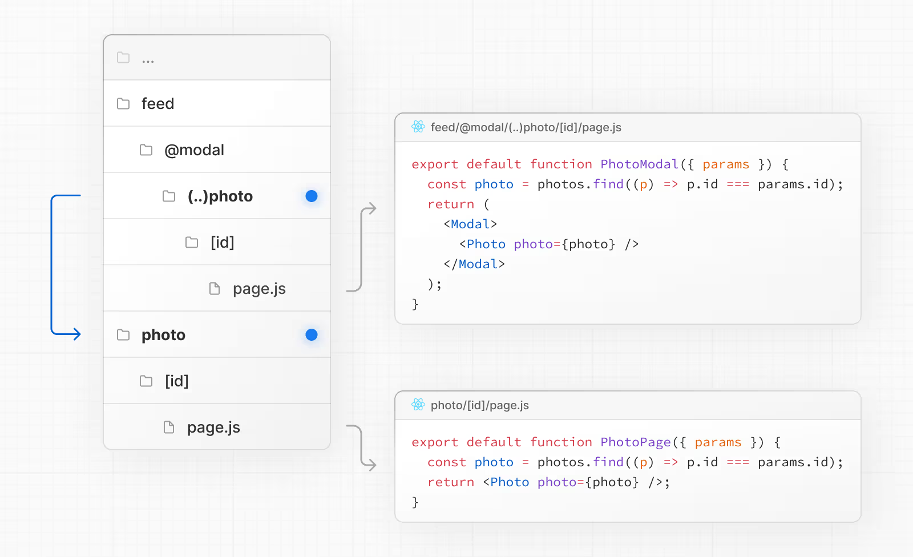

<h1> 📚 Next.js 5주차 학습정리 | Routing (2)

## 💡 Dynamic Routes

- URL 경로의 특정 세그먼트 이름을 미리 알 수 없을 때 사용하는 기능
  - 사용자가 작성한 블로그 게시글 페이지처럼 `post/123`, `post/abc` 등 경로가 **사용자 데이터**에 따라 달라질 경우에 적합.
- 동적 세그먼트는 요청 시점(request time) 혹은 빌드 시점(build time) 에 채워짐

폴더 이름을 `대괄호 []` 로 감싸는 방식으로 동적 세그먼트 생성.

- `[id]`, `[slug]`같은 형식 (변하는 값들이 들어올 자리 표시)

- 동적 세그먼트 값은 `params`라는 이름의 `props`로 전달됨.
- `params`를 사용할 수 있는 곳
  - `layout.tsx` , `page.tsx`, `route handler`, `generateMetadata()` 함수 등

### 📍 Example

```
export default async function Page({
  params,
}: {
  params: Promise<{ slug: string }>
}) {
  const { slug } = await params
  return <div>My Post: {slug}</div>
}
```

- params : `{ slug: string }` 타입의 비동기 객체 (= Promise)
- `await params`로 `slug` 값을 받아서 → `My Post: slug`값을 출력
  - ex. `/blog/a`에 접근 → `My Post: a`가 출력됨

### 📍 Good To Know

1. `params prop`은 **Promise 객체**이기 때문에, 값을 접근하려면 `async/await` 문법이나 React의 **use 함수**를 반드시 사용해야 한다.
2. Next.js 버전 14 이하에서는 params가 `동기적(synchronous) prop`이었기 때문에 바로 사용할 수 있었다. Next.js 15에서는 **하위 호환성(backwards compatibility)** 을 위해 여전히 동기적으로 접근하는 것이 가능하지만, 이 동작 방식은 앞으로 지원이 중단(deprecated)될 예정
3. `Dynamic Segments` = 기존 pages 디렉토리에서의 `Dynamic Routes`

### 📍 정적 파라미터 생성

- `generateStaticParams` 함수 : 동적 라우트 세그먼트와 함께 사용되어, 요청 시점(on-demand)이 아닌 **빌드 시점(build time)**에 정적으로 라우트를 생성할 수 있도록 해줌.

예시 코드

```
export async function generateStaticParams() {
  const posts = await fetch('https://.../posts').then((res) => res.json())

  return posts.map((post) => ({
    slug: post.slug,
  }))
}
```

### ⚡️ `generateStaticParams` 함수

- 동적 라우트와 함께 사용되어 빌드 시점에 정적으로 페이지를 생성할 수 있게 해주는 함수
- 요청 시마다 만드는 게 아니라 미리 만들어서 성능을 높임

```
export async function generateStaticParams() {
  const posts = await fetch('https://.../posts').then((res) => res.json())

  return posts.map((post) => ({
    slug: post.slug,
  }))
}
```

- 외부 API에서 글 목록을 받아오고, 각 글의 slug를 기반으로 정적 경로를 만듦

  - `/blog/hello`, `/blog/nextjs` 같은 페이지들은 미리 생성

- 💡 장점
- fetch 요청이 자동으로 메모이제이션됨 → 동일한 요청이 여러 번 있어도 한 번만 수행됨 → 빌드 시간 단축
- **Memoization** : 동일한 계산을 반복해야 할 경우, 결괏값을 메모리에 저장해 두었다가 꺼내어 씀으로써 중복 계산을 방지하는 기법 (넓게 말하면 캐싱의 일종으로 볼 수 있음)

### 📍 Catch All Segments (모든 하위 경로를 포괄하는 세그먼트)

- Dynamic Segments는 `[...folderName]` 이렇게 대괄호 안에 ... (점 세개)를 추가하면, 그 경로 이후의 모든 하위 경로를 한 번에 포괄할 수 있음

`app/shop/[...slug]/page.tsx`

- 경로 깊이에 상관없이 `/shop/` 이후의 모든 세그먼트를 배열 형태로 받아옴.


### 📍 Optional Catch All Segments (선택적 전체 포괄 세그먼트)

- Catch-all Segments는 기본적으로 특정 경로 이후의 모든 하위 경로를 포괄
- 값을 선택적으로 만들고 싶을 때는 [[...]] (대괄호 두 겹) 을 사용

`app/shop/[[...slug]]/page.tsx`

- `/shop`도 매칭됨. (하위 경로가 없어도 동작)


### 📍 TypeScript에서 Dynamic Routes `params` 정의하기

- TypeScript를 사용할 경우, 라우트에 따라 params 객체에 타입을 직접 지정할 수 있음
- 해당 경로에서 어떤 동적 세그먼트를 사용하는지에 따라 달라짐

```
export default async function Page({
  params,
}: {
  params: Promise<{ slug: string }>
}) {
  return <h1>My Page</h1>
}
```


## 💡 Parallel Routes (병렬 라우트)

- 하나의 레이아웃 안에서 여러 페이지를 동시에 또는 조건에 따라 렌더링할 수 있는 기능
- 특히나 앱 내에서 동적으로 바뀌는 영역이 많을 때 유용
  - dashboard 화면
  - 소셜 미디어의 피드/사이드바



- 왼쪽에는 `Team` 정보, 오른쪽에는 `Analytics` 정보

🌱 두 페이지를 각각 병렬로 렌더링하면서도 공통 레이아웃을 유지할 수 있다는 점이 장점.

### 📍 Slots

```
app/
├── @analytics/
│   └── page.tsx
├── @team/
│   └── page.tsx
└── layout.tsx

```

- `@폴더명` 형태로 폴더를 생성함으로써 Slot 정의
- `@analytics`, `@team` 두 개의 슬롯 생성

### ⚡️ 슬롯의 라우팅 구조

- 슬롯은 병렬 라우팅 과정에서 **공통 부모 레이아웃(layout.tsx)** 에 **props 형태** 로 전달된다.

```
export default function Layout({
  children,
  team,
  analytics,
}: {
  children: React.ReactNode
  analytics: React.ReactNode
  team: React.ReactNode
}) {
  return (
    <>
      {children}
      {team}
      {analytics}
    </>
  );
}
```

- `app/layout.tsx` 안에서 `@analytics`, `@team`에 해당하는 컴포넌트는 `children` 과 나란히 병렬로 렌더링됨

#### ⚠️ 주의

1. 슬롯은 라우트 세그먼트가 아님 => URL 경로에는 영향 ❌

- ex. 실제 경로가 `/@analytics/views`여도 URL은 `**/views**` 처럼 표시

2. 슬롯은 일반적인 `페이지(Page) 컴포넌트` 와 조합되어 최종적으로 하나의 화면을 구성함

3. 같은 라우트 세그먼트 수준에서, 정적 슬롯과 동적 슬롯을 혼합해서 사용할 수 ❌

- 슬롯 중 하나라도 동적(dynamically matched)이라면 해당 수준의 **모든 슬롯**이 동적이어야 함.
- ex. `@team`이 `[teamId]` 같은 동적 슬롯 -> `@analytics`도 `[analyticsId]`처럼 동적으로 바꿔야 함

### 📍 Active State와 Navigation 방식

- Next.js는 각 slot의 active subpage 상태를 자동으로 추적하지만, navigation 방식에 따라 다르게 작동함

✅ Soft Navigation

- ex. `<Link>`, `router.push()` 사용 시
- 해당 slot만 새로 렌더링하고, 나머지 slot은 기존 상태 유지
- URL과 맞지 않아도 유지됨 → 성능 최적화에 유리

✅ Hard Navigation

- 전체 새로고침 or 주소창 입력
- 전체 페이지가 새로 로드됨
- URL과 맞지 않는 slot은 상태를 추적할 수 없기 때문에
  - default.js 있으면 그걸 렌더링
  - 없으면 404 에러 발생

#### 👍🏻 Good to Know

해당되지 않는 경로에 대해 404 오류를 발생시키면, 원래 보여주려고 하지 않았던 페이지에 병렬 슬롯이 잘못 표시되는 실수를 방지할 수 있다.

### `default.js`

- 초기 로드 또는 새로고침 시 → URL과 일치하지 않는 slot에는 `default.js`가 `fallback`으로 렌더링됨



####

- `@team slot`에는 `/settings `페이지가 존재
- `@analytics`에는 `/settings`가 없음

🔹 **Soft Navigation 시**

- `@team` : `/settings` 렌더링
- `@analytics`는 기존 활성 상태 유지

🔹 **Hard Navigation 시**

- `@analytics`는 `default.js` 렌더링
- `default.j`s 없으면 404 발생

⚡️ children은 암묵적인 슬롯이기 때문에, Next.js가 상위(parent) 페이지의 활성 상태를 복구하지 못할 경우를 대비해 children을 위한 default.js 파일도 만들어야 한다.

### `useSelectedLayoutSegment(s)`

- `useSelectedLayoutSegment`, `useSelectedLayoutSegments` : `parallelRoutesKey`를 인자로 받아 **해당 slot 안에서 활성화된 경로 세그먼트** 를 읽을 수 있음

```
'use client'

import { useSelectedLayoutSegment } from 'next/navigation'

export default function Layout({ auth }: { auth: React.ReactNode }) {
  const loginSegment = useSelectedLayoutSegment('auth')
  // ...
}
```

1. `app/layout.tsx`에서 u`seSelectedLayoutSegment`('auth') 호출

2. 사용자가 `/login` (즉, `app/@auth/login`)으로 이동하면 `loginSegment`는 **"login"** 문자열을 반환

## Examples

### 1. Conditional Routes



- Parallel Routes를 이용하면 조건 (ex. 사용자 역할)에 따라 다른 라우트를 조건부로 렌더링할 수 있음

#### 예시

- `/admin` 역할이면 관리자용 dashboard
- `/user` 역할이면 일반 사용자용 dashboard
  → 동일한 슬롯 위치에 서로 다른 컴포넌트를 조건에 따라 렌더링 가능

```
import { checkUserRole } from '@/lib/auth'

export default function Layout({
  user,
  admin,
}: {
  user: React.ReactNode
  admin: React.ReactNode
}) {
  const role = checkUserRole()
  return role === 'admin' ? admin : user
}
```

### 2. Tab Groups



- slot 안에 layout을 추가하면 해당 slot을 독립적으로 탭처럼 네비게이션할 수 있음

#### 예시

- `@analytics` 슬롯 안에 서브페이지 두 개 (`/page-views`, `/visitors`) 를 둬서 사용자에게 **탭 전환**처럼 보여줄 수 있음

```
import Link from 'next/link'

export default function Layout({ children }: { children: React.ReactNode }) {
  return (
    <>
      <nav>
        <Link href="/page-views">Page Views</Link>
        <Link href="/visitors">Visitors</Link>
      </nav>
      <div>{children}</div>
    </>
  )
}
```

### 3. Modals

- **Intercepting Routes + Parallel Routes** 를 함께 사용하면 깊은 연결(deep linking) 가능한 모달을 만들 수 있음

#### 아래와 같은 기능을 할 수 있다

- 모달 내용을 URL로 공유 가능하게 만들기
- 페이지 새로고침해도 모달 유지
- 뒤로가기 시 모달만 닫기, 이전 페이지로 돌아가지 않도록
- 앞으로 가기 시 모달 다시 열기



#### 단계

1. `/login` 경로 생성 → 메인 로그인 페이지를 렌더링
2. `@auth` slot에 `default.js` 추가

- 비활성 상태일 때는 모달이 렌더링되지 않도록 null 반환

3. `@auth` slot에서 `/login`경로를 가로채기

- `/auth/(.)login` 폴더 생성
- `page.tsx` 파일에서 `<Modal>`컴포넌트 및 자식 컴포넌트 import하여 렌더링

### 💡 모달 열기

- 모달을 열기 위해서는 `@auth slot`을 상위 layout에 `prop`으로 전달하고, `children`과 같이 렌더링해야 함.

```
import Link from 'next/link'

export default function Layout({
  auth,
  children,
}: {
  auth: React.ReactNode
  children: React.ReactNode
}) {
  return (
    <>
      <nav>
        <Link href="/login">Open modal</Link>
      </nav>
      <div>{auth}</div>
      <div>{children}</div>
    </>
  )
}
```

- 사용자가 `<Link>`를 클릭 -> `/login` 페이지로 이동하지 않고 모달 열림
- 하지만 **페이지를 새로고침** 하거나 **처음 접속** 할 때 `/login`으로 이동 시 - **정식 로그인 페이지** 렌더링

### 💡 모달 닫기

- `router.back()` 또는 `Link`로 모달을 닫을 수 있음
- 모달이 더 이상 필요 없는 페이지로 이동할 때는 해당 슬롯`(@auth)`이 `null`을 반환해야 함

- 방법
  - / 경로용 `@auth/page.tsx`, 모든 경로 대응용 `@auth/[[...catchall]]/page.tsx`를 만들어
  - `null`을 반환하게 설정

#### app/ui/modal.tsx

```
'use client'

import { useRouter } from 'next/navigation'

export function Modal({ children }: { children: React.ReactNode }) {
  const router = useRouter()

  return (
    <>
      <button
        onClick={() => {
          router.back()
        }}
      >
        Close modal
      </button>
      <div>{children}</div>
    </>
  )
}
```

| 요소                     | 설명                                                               |
| ------------------------ | ------------------------------------------------------------------ |
| `use client`             | 클라이언트 컴포넌트임을 명시 (모달은 상호작용이 필요하기 때문)     |
| `useRouter()`            | Next.js의 클라이언트 라우터 훅. `router.back()` 호출에 사용됨      |
| `<button onClick={...}>` | 버튼 클릭 시 모달 닫힘. `router.back()`으로 이전 URL 상태로 되돌림 |
| `children`               | 모달 내부에 표시할 내용을 외부에서 전달받아 렌더링함               |

#### app/ui/modal.tsx

```
import Link from 'next/link'

export function Modal({ children }: { children: React.ReactNode }) {
  return (
    <>
      <Link href="/">Close modal</Link>
      <div>{children}</div>
    </>
  )
}
```

| 요소              | 설명                                             |
| ----------------- | ------------------------------------------------ |
| `<Link href="/">` | 클릭 시 루트(`/`) 페이지로 이동 → 모달 닫기 효과 |
| `children`        | 모달 안에 들어갈 콘텐츠를 외부에서 받아서 렌더링 |

#### app/@auth/page.tsx

```
export default function Page() {
  return null
}
```

| 요소                             | 설명                                                                         |
| -------------------------------- | ---------------------------------------------------------------------------- |
| `export default function Page()` | 기본 페이지 컴포넌트 정의. Next.js에서 이 파일이 해당 라우트의 엔트리 포인트 |
| `return null`                    | 아무 것도 렌더링하지 않음 → 슬롯 비활성 상태로 설정하는 데 사용됨            |

#### | >> 해당 slot이 비어 있어야 할 때, 즉 모달이 열리지 않아야 할 페이지에서 사용

#### app/@auth/[...catchAll]/page.tsx

```
export default function CatchAll() {
  return null
}
```

- 모든 경로에서 특정 slot(ex. 모달)을 비워두고 싶을 때
- `@auth/[[...catchall]]/page.tsx` 파일에 이 컴포넌트를 두면 어떤 경로에서도 모달이 열리지 X

### 4. Loading and Error UI



- Parallel Routes는 각 슬롯을 **독립적으로 스트리밍** 가능
- 각 슬롯마다 별도의 error와 loading 상태를 정의할 수 있음
- ex. 어떤 슬롯은 로딩 중일 때 스피너를, 다른 슬롯은 에러 메시지를 각각 보여주기 가능

## 💡 Intercepting Routes

- 다른 위치의 라우트를 레이아웃 안에서 불러오는 방식 <br/> → 사용자가 **컨텍스트 전환 없이** 특정 콘텐츠를 볼 수 있게 함



- `/feed`에서 사진을 클릭하면 `/photo/123` 페이지가 모달 형태로 오버레이됨
- URL은 `/photo/123`로 유지되지만, 사용자는 `/feed` 안에 있는 것처럼 경험함

🔹 Next.js가 해당 라우트를 가로채서 현재 레이아웃 위에 표시하기 때문에 **화면 전환 없이 콘텐츠 추가 표시** 가능 (ex. 모달, 슬라이드 등)

‼️ 하지만 **공유 가능한 URL** 을 클릭하거나 **페이지를 새로고침** 해서 사진에 접근할 경우

- 모달이 아니라 전체 사진 페이지가 렌더링되어야 함.
- 이때는 route interception가 발생하지 않아야 함.

| 내부 탐색일 땐 모달로, 직접 URL 접근이나 새로고침일 땐 정식 페이지로 보여야 한다!



### 📍 Convention

- Intercepting routes는 `(..) 규칙`을 이용해 정의함.
  - ../ (상대경로 규칙)과 비슷하지만 segment 단위에서 사용됨
  - 폴더 구조에서 상대경로처럼 상위 segment를 참조할 수 있다는 의미

#### 사용 방법

- (.) → 같은 레벨의 segment와 매칭
- (..) → 한 단계 위 segment와 매칭
- (..)(..) → 두 단계 위 segment와 매칭
- (...) → **루트(app 디렉토리)** 부터 매칭

## Examples

### 1. Modals

- **Intercepting Routes** 와 **Parallel Routes**를 함께 사용하면 모달 구조를 깔끔하게 구현 가능

#### 가능한 기능

- 모달을 URL로 공유
- 새로고침해도 모달 유지, 닫히지 않음
- 뒤로가기 시 모달만 닫히고, 이전 페이지로 돌아가지 않음
- 앞으로 가기 시 모달 다시 열림



- 위의 예시에서 photo segment 경로를 지정할 때 ( .. ) matcher 하나만 사용해도 됨.
- `@modal` 이 **segment(경로 조각)** 가 아니라 **slot(병렬 슬롯)** 이기 때문

### `@modal/(..)photo/[id]/page.tsx` 의 의미

```
app/
├── gallery/
│   └── page.tsx
├── @modal/
│   └── (..)photo/
│       └── [id]/
│           └── page.tsx
```

| 요소     | 설명                                                             |
| -------- | ---------------------------------------------------------------- |
| `@modal` | 병렬 슬롯 (slot) → 실제 라우팅 경로(segment)로 **계산되지 않음** |
| `( .. )` | 상위 segment 한 단계 위로 이동 → 예: `gallery`의 바로 위로 이동  |
| `photo`  | 위로 올라간 위치에서의 `photo` 경로를 의미                       |

→ gallery에서 (..) 하나로 충분히 한 단계 위의 photo 경로를 참조할 수 있음.

- (..)photo는 한 segment 위인 /photo/:id를 가리킴

📌 파일 구조상으로 보면 gallery → @modal → (..)photo → [id] → page.tsx로 **두 단계 이상을 올라간 느낌**이지만, slot은 **라우팅 깊이에 영향을 주지 않기 때** 문에 실제론 한 단계만 위로 보면 .
