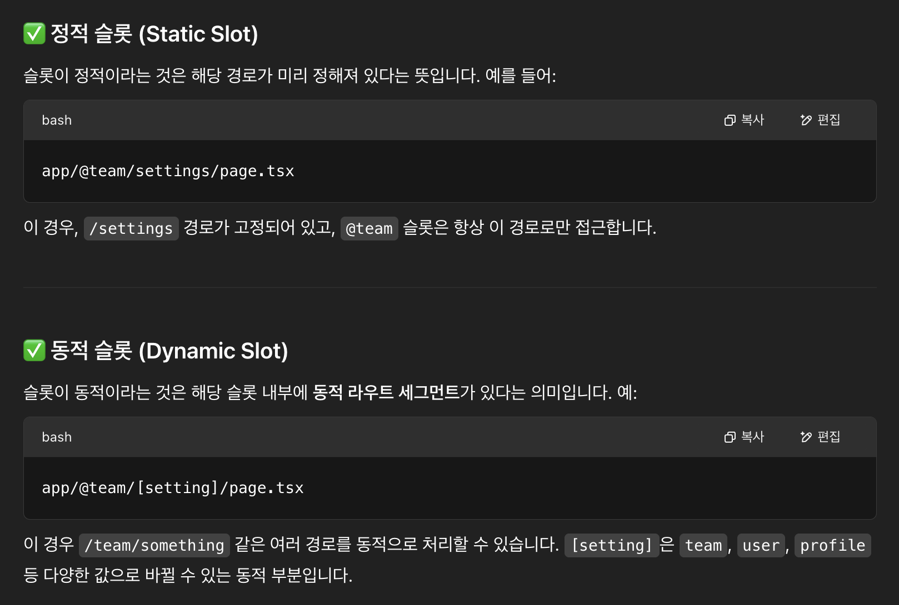

# Dynamic Routes

정확한 세그먼트 **이름을 미리 알 수 없는 동적 데이터**로 **라우트를 만들**고 싶을 때는, 요청 시점이나 빌드 시점에 채워지는 **동적 세그먼트를 사용**할 수 있습니다.

## 컨벤션

- 동적 세그먼트는 `[폴더이름]` 처럼, 폴더 이름을 대괄호로 감싸서 만들 수 있습니다. 예: `[id]`, `[slug]`
- 동적 세그먼트 값은 `layout`, `page` 컴포넌트나, `route`,`generateMetadata` 함수에 `params`속성으로 전달된다.

## 예시

예를 들어 블로그는 `app/blog/[slug]/page.js` 라우트를 가질 수 있고, 여기서 `[slug]`는 블로그 글의 동적 세그먼트입니다.

```tsx
export default async function Page({
  params,
}: {
  params: Promise<{ slug: string }>;
}) {
  const { slug } = await params;
  return <div>My Post: {slug}</div>;
}
```

위 코드에서는 `params`가 `Promise` 객체로 전달되며, 이를 `await`해서 `slug` 값을 추출하고 있습니다.


## 참고하면 좋은 점 (Good to know)

- `params`는 `Promise`이므로, 값을 사용하려면 `async/await` 또는 `React`의 `use()` 함수를 사용해야 합니다.

  - 버전 14 이하에서는 `params`가 동기적으로 전달되었습니다. Next.js 15에서도 여전히 동기적으로도 접근할 수 있지만, 향후에는 지원이 중단될 예정입니다.

- **동적 세그먼트(Dynamic Segments)**는 `pages 디렉토리`의 **동적 라우트(Dynamic Routes)**와 동일한 기능을 합니다.

## Generating Static Params

`generateStaticParams` 함수는 **동적 세그먼트(Dynamic Segments)**와 함께 사용되어 **요청 시점이 아닌 빌드 시점에 정적으로 라우트를 생성**할 수 있게 합니다.

## `generateStaticParams` 예시

아래 예시는 API에서 블로그 포스트 목록을 받아 각 slug로 정적 페이지를 생성합니다.

```tsx
export async function generateStaticParams() {
  const posts = await fetch("https://.../posts").then((res) => res.json());

  return posts.map((post) => ({
    slug: post.slug,
  }));
}
```

`generateStaticParams`의 주요 이점은 **데이터를 스마트하게 가져오는 것**입니다.

`generateStaticParams` 함수 내에서 **`fetch` 요청을 사용하여 콘텐츠를 가져오는 경우, 해당 요청은 자동으로 메모이제이션**됩니다.

📙 이는 **동일한 인자(arguments)를 가진 `fetch` 요청**이 여러 `generateStaticParams`, `Layout`, `Page`에서 반복되더라도 **한 번만 수행된다는 뜻**이며, 이로 인해 **빌드 시간이 단축**됩니다.

## Catch-all Segments

동적 세그먼트는 **대괄호 안에 줄임표(ellipsis (...))를 추가함**으로써 이후의 모든 세그먼트를 포괄하는 **catch-all 세그먼트로 확장**할 수 있습니다.

예를 들어,`app/shop/[...slug]/page.js`는

- `/shop/clothes`
- `/shop/clothes/tops`
- `/shop/clothes/tops/t-shirts`

등과 같이 **모든 하위 경로와 매칭**됩니다.


## Optional Catch-all Segments

Catch-all Segments는 이중 대괄호 `[[...폴더명]]`을 사용하여 **옵셔널(선택적)** 로 만들 수 있습니다.

예를 들어, `app/shop/[[...slug]]/page.js`는

- `/shop`
- `/shop/clothes`
- `/shop/clothes/tops`,
- `/shop/clothes/tops/t-shirts`

위의 경우 모두 매칭됩니다.

일반 `catch-all`과 `optional catch-all`의 차이는, `optional catch-all`의 경우 **파라미터가 없는 경로도 매칭**된다는 점입니다. (위 예시에서 `/shop`).


## Typescript

`sTypeScript`를 사용할 경우, 라우트 세그먼트 설정에 따라 `params`에 대한 타입을 지정할 수 있습니다.

```tsx
// app/blog/[slug]/page.tsx

export default async function Page({
  params,
}: {
  params: Promise<{ slug: string }>;
}) {
  return <h1>My Page</h1>;
}
```


# 병렬 라우트 (Parallel Routes)

병렬 라우트를 사용하면 **하나의 레이아웃 안**에서 **하나 이상의 페이지를 동시에 또는 조건적으로 렌더링**할 수 있습니다.

**✨ 유용한 케이스**  
매우 동적인 앱의 섹션에서 유용하다.

- **대시보드**

  
  대시보드에서는 **병렬 라우트를 사용**하여 **팀(`team`) 페이지**와 **분석 페이지(`analytics`)** 를 동시에 렌더링할 수 있다.

- 소셜 사이트

## Slots (슬롯)

병렬 라우트(Parallel routes)는 네임드 슬롯(named slots)을 사용하여 생성됩니다.

> **슬롯(Slots) 은 `@folder` (@폴더) 규칙으로 정의됩니다.**

예를 들어, 아래의 파일 구조는 `@analytics`와 `@team`이라는 두 개의 슬롯을 정의합니다.


슬롯(Slot)은 공통 부모 레이아웃(shared parent layout) 컴포넌트에 `props`로 전달됩니다.

**위 예시에서는 `app/layout.js` 컴포넌트가 `@analytics`와 `@team` 슬롯을 `props`로 받아 `children`과 함께 병렬로 렌더링할 수 있습니다.**

```tsx
// app/layout.ts

export default function Layout({
  children,
  team,
  analytics,
}: {
  children: React.ReactNode;
  analytics: React.ReactNode;
  team: React.ReactNode;
}) {
  return (
    <>
      {children}
      {team}
      {analytics}
    </>
  );
}
```

하지만 **슬롯은** 라우트 세그먼트(route segments)가 아니며 **URL 구조에 영향을 주지 않습니다.**

예를 들면, `/@analytics/views`는 `@analytics`가 슬롯이기 때문에 **실제 URL은 `/views`**가 됩니다.

슬롯(Slots)은 일반적인 페이지 컴포넌트와 결합되어 **해당 라우트 세그먼트에 연결된 최종 페이지를 구성**합니다.

이 때문에, **동일한 라우트 세그먼트 레벨**에서 **정적 슬롯(static slots)과 동적 슬롯(dynamic slots)을 혼합할 수 없습니다.**

> **하나의 슬롯이 동적이면, 해당 레벨의 모든 슬롯은 동적이어야 합니다.**
>
> 
>
> 

### 참고로 알아두면 좋은 점(Good to know)

- `children prop`은 암묵적인 슬롯이며, 폴더에 매핑될 필요가 없습니다.  
  👉 즉, `app/page.js`는 `app/@children/page.js`와 동일합니다.

## 활성 상태(Active state)와 네비게이션(navigation)

기본적으로 `Next.js`는 **각 슬롯의 활성 상태(또는 하위 페이지(subpage))를 추적**합니다.

하지만 **슬롯 내에 렌더링되는 콘텐츠**는 **탐색(navigation) 방식**에 따라 달라집니다:

### 소프트 네비게이션(Soft Navigation)

**클라이언트 사이드 네비게이션(client-side navigation)**

> Next.js가 부분 렌더링(partial render)을 수행하여, **슬롯 내 하위 페이지만 변경하며**, **다른 활성화된 슬롯의 하위 페이지**(other slot's active subpages)는 **현재 URL과 맞지 않더라도 그대로 유지**합니다.

### 하드 네비게이션(Hard Navigation)

**전체 페이지가 새로고침**(full-page load (browser refresh))되면, **Next.js는 현재 URL과 일치하지 않는 슬롯의 활성 상태를 알 수 없습니다.**

대신, **해당되지 않는 슬롯**에 대해 **`default.js` 파일을 렌더링**하거나, `default.js`가 없다면 `404 페이지`를 표시합니다.

#### 참고로 알아두면 좋은 점(Good to know)

> 일치하지 않는 라우트(unmatched routes)에 대해 `404`를 보여주는 것은, **의도되지 않은 페이지에서 병렬 라우트(parallel route)가 잘못 렌더링되는 것을 방지**해 줍니다.

### `default.js`

**초기 로드** 또는 **전체 페이지 새로고침(full-page reload)** 시 **일치하지 않는 슬롯에 대해 fallback**으로 렌더링할 `default.js` 파일을 정의할 수 있습니다.

아래와 같은 폴더 구조를 생각해봅시다. `@team` 슬롯은 `/settings` 페이지가 있지만, `@analytics` 슬롯은 없습니다.


`/settings` 경로로 이동하면, `@team` 슬롯은 `/settings` 페이지를 렌더링하고, `@analytics` 슬롯은 현재 활성화된 페이지 상태를 그대로 유지합니다.

페이지를 새로고침하면, Next.js는 `@analytics` 슬롯에 대해 `default.js`를 렌더링하고, 만약 `default.js`가 없다면 `404 페이지`를 표시합니다.

또한 `children`은 암묵적 슬롯(slot)이기 때문에, 상위 페이지의 활성 상태를 복구할 수 없는 경우를 대비해 **`children`용 fallback인 `default.js` 파일도 만들어야 합니다.**

### useSelectedLayoutSegment(s)

`useSelectedLayoutSegment`와 `useSelectedLayoutSegments` 훅은 둥다 `parallelRoutesKey` 파라미터를 받아, 슬롯 내의 **활성화된 라우트 세그먼트(active route segment)**를 읽을 수 있게 해줍니다.

```tsx
// app/layout.tsx

"use client";

import { useSelectedLayoutSegment } from "next/navigation";

export default function Layout({ auth }: { auth: React.ReactNode }) {
  const loginSegment = useSelectedLayoutSegment("auth");
  // ...
}
```

사용자가 `app/@auth/login`(또는 브라우저 주소창 기준 `/login`)으로 이동하면, `loginSegment` 값은 `"login"` 문자열이 됩니다.

## 예시

### 조건부 라우트 (Conditional Routes)

> **특정 조건에 기반하여 조건부로 라우트를 렌더링할 때 사용**  
> (to conditionally render routes based on certain conditions)

병렬 라우트(Parallel Routes)를 **특정 조건(예: 사용자 역할)에 따라 조건적으로 라우트를 렌더링하는 데 사용**할 수 있습니다.

예를 들어, `/admin`과 `/user` 역할에 따라 서로 다른 대시보드 페이지를 렌더링할 수 있습니다:


```tsx
// app/dashboard/layout.tsx

import { checkUserRole } from "@/lib/auth";

export default function Layout({
  user,
  admin,
}: {
  user: React.ReactNode;
  admin: React.ReactNode;
}) {
  const role = checkUserRole();
  return role === "admin" ? admin : user;
}
```

### 탭 그룹 (Tab Groups)

슬롯(slot) 내부에 레이아웃을 추가하면, 사용자가 해당 슬롯을 독립적으로 탐색할 수 있습니다. **이 기능은 탭을 만들 때 유용합니다.**

예를 들어, `@analytics` 슬롯에는 `/page-views`와 `/visitors`라는 두 하위 페이지가 있을 수 있습니다.


`@analytics` 슬롯 내부에 **레이아웃 파일을 만들어**, **두 페이지 간에 탭 UI를 공유**합니다:

```tsx
// app/@analytics/layout.tsx

import Link from "next/link";

export default function Layout({ children }: { children: React.ReactNode }) {
  return (
    <>
      <nav>
        <Link href="/page-views">Page Views</Link>
        <Link href="/visitors">Visitors</Link>
      </nav>
      <div>{children}</div>
    </>
  );
}
```

### 모달(Modals)

**병렬 라우트(Parallel Routes)**는 **인터셉팅 라우트(Intercepting Routes)**와 함께 사용하여, **딥 링크(deep linking)를 지원하는 모달**을 만들 수 있습니다.

이 기능은 **아래와 같은 모달을 만들 때 자주 발생하는 문제를 해결**해 줍니다. 예를 들면 다음과 같습니다:

- **모달 내용**을 **URL을 통해 공유 가능**하게 만들기
- 페이지를 **새로고침**해도 모달이 닫히지 않고 **컨텍스트를 유지**하기
- **브라우저 뒤로가기를 누르면** 이전 라우트가 아니라 **모달만 닫히도록 하기**
- **앞으로 가기**를 누르면 **다시 모달이 열리도록 하기**

사용자가 **클라이언트 사이드 네비게이션(client-side navigation)**으로 **레이아웃에서 로그인 모달**을 열거나, **`/login `페이지에 직접 접근**할 수 있는 경우의 UI 패턴을 생각해 봅시다.


이 패턴을 구현하려면, 먼저 **`/login` 라우트를 만들어 주요 로그인 페이지를 렌더링**합니다.


```tsx
// app/login/page.tsx

import { Login } from "@/app/ui/login";

export default function Page() {
  return <Login />;
}
```

그런 다음, `@auth` 슬롯 안에 `default.js` 파일을 추가하고 `null`을 반환하게 합니다. 👉 이렇게 하면 **모달이 활성화되지 않았을 때 렌더링되지 않도록 보장**합니다.

```tsx
// app/@auth/default.tsx

export default function Default() {
  return null;
}
```

`@auth` 슬롯 내부에서 `/login` 라우트를 인터셉트하기 위해 `/(.)login` 폴더를 업데이트합니다.

`/(.)login/page.tsx` 파일에 `<Modal>` 컴포넌트와 자식 요소들을 가져옵니다:

```tsx
// app/@auth/(.)login/page.tsx

import { Modal } from "@/app/ui/modal";
import { Login } from "@/app/ui/login";

export default function Page() {
  return (
    <Modal>
      <Login />
    </Modal>
  );
}
```

#### 참고로 알아두면 좋은 점(Good to know)

- 라우트를 **인터셉트하기 위해 사용하는** `(.)`와 같은 **규칙은 파일 시스템 구조에 따라 달라집니다.**

- **`<Modal>` 기능**을 `<Login>` 같은 **모달 콘텐츠와 분리함**으로써, **모달 내부의 콘텐츠가 서버 컴포넌트가 되도록 보장**할 수 있습니다.

#### 모달 열기(Opening the modal)

이제 **Next.js 라우터**를 활용해 **모달을 열고 닫을 수 있습니다.**

이 방법은 **모달을 열었을 때**나 **앞으로/뒤로 이동할 때** URL이 올바르게 업데이트되도록 보장합니다.

모달을 열기 위해, `@auth` 슬롯(slot)을 **상위 레이아웃에 `props`로 전달**하고 **`children`과 함께 렌더링**합니다.

```tsx
// app/layout.tsx

import Link from "next/link";

export default function Layout({
  auth,
  children,
}: {
  auth: React.ReactNode;
  children: React.ReactNode;
}) {
  return (
    <>
      <nav>
        <Link href="/login">Open modal</Link>
      </nav>
      <div>{auth}</div>
      <div>{children}</div>
    </>
  );
}
```

사용자가 `<Link>`를 클릭하면, **`/login` 페이지로 이동하는 대신 모달이 열립니다.**

하지만 **새로고침(refresh)**하거나 **처음 로드(initial load)**할 경우 **`/login`은 메인 로그인 페이지**로 이동합니다.

#### 모달 닫기(Closing the modal)

`router.back()`을 호출하거나 `<Link>` 컴포넌트를 사용해 모달을 닫을 수 있습니다.

```tsx
// app/ui/modal.tsx

"use client";

import { useRouter } from "next/navigation";

export function Modal({ children }: { children: React.ReactNode }) {
  const router = useRouter();

  return (
    <>
      <button
        onClick={() => {
          router.back();
        }}
      >
        Close modal
      </button>
      <div>{children}</div>
    </>
  );
}
```

`<Link>` 컴포넌트를 사용해 더 이상 **`@auth` 슬롯을 렌더링하지 않는 페이지로 이동**할 경우, 병렬 라우트(parallel route)가 **`null`을 반환하는 컴포넌트에 매칭**되도록 해야 합니다.

예를 들어, 루트 페이지(/)로 돌아갈 때는, `@auth/page.tsx` 컴포넌트를 만들어야 합니다:

```tsx
// app/ui/modal.tsx

import Link from "next/link";

export function Modal({ children }: { children: React.ReactNode }) {
  return (
    <>
      <Link href="/">Close modal</Link>
      <div>{children}</div>
    </>
  );
}
```

```tsx
// app/@auth/page.tsx

export default function Page() {
  return null;
}
```

또는 `/foo`, `/foo/bar`와 같이, 다른 모든 경로로 이동할 경우에는 `catch-all` 슬롯을 사용할 수 있습니다:

```tsx
// app/@auth/[...catchAll]/page.tsx

export default function CatchAll() {
  return null;
}
```

#### 참고로 알아두면 좋은 점(Good to know)

- 우리는 `@auth` 슬롯에서 모달을 닫기 위해 `catch-all 라우트`를 사용합니다. 그 이유는 위에서 설명한 "Active state and navigation(활성 상태와 네비게이션)"의 동작 방식 때문입니다.  
  **클라이언트 사이드**에서 **슬롯과 더 이상 매칭되지 않는 경로로 이동해도 슬롯이 여전히 보이기** 때문에, **모달을 닫기 위해 `null`을 반환하는 경로**와 **슬롯을 매칭**시켜야 합니다.

- 다른 예로는, `갤러리(gallery)`에서 사진 모달을 열되 **`/photo/[id]` 같은 전용 페이지도 존재**하는 경우가 있습니다. 또는 쇼핑 카트를 사이드 모달로 여는 경우도 있습니다.

### Loading and Error UI

병렬 라우트는 독립적으로 스트리밍될 수 있으므로, **각 라우트에 대해 개별적인 로딩 및 에러 상태를 정의**할 수 있습니다

**병렬 라우트는 사용자 정의 에러 및 로딩 상태를 가능하게 해줍니다**


> 자세한 내용은 **로딩 UI 및 에러 처리** 문서 (Loading UI and Error Handling documentation)에서 확인 가능

# 인터셉팅 라우트(Intercepting Routes)

인터셉팅 라우트(Intercepting Routes)를 사용하면 **애플리케이션의 다른 위치에 있는 라우트**를 **현재 레이아웃 내에서 로드**할 수 있습니다.

이러한 라우팅 패러다임(routing paradigm)은 사용자가 다른 컨텍스트로 이동하지 않고도, **라우트의 콘텐츠를 표시하고 싶을 때 유용**합니다.

예를 들어 피드에서 사진을 클릭했을 때, 해당 사진을 모달로 표시하여 피드 위에 겹쳐서 보여줄 수 있습니다.

이 경우, Next.js는 **`/photo/123` 라우트를 인터셉트**하고, URL을 마스킹(masks the URL)하면서 `/feed` 위에 오버레이합니다.


하지만 **공유 가능한 URL을 클릭**하거나 **페이지를 새로고침**했을 때는, **전체 사진 페이지가 렌더링되어야 하며 모달은 나타나지 않아야 합니다.**  
**👉 이때는 인터셉팅 라우트가 작동하지 않아야 합니다.**


## 컨벤션(Convention)

인터셉팅 라우트는 `(..)` 규칙으로 정의할 수 있으며, 이는 상대 경로의 `../`와 유사하지만 라우트 세그먼트용입니다.

**다음과 같은 형식을 사용할 수 있습니다:**

- **`(.)`** 는 같은 수준의 세그먼트를 매칭합니다

- **`(..)`** 는 한 단계 위의 세그먼트를 매칭합니다

- **`(..)(..)`** 는 두 단계 위의 세그먼트를 매칭합니다

- **`(...)`** 는 루트 app 디렉토리부터 세그먼트를 매칭합니다

예를 들어, **`feed` 세그먼트** 내에서 **`photo` 세그먼트를 인터셉트**하려면 `(..)photo` 디렉토리를 만들면 됩니다.


> **주의**: (..) 규칙은 파일 시스템(file-system)이 아닌 라우트 세그먼트(route segments) 기준입니다.

## 예시

인터셉팅 라우트는 병렬 라우트와 함께 사용하여 **모달**을 만들 수 있습니다.  
이 방식은 모달 구현 시 자주 마주치는 문제를 해결할 수 있도록 해줍니다:

**(병렬 라우트에서 작성한 내용 참고)**

아래 예시에서 `photo` 세그먼트에 접근할 때 `(..)` 매처를 사용할 수 있습니다. 이는 `@modal`이 **세그먼트가 아닌 슬롯**이기 때문입니다.

즉, 파일 시스템 상으로는 두 단계 위에 있어도, **세그먼트 기준으로는 photo 라우트가 한 단계 위에 있다**는 뜻입니다.

자세한 구현 예시는 병렬 라우트 문서를 참고하거나, 이미지 갤러리 예제를 참조하세요.


### 참고로 알아두면 좋은 점(Good to know)

- 다른 예로는 상단 네비게이션 바에서 로그인 모달을 열면서도 별도의 `/login` 페이지도 갖는 경우가 있습니다.
- 또는 사이드 모달로 쇼핑 카트를 여는 경우도 포함됩니다.
