# Routing(2)

## Dynamic Routes (동적 라우팅)

- 세그먼트 이름이 정확하게 정해지지 않고 동적으로 라우트를 설정하는 경우 동적 라우팅을 사용함
- 예시: 블로그 상세 페이지(동일한 상위 경로에서 id별로 다른 데이터 필요)

### 컨벤션

- 동적 라우팅을 사용하는 경우 폴더 이름을 대괄호([])로 감쌈
- 해당 폴더 이름은 param 이 되고 해당 세그먼트에 속한 `layout.ts`, `page.ts`, `route.ts`, `generateMetadata`에게 전달됨
  - [id] -> {id: string}
- 만약 상위 세그먼트에도 동적 라우팅이 있다면 param은 누적됨
  - [a]/[b] -> {a: string, b: string}

### 예시

`app/blog/[slug]/page.tsx`인 경우

```typescript
export default async function Page({
  params,
}: {
  // slug가 param으로 전달됨
  params: Promise<{ slug: string }>;
}) {
  const { slug } = await params;
  return <div>My Post: {slug}</div>;
}
```

- 주의해야할 점
  - param은 Promise 형태로 되어있음 -> React 19의 비동기 Context 모델을 반영하고, 병렬 로딩 최적화
  - 값에 접근하기 위해선 async/await 또는 `use`함수를 사용해야 함
  - 14버전과의 호환성을 위해 15버전에서도 동기적 접근이 가능은 하지만 비동기 접근을 권장함

### Generating Static Params

- generateStaticParams는 동적 세그먼트와 함께 사용하며 빌드 시 정적으로 경로를 생성할 수 있도록 도움

```typescript
export async function generateStaticParams() {
  const posts = await fetch("https://.../posts").then((res) => res.json());

  // 여기 페이지에서 사용되는 post의 slug 값을 미리 가지고 옴 빌드 시점에 데이터를 가져오기 위함(SSG)
  return posts.map((post) => ({
    slug: post.slug,
  }));
}
```

- 이걸 사용하면서 동적 라우팅에 사용되는 일부 param에 대해 미리 데이터를 가지고 오고 빌드 시점에 렌더링을 진행하기 때문에 검색 성능을 향상시킬 수 있음

### Catch-all Segment

- 동적 세그먼트에서 대괄호 안에 `...`를 추가해 모든 자식 세그먼트를 포함하도록 할 수 있음
- 예: `app/shop/[...slug]/page.js`에서 `/shop/clothes/tops/t-shirts`경로로 접근하는 경우 `{slug: ['clothes', 'tops', 't-shirts']}`로 사용 가능함

### Optional Catch-all Segments

- Catch-all Segment를 [[...slug]]와 같이 이중 대괄호 안에 넣는 경우 옵셔널로 접근할 수 있음
- `app/shop/[[...slug]]/page.js`의 경우 /shop({ slug: undefined }) 으로 접근할 때와 /shop/a/b 로 접근할 때 같은 page.js가 나타남

#### 언제 사용?

- URL Depth가 가변적일때
  - 카테고리 구조가 다양할 때
- CMS와 같은 서비스에서 컨텐츠 경로를 하나의 Route로서 관리할 수 있음

## Parallel Routes (병렬 라우팅)

- 동일한 레이아웃 내에서 하나 이상의 페이지를 동시 또는 조건부로 렌더링 할 수 있음
- 대시보드나 소셜 사이트 피드와 같이 앱의 동적인 섹션에 유용
- 예를 들어 대시보드에서 병렬 라우팅을 이용해 team와 analytics를 나타낼 수 있음
  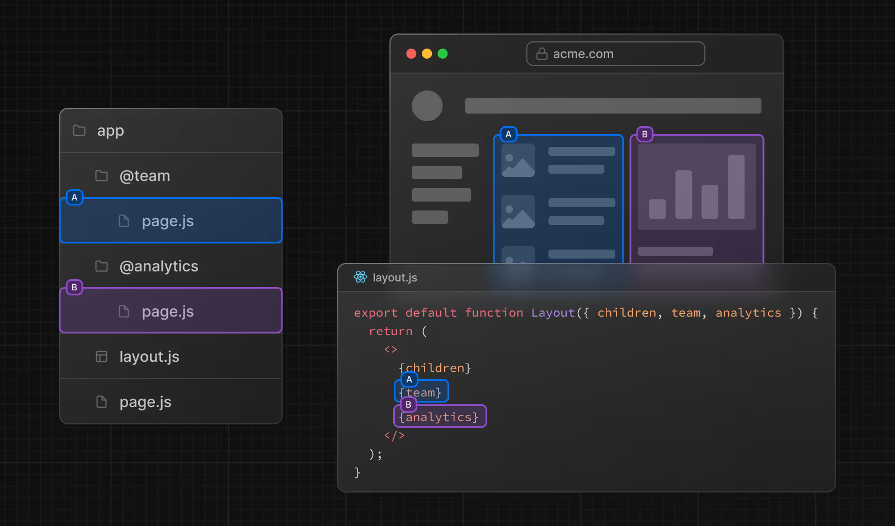

잠깐!! 그냥 컴포넌트로 하면 되는 거 아닌가? 왜 병렬 라우팅을 사용해?

-> 각각의 독립된 경로로 관리하기 떄문에 특정 기능(탭, 모달 등)을 URL로서 관리 가능하고 부분 렌더링이 가능

### Slot

- 병렬 라우팅은 `slot`이라는 이름을 통해 생성할 수 있음

  - `@folder`를 컨벤션으로 가짐
    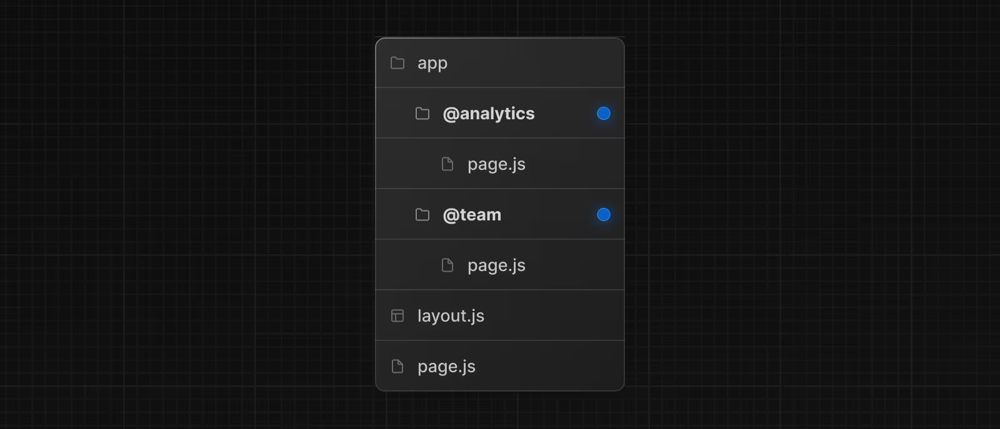

- 슬롯은 부모 레이아웃에 Props로 전달됨.
- 위 사진에서 `app/layout/js`은 `@analytics`와 `@teams`를
  props으로 사용할 수 있음

```typescript
export default function Layout({
  // children도 어떻게 보면 암묵적 slot
  children,
  team,
  analytics,
}: {
  children: React.ReactNode;
  analytics: React.ReactNode;
  team: React.ReactNode;
}) {
  return (
    <>
      {children}
      {team}
      {analytics}
    </>
  );
}
```

- 그러나 슬롯은 _경로 세그먼트가 아님_
- 예를 들어 `/@analytics/views`의 경우 실제 URL은 `/views`
- 슬롯은 일반 페이지 구성요소와 결합되어 경로 세그먼트와 연결된 최종 페이지를 형성
  - 동일한 세그먼트 Level에서 특정 슬롯만 동적이거나 정적일 수는 없음
  - 하나의 슬롯이 동적인 경우 모든 슬롯이 동적이어야 함

### 활성 상태와 탐색

- Next에서는 각 슬롯의 활성 상태 또는 하위 페이지를 추적함
- 슬롯 내에서 렌더링되는 콘텐츠는 탐색 유형에 따라 달라짐

#### Soft Navigation

- 사용자가 Link 클릭과 같은 액션을 통해 내부에서 이동하는 경우
- 브라우저에서는 바뀐 Slot의 컨텐츠만 교체
  - URL과 다른 Slot은 기존 상태를 유지함
- 예시: 메뉴 슬롯과 컨텐츠 슬롯이 있는 경우 `/dashboard/profile → /dashboard/settings`로 바뀔 때, 메뉴는 그대로 있고, 프로필은 설정으로 바뀜

#### Hard Navigation

- URL 직접 입력, 새로고침 등으로 전체 페이지 로드가 발생한 경우, 해당 URL에 해당되지 않는 슬롯들은 현재 활성화된 컨텐츠가 없기 때문에 `default.js`를 보임.
  - 만약 `default.js`가 없는 경우 `404 에러` 발생

#### `default.js`

- 전체 페이지 로드가 발생할 때, 초기 화면을 보이기 위한 fallback 역할
- 만약 `@team`과 `@analytics`이 존재하고 `@team`에만 `/setting`이 있다고 가정
  
- `/settings`로 Soft Navigating이 일어날 때, `@analytics`은 기존 컨텐츠를 유지하고 `@team` 은 `/settings`을 나타냄
- 만약 페이지 새로고침을 하는 경우 `@analytics`은 `default.js`를 보임 (만약 `default.js`가 없는 경우 404를 렌더링)
- **추가** `children`도 암묵적인 Slot이기 때문에 기존의 콘텐츠를 복구할 수 없는 경우 `default.js`가 있어야 함

#### `useSelectedLayoutSegment(s)`

- `useSelectedLayoutSegment` 와 `useSelectedLayoutSegments`는 슬롯 내에서 현재 활성화된 경로 세그먼트를 읽을 수 있음

```typescript
"use client";

import { useSelectedLayoutSegment } from "next/navigation";

export default function Layout({ auth }: { auth: React.ReactNode }) {
  // 만약 @auth 슬롯 안에 /login이 존재하고 현재 활성화 되어있다면 "login"을 반환함
  const loginSegment = useSelectedLayoutSegment("auth");
  // ...
}
```

### 예시

#### 조건부 라우팅

- 병렬 라우팅을 이용해 조건부 렌더링이 가능함
- 예를 들어 사용자의 Role에 따른 렌더링이 있음
  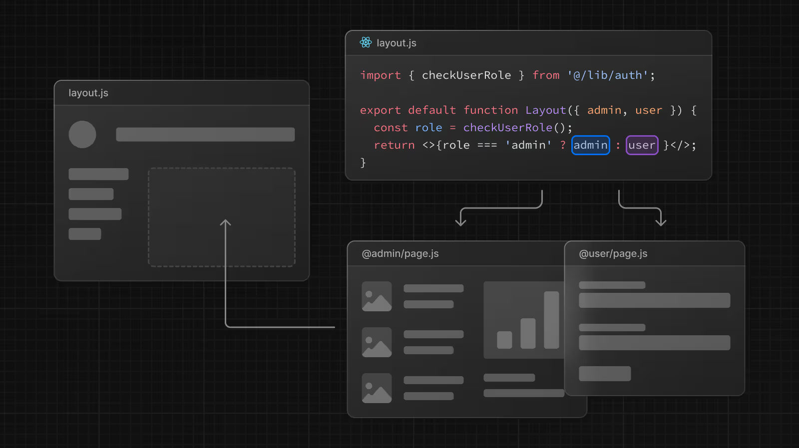

```typescript
import { checkUserRole } from "@/lib/auth";

export default function Layout({
  user,
  admin,
}: {
  user: React.ReactNode;
  admin: React.ReactNode;
}) {
  const role = checkUserRole();
  return role === "admin" ? admin : user;
}
```

#### Tab

- 한 슬롯 내에 Layout을 넣어 Tab을 구현할 수 있음
- 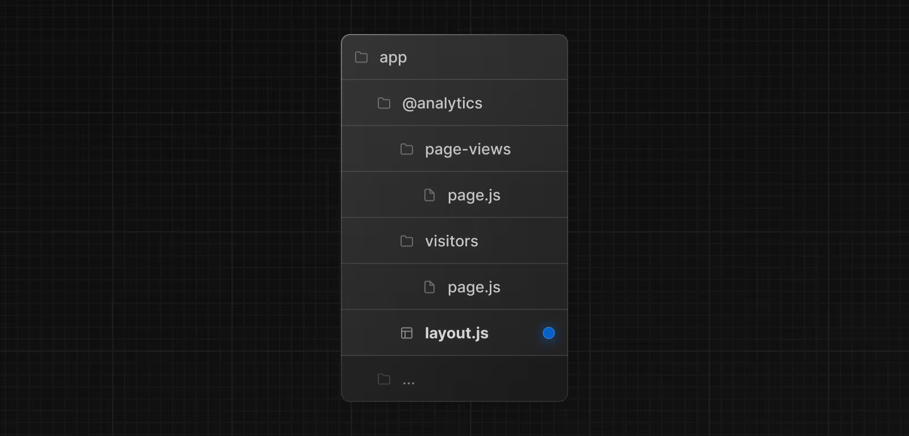

```typescript
// app/@analytics/layout.tsx
import Link from "next/link";

export default function Layout({ children }: { children: React.ReactNode }) {
  return (
    <>
      <nav>
        // TabItem을 Link로 함<Link href="/page-views">Page Views</Link>
        <Link href="/visitors">Visitors</Link>
      </nav>
      // 해당하는 Route가 나타남
      <div>{children}</div>
    </>
  );
}
```

#### Modal

- 병렬 라우팅을 인터셉트 라우팅과 함께 사용하면 Deep Linking을 지원하는 모달을 만들 수 있음
- 이 방법을 사용하는 경우 아래 문제 해결 가능
  - URL을 통해 모달 콘텐츠 공유 가능
  - 페이지가 새로고침 될 때 모달을 닫지 않고 컨텍스트 유지 가능
  - 뒤로 이동할 때 모달을 닫고 앞으로 이동할 때 모달을 열 수 있음
- **로그인 모달을 열거나 로그인 페이지에 액세스하는 방법**
  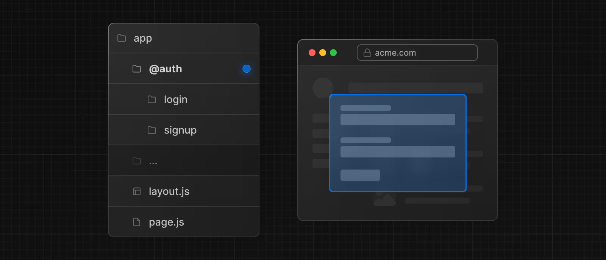
  위 이미지를 구현하기 위해 먼저 메인 로그인 페이지를 만들어야 함
  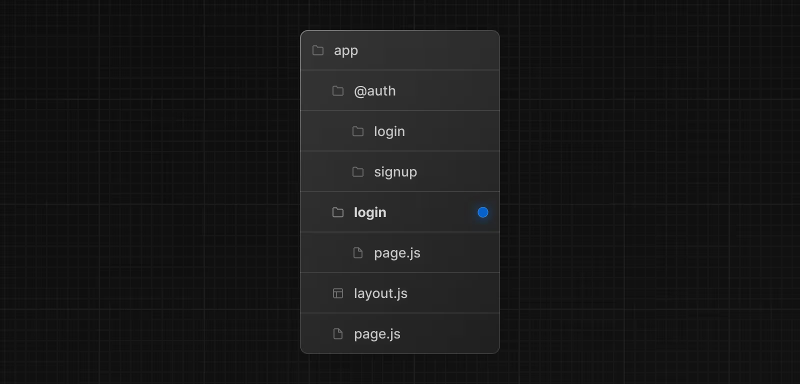

```typescript
// app/login/page.tsx
import { Login } from "@/app/ui/login";

export default function Page() {
  return <Login />;
}
```

- 그리고 `@auth`슬롯에 `default.js`를 설정하는데, 활성화 되지 않았을 떄는 아무것도 렌더링되지 않도록 하기 위해 `return null` 해야 함

```typescript
export default function Default() {
  return null;
}
```

- 인터셉트 라우트를 이용해서 로그인 페이지의 메인 라우트인 `/login`을 강탈하기 위해서 `/(.)login`를 만들고 `/(.)login/page.tsx`에 모달 컴포넌트를 만듬
- 그리고 `Link` 컴포넌트를 이용해 login 모달을 활성화할 수 있음

```typescript
import Link from "next/link";

export default function Layout({
  auth,
  children,
}: {
  auth: React.ReactNode;
  children: React.ReactNode;
}) {
  return (
    <>
      <nav>
        <Link href="/login">Open modal</Link>
      </nav>
      <div>{auth}</div>
      <div>{children}</div>
    </>
  );
}
```

- Modal에서는 router.back을 이용해서 모달을 닫을 수 있음

```typescript
"use client";

import { useRouter } from "next/navigation";

export function Modal({ children }: { children: React.ReactNode }) {
  const router = useRouter();

  return (
    <>
      <button
        onClick={() => {
          router.back();
        }}
      >
        Close modal
      </button>
      <div>{children}</div>
    </>
  );
}
```

- 만약 router.back()이 아닌 Link를 통해 /로 이동하는 방식을 하는 경우 @slot은 아무것도 나타내면 안되기 때문에(`@auth`가 남아있을 수 있음) `@auth/page.tsx`에 page.tsx에서 null을 반환하고 있어야 함

### Loading과 Error UI

- 각 슬롯에서 로딩과 에러처리 가능
  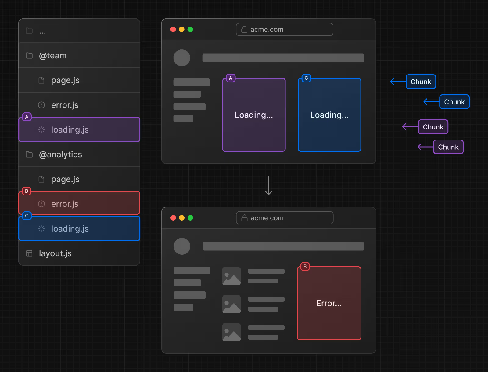

[예시](https://ariakit.org/examples/tab-next-router)
[예시2](https://app-router.vercel.app/parallel-routes)

## Intercept Routes (인터셉트 라우팅)

- 말 그대로 원래 있던 경로를 가로채서 현재 레이아웃에서 다른 경로의 콘텐츠를 나타낼 수 있는 기능
- 사용자가 다른 컨텍스트로 전환하지 않더라도 경로의 콘텐츠를 나타낼 수 있음
  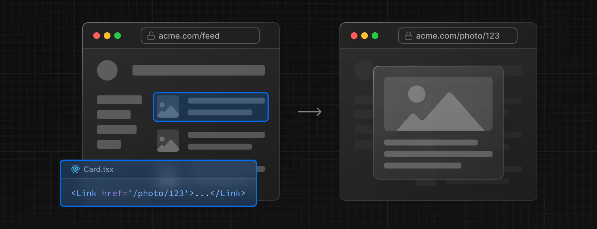
- 위에 경우 사진을 클릭하면 `/photo/123`를 가로채서 `/feed`에 나타내는 방식임
- 이후 새로고침 시 모달이 아닌 페이지로 이동함
  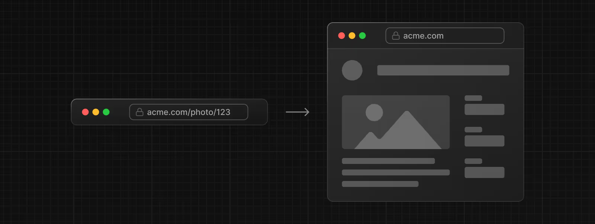

### 컨벤션

- (..)를 사용하여 컨벤션을 나타냄
  - ../와 비슷
- 아래와 같이 사용 가능
  - (.): 같은 레벨에 접근
  - (..): 한 레벨 위에 접근
  - (..)(..): 두 레벨 위에 접근
  - (...): app 디렉토리로 접근
    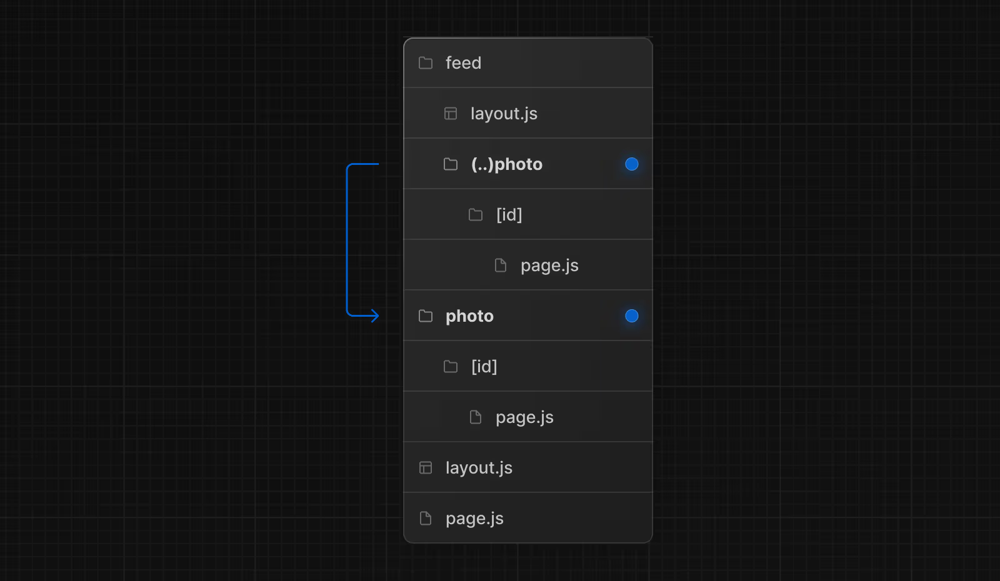

### 에시

- 병렬 라우팅과 결합해서 모달을 제작함
  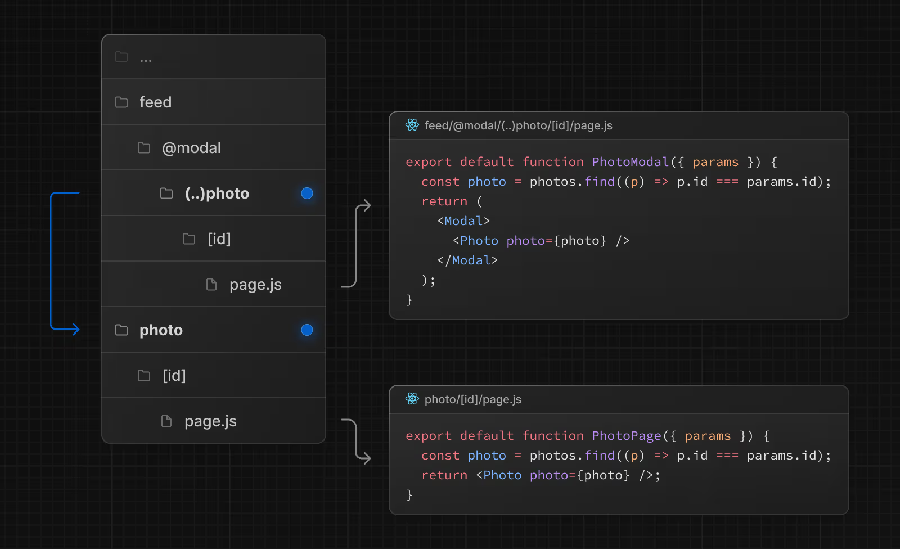
- 위 이미지에서 @modal은 슬롯이기 때문에 세그먼트 경로에 (..)를 사용하여 한 레벨 위로 접근함 -> 파일 시스템 상에서는 두 레벨 위지만 세그먼트 레벨에서는 한 레벨 위임

[예시](https://nextgram.vercel.app/)
[예시 코드](https://github.com/vercel/nextgram)
